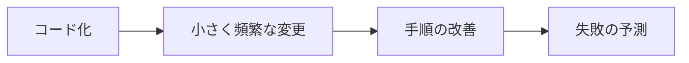

# Textbook Generator - プロジェクト要件・構造定義

## 1. プロジェクト概要

Claude Code を生成エンジンとして使い、任意の学習対象から教科書(Markdown)と理解度確認問題(4 択)を自動生成するツール。生成物は Next.js のビューワで閲覧・演習できる。将来的にはデスクトップアプリ化し、コミュニティ機能や RAG チャットボットへの拡張も視野に入れる。

### コアコンセプト

- **Claude Code 駆動**: 生成パイプライン全体を Claude Code の skill/agent で構築
- **2 モード入力**: 対象のみ渡す(骨子から作成) / 骨子(outline.yaml)を渡す(本文生成から開始)
- **疎結合**: 生成パートと閲覧パートは独立。生成物(Markdown + JSON)が両者のインターフェース
- **マイクロラーニング指向**: 1 セクション = 1 ページ = 3-5 分を基本単位とする
- **段階的成長**: 個人ローカル → クラウド公開 → コミュニティ化、を段階的に進める

### スコープ外(v1 では作らない)

- RAG チャットボット(設計上の対応のみ準備)
- ローカル LLM 連携
- 課金・ユーザー管理(個人 + 共有者まで)
- デスクトップアプリ(GUI 化はフェーズ後半)

---

## 2. システム構成

```
[生成パート / ローカル実行]
Claude Code
  ├─ .claude/CLAUDE.md(プロジェクト全体方針)
  ├─ .claude/skills/outline/(骨子生成)
  ├─ .claude/skills/chapter/(章本文生成)
  ├─ .claude/skills/quiz/(4 択問題生成)
  └─ .claude/agents/reviewer.md(章レビュー)
        ↓ 生成物
  textbooks/{slug}/
    ├─ outline.yaml
    ├─ meta.yaml
    ├─ chapters/
    │   └── {chapter-id}/
    │       ├─ chapter.yaml(章メタ)
    │       └─ sections/
    │           ├─ 01-{slug}.md(セクション = 1 ページ)
    │           └─ 02-{slug}.md
    └─ quizzes/
        └─ {chapter-id}.json
        ↓ push
[ストレージ]
Supabase(Postgres + Storage)
        ↓ 読み取り
[閲覧パート / Vercel]
Next.js (App Router)
  ├─ Supabase Auth(Magic Link)
  ├─ Markdown レンダラ(Mermaid 対応)
  ├─ セクション単位のスワイプ UI
  ├─ 4 択演習 UI
  └─ 進捗管理
```

---

## 3. ディレクトリ構造

```
textbook-gen/
├── .claude/
│   ├── CLAUDE.md
│   ├── skills/
│   │   ├── outline/SKILL.md
│   │   ├── chapter/SKILL.md
│   │   └── quiz/SKILL.md
│   └── agents/
│       └── reviewer.md
├── textbooks/
│   └── {topic-slug}/
│       ├── meta.yaml
│       ├── outline.yaml
│       ├── chapters/
│       │   └── {chapter-id}/
│       │       ├─ chapter.yaml
│       │       └─ sections/
│       │           ├─ 01-{section-slug}.md
│       │           └─ 02-{section-slug}.md
│       ├── quizzes/
│       │   ├── 01.json
│       │   └── 02.json
│       └── sources/       # ローカルディレクトリ参照時のメモ等
├── viewer/                # Next.js プロジェクト
│   ├── app/
│   ├── components/
│   ├── lib/supabase.ts
│   └── package.json
├── scripts/
│   ├── sync.ts            # ローカル生成物 → Supabase 同期
│   └── init-textbook.ts   # 新規教材ディレクトリ初期化
├── docs/
│   ├── outline-schema.md
│   └── ux-design.md
└── README.md
```

---

## 4. 学習単位の設計

### 4.1 単位の階層

```
教科書(Textbook)         5-10 時間
  └─ 章(Chapter)         12-25 分(目安 15 分)
      ├─ セクション × N    3-5 分 / 1200-3000 字
      └─ クイズ            5 分
```

### 4.2 セクション設計の根拠

- マイクロラーニング研究: 3-7 分が retention に最適。5 分未満で深さ不足、15 分超で認知負荷過多
- 日本語黙読速度: 約 600-700 字/分。技術用語込みなら実効 400-500 字/分
- 1 セクション = 1 ページ = 1 学習ユニットとして UX/データモデルを統一

### 4.3 セクション粒度ルール

字数は **地の文 + 見出し**で数える(frontmatter・fenced コードブロック・Mermaid 図は除外)。

| 項目         | 目安                              |
| ------------ | --------------------------------- |
| 目標文字数   | 1500-2000 字                      |
| 最小文字数   | 1200 字(これ未満は隣接統合を検討) |
| 最大文字数   | 3000 字(これ超は分割を検討)       |
| 警告閾値     | 2500 字超で reviewer agent が警告 |
| 推定読了時間 | 3-5 分                            |

**例外**:

- **概念導入セクション**は短くても可(500-1000 字)。
- **コード多めセクション**: fenced コードブロック(コマンド例含む)を 2 つ以上含むセクションは、地の文の下限を **800 字**に緩和する(目標 1000-1500 字)。コード例自体が学習内容の主役であり、地の文を水増ししないため。Mermaid 図のみのセクションには適用しない。
- **図解中心セクション**は文字数より図の質を優先。
- **演習セクション**は文字数カウント対象外。

### 4.4 章設計ルール

| 項目             | 目安     |
| ---------------- | -------- |
| 目標時間         | 15 分    |
| 許容範囲         | 12-25 分 |
| セクション数目安 | 3-5      |
| セクション数許容 | 2-7      |

---

## 5. UX 設計

### 5.1 操作モデル(中核思想)

**スクロール = 読む、スワイプ = 進む** で役割を完全分離。

```
[縦方向]
  セクション内の本文を読む。長文でもスクロールで対応。

[横方向]
  セクションを移動。1 スワイプ = 1 ページめくり = 次の学習ユニットへ。

[心理モデル]
  本のページをめくる体験。Kindle/iBooks のメタファー。
```

### 5.2 レスポンシブ表示

| デバイス   | 表示                         | 操作                      |
| ---------- | ---------------------------- | ------------------------- |
| スマホ     | 1 セクション = 1 画面        | 横スワイプ                |
| タブレット | 見開き 2 ページ(オプション)  | 横スワイプ / タップ       |
| PC         | 見開き 2 ページ + サイドバー | 矢印キー / 「次へ」ボタン |

### 5.3 セクション内 UI 要素

````
┌─────────────────────────┐
│ 第3章 > 第2節 サブネット設計    │ ← ヘッダ(章・節タイトル)
├─────────────────────────┤
│                         │
│   [本文 Markdown]        │
│                         │
│   ```mermaid             │
│   [図解]                 │
│   ```                    │
│                         │
│   セクションまとめ        │
│   ・ポイント1            │
│   ・ポイント2            │
│                         │
├─────────────────────────┤
│ ━━━━━━━━━━━ 80% 読了      │ ← 読了プログレス
│ ●●○○○○○  2/7        │ ← セクション位置インジケーター
│              [次へ →]   │ ← 次セクション CTA
└─────────────────────────┘
````

### 5.4 章ブレイク画面

章の最終セクション → クイズ → 章完了画面、の流れ。

```
┌─────────────────────────┐
│                         │
│      🎉 第3章 完了!      │
│                         │
│      VPC 設計            │
│                         │
│   ✓ 7 セクション         │
│   ✓ クイズ 8/10          │
│   ⏱ 18 分                │
│                         │
│   [振り返る]  [次の章へ →] │
│                         │
└─────────────────────────┘
```

### 5.5 図解の扱い

- Mermaid 図はインライン表示
- タップで拡大モーダル(ピンチアウト対応)
- 図の上下に余白を確保して呼吸感を出す
- 図が縦に長くなる場合は、図単独のセクションにすることも検討

### 5.6 クイズ画面

- 章末セクションをスワイプした次の画面
- 通常セクションと異なる背景色で区別
- 回答後に即座に解説表示
- 1 問 1 ページ、スワイプで次問題

---

## 6. データスキーマ

### 6.0 メタ情報の正本(source of truth)

同じ属性が複数ファイルに現れるため、生成・同期での衝突を避けるよう正本を固定する。

| 情報                                  | 正本                       | 役割                                                        |
| ------------------------------------- | -------------------------- | ----------------------------------------------------------- |
| 教材全体メタ(title, visibility 等)  | `meta.yaml`                | 教材の最終的なメタ                                          |
| 章立ての構想(章・節の分解案)        | `outline.yaml`             | **生成の入力(骨子)のみ**。生成後は本文の正本ではない      |
| 章メタ(title, objectives, 節の順序) | `chapter.yaml`             | 章レベルの正本。`section_order` で節の並びを管理            |
| 節メタ(title, estimated_minutes 等) | section `.md` frontmatter  | **節レベルの正本**。outline と食い違う場合は frontmatter 優先 |

`sync.ts` は frontmatter / chapter.yaml / meta.yaml を DB に反映し、outline.yaml は `textbooks.outline`(構想の記録)としてのみ保存する。outline の節 title/estimated_minutes は参考値であり、DB の sections には書き込まない。

### 6.1 meta.yaml(教材メタ情報)

```yaml
slug: aws-saa-c03
title: AWS SAA-C03 試験対策
description: AWS Certified Solutions Architect - Associate 試験対策教材
version: 1.0.0
created_at: 2026-05-26
updated_at: 2026-05-26
authors:
  - リキ
visibility: private # private | shared | unlisted | public
shared_with: # visibility=shared のときのみ
  - example@example.com
unlisted_token: null # visibility=unlisted のとき発行
search_indexable: false # public でも検索除外可能
allow_fork: false # 他人のコピー・改変を許可するか
tags:
  - aws
  - certification
contains_local_sources: false # ローカルディレクトリ参照を含む場合 true(公開禁止フラグ)
```

### 6.2 outline.yaml(骨子)

```yaml
title: AWS SAA-C03 試験対策
target_audience:
  level: 中級 # 初級 | 中級 | 上級
  prerequisites:
    - AWS の基本サービス(EC2, S3, VPC)を触ったことがある
    - ネットワークの基礎知識
  estimated_hours: 8
style:
  tone: ですます調・実務寄り
  code_examples: true
  diagram_default: mermaid
sources: # 任意。ローカルディレクトリやドキュメントを参照する場合
  - type: local_dir
    path: ../my-project
  - type: url
    url: https://example.com/spec
chapters:
  - id: "01"
    title: AWS Well-Architected Framework
    estimated_minutes: 15
    learning_objectives:
      - 5 つの柱を説明できる
      - 各柱の代表的なベストプラクティスを挙げられる
    sections:
      - id: "01-01"
        title: フレームワークの概要
        estimated_minutes: 3
      - id: "01-02"
        title: 運用上の優秀性とセキュリティ
        estimated_minutes: 4
      - id: "01-03"
        title: 信頼性とパフォーマンス効率
        estimated_minutes: 4
      - id: "01-04"
        title: コスト最適化と全体まとめ
        estimated_minutes: 4
    diagrams:
      - purpose: 5 つの柱の関係図
        type: mermaid
        section: "01-01"
    quiz:
      count: 10
      difficulty: medium # easy | medium | hard
```

### 6.3 chapter.yaml(章メタ)

```yaml
id: "01"
title: AWS Well-Architected Framework
estimated_minutes: 15
learning_objectives:
  - 5 つの柱を説明できる
  - 各柱の代表的なベストプラクティスを挙げられる
section_order:
  - "01-01"
  - "01-02"
  - "01-03"
  - "01-04"
```

### 6.4 セクション Markdown(本文 / RAG 対応 frontmatter 付き)

````markdown
---
section_id: "01-02"
chapter_id: "01"
title: 運用上の優秀性とセキュリティ
order: 2
estimated_minutes: 4
estimated_chars: 1800
learning_points:
  - 運用上の優秀性の 4 つの設計原則
  - セキュリティの責任共有モデル
  - IAM の最小権限の原則
tags:
  - waf
  - security
  - operations
related_sections:
  - "01-01" # 前提セクション
  - "02-01" # 関連セクション(後続章への伏線)
key_terms:
  - term: 責任共有モデル
    definition: AWS とユーザーがクラウドのセキュリティ責任を分担する考え方
  - term: 最小権限の原則
    definition: ユーザーやサービスに必要最小限の権限のみを付与する設計原則
---

# 運用上の優秀性とセキュリティ

## このセクションで学ぶこと

- 運用上の優秀性の 4 つの設計原則
- セキュリティの責任共有モデル
- IAM の最小権限の原則

## 運用上の優秀性

本文...


````

## セキュリティ

本文...

## まとめ

- 運用は「コード化」と「自動化」で安定させる
- セキュリティは AWS とユーザーで責任を分担する
- IAM は最小権限の原則で設計する

````

### 6.5 quiz JSON(章末問題)

```json
{
  "chapter_id": "01",
  "questions": [
    {
      "id": "q01-01",
      "question": "AWS Well-Architected Framework の 5 つの柱に含まれないものはどれか?",
      "options": [
        { "id": "a", "text": "運用上の優秀性" },
        { "id": "b", "text": "セキュリティ" },
        { "id": "c", "text": "コスト最適化" },
        { "id": "d", "text": "可搬性" }
      ],
      "answer": "d",
      "explanation": "5 つの柱は運用上の優秀性、セキュリティ、信頼性、パフォーマンス効率、コスト最適化。可搬性は含まれない。",
      "source_refs": [
        { "section_id": "01-01", "anchor": "5 つの柱" }
      ],
      "difficulty": "easy",
      "tags": ["waf", "basics"]
    }
  ]
}
````

### 6.6 Supabase テーブル定義(概要)

```sql
-- textbooks: 教材メタ
create table textbooks (
  id uuid primary key default gen_random_uuid(),
  slug text unique not null,
  title text not null,
  description text,
  visibility text not null default 'private',  -- private/shared/unlisted/public
  unlisted_token text,
  search_indexable boolean default false,
  allow_fork boolean default false,
  meta jsonb not null,
  outline jsonb not null,
  owner_id uuid references auth.users(id),
  contains_local_sources boolean default false,
  created_at timestamptz default now(),
  updated_at timestamptz default now()
);

-- chapters: 章メタ
create table chapters (
  id uuid primary key default gen_random_uuid(),
  textbook_id uuid references textbooks(id) on delete cascade,
  chapter_id text not null,
  title text not null,
  estimated_minutes int,
  meta jsonb,
  order_index int not null,
  unique (textbook_id, chapter_id)
);

-- sections: セクション本文(1 ページ単位)
create table sections (
  id uuid primary key default gen_random_uuid(),
  textbook_id uuid references textbooks(id) on delete cascade,
  chapter_id text not null,
  section_id text not null,
  title text not null,
  content_md text not null,
  frontmatter jsonb not null,    -- learning_points, tags, key_terms 等
  order_index int not null,
  estimated_chars int,
  estimated_minutes int,
  unique (textbook_id, section_id)
);

-- quizzes: 章末問題
create table quizzes (
  id uuid primary key default gen_random_uuid(),
  textbook_id uuid references textbooks(id) on delete cascade,
  chapter_id text not null,
  questions jsonb not null,
  unique (textbook_id, chapter_id)
);

-- section_progress: セクション完了記録(最新のみ保持)
create table section_progress (
  id uuid primary key default gen_random_uuid(),
  user_id uuid references auth.users(id),
  textbook_id uuid references textbooks(id) on delete cascade,
  section_id text not null,
  completed_at timestamptz default now(),
  unique (user_id, textbook_id, section_id)
);

-- quiz_progress: クイズ回答記録(最新のみ保持)
create table quiz_progress (
  id uuid primary key default gen_random_uuid(),
  user_id uuid references auth.users(id),
  textbook_id uuid references textbooks(id) on delete cascade,
  question_id text not null,
  selected text,
  is_correct boolean,
  answered_at timestamptz default now(),
  unique (user_id, textbook_id, question_id)
);
-- 進捗は「最新のみ保持」。再回答時は unique 制約キーで upsert(履歴は残さない)。

-- shared_access: 共有制御
create table shared_access (
  textbook_id uuid references textbooks(id) on delete cascade,
  email text not null,
  primary key (textbook_id, email)
);
```

RLS は以下の方針:

- `public` → 全 SELECT 許可
- `unlisted` → token を持つアクセスのみ
- `shared` → `shared_access` に email がある or owner_id 一致
- `private` → owner_id 一致のみ

---

## 7. Claude Code 側の skill 設計

### 7.1 .claude/CLAUDE.md(共通方針)

- 教材生成プロジェクトであること
- ですます調・実務寄りのトーン(meta.yaml の style に従う)
- 1 セクション = 1 ページ = 3-5 分 = 1500-2000 字目安(上限 3000 字)
- 図解は Mermaid をデフォルトとする
- 生成物は必ず reviewer agent を通すこと
- ローカルディレクトリ参照を含む教材は `contains_local_sources: true` を立てる

### 7.2 skills/outline/

**役割**: 学習対象から outline.yaml を生成する。

**入力パターン**:

- A. テキストだけ(例: 「AWS SAA-C03 試験対策」)
- B. ローカルディレクトリのパス
- C. URL や PDF などの外部ソース

**処理フロー**:

1. 対象から目的・想定読者・前提知識をヒアリング(対話的)
2. 章立て案を提示してユーザーレビュー
3. **各章を 12-25 分の単位に分解、その中で 3-5 セクションに分割**
4. 各セクションの推定時間と扱う内容を proposed
5. outline.yaml として書き出し

### 7.3 skills/chapter/

**役割**: outline.yaml の 1 章分から、複数の section Markdown を生成する。

**生成テンプレート(各セクション)**:

- frontmatter(section_id, chapter_id, title, order, estimated_minutes, estimated_chars, learning_points, tags, related_sections, key_terms)
- 「このセクションで学ぶこと」(箇条書き)
- 本文(概念 → 具体例 → 注意点 の 3 層構造)
- 必要箇所に Mermaid 図解
- セクション末尾の「まとめ」(3 行以内の箇条書き)

**長さの自動調整**:

- 目標 1500-2000 字、超過時は分割提案、不足時は統合提案
- 2500 字超で reviewer agent に警告フラグ

**図解判断ガイドライン**:

- 関係性・階層 → Mermaid graph
- 処理順序 → Mermaid sequence/flowchart
- 状態変化 → Mermaid stateDiagram
- データモデル → Mermaid erDiagram
- それ以外で必要なら D2 へエスカレーション(将来拡張)

### 7.4 skills/quiz/

**役割**: 1 章分のセクション群から 4 択問題 JSON を生成する。

**Distractor 戦略**:

- 初学者が混同しやすい概念を選ぶ
- 「ほぼ正解だが部分的に違う」選択肢を 1 つは入れる
- 完全にランダムな誤答は避ける

**source_refs**: 各問題に section_id とアンカーで根拠を紐づける(将来の RAG 引用にも使う)。

**自己レビュー**: 生成後に reviewer agent で「正解が本当に 1 つだけか」「根拠が本文にあるか」を確認。

### 7.5 agents/reviewer.md

セクション本文または問題セットを受け取り、以下を点検:

- 学習目標との整合性
- セクション長さ(1200-3000 字の範囲か。コード多め=コード2つ以上は下限 800 字、概念導入は 500-1000 字の例外あり)
- 説明の論理飛躍
- frontmatter の妥当性(key_terms が本文に登場するか等)
- 4 択問題の正解一意性
- source_refs の妥当性

**挙動**: reviewer は **指摘レポート(問題箇所と理由)を返すのみで、本文・問題の自動修正は行わない**。修正は人間の判断、または該当 skill(chapter/quiz)の再実行で行う。これにより意図しない改変を防ぎ、レビュー結果を予測可能に保つ。

---

## 8. ビューワ(Next.js)要件

### 8.1 機能

- Magic Link によるログイン(Supabase Auth)
- 教材一覧(自分の所有 + 共有されたもの + 公開教材)
- 教材詳細(章一覧 + 全体進捗バー)
- 章ビュー(セクションスワイプ UI、Markdown + Mermaid レンダリング)
- セクション内 UI(本文・図解・読了プログレス・次セクション CTA)
- クイズビュー(1 問 1 ページ、スワイプ遷移)
- 章完了画面(達成感の演出)
- 進捗管理(セクション単位 + クイズ正答率)
- 共有管理画面(自分の教材を email 単位で共有 / unlisted リンク発行)

### 8.2 技術スタック

- Next.js 15 (App Router)
- TypeScript
- Tailwind CSS
- shadcn/ui
- @supabase/ssr
- react-markdown + remark-gfm + rehype-mermaid
- framer-motion(スワイプアニメーション)
- zod(スキーマ検証)

### 8.3 ページ構成

```
/                                  # ログイン
/textbooks                         # 一覧
/textbooks/[slug]                  # 章一覧 + 進捗
/textbooks/[slug]/[chapter]        # 章本文(セクションスワイプ)
/textbooks/[slug]/[chapter]/quiz   # 演習
/textbooks/[slug]/settings         # 共有設定
/discover                          # 公開教材一覧(将来)
```

### 8.4 スワイプ UI の実装方針

```css
.chapter-viewer {
  display: flex;
  overflow-x: scroll;
  scroll-snap-type: x mandatory;
  scroll-behavior: smooth;
}

.section {
  flex: 0 0 100vw;
  scroll-snap-align: start;
  overflow-y: auto;
}

@media (min-width: 768px) {
  /* タブレット以上: 見開き 2 ページ */
  .section {
    flex: 0 0 50vw;
  }
}
```

PC では矢印キーイベントで横スクロールをトリガー、サイドバーに章内セクション目次を常時表示。

---

## 9. 同期スクリプト(scripts/sync.ts)

ローカルの `textbooks/{slug}/` 配下を Supabase に push する CLI。

```bash
$ pnpm sync aws-saa-c03         # 単一教材
$ pnpm sync --all               # 全教材
$ pnpm sync --dry-run           # 差分プレビューのみ
```

処理:

1. meta.yaml 読み込み → textbooks テーブル upsert
2. `contains_local_sources: true` の場合は公開不可フラグを警告
3. outline.yaml 読み込み → textbooks.outline 更新
4. chapters/{id}/chapter.yaml 読み込み → chapters テーブル upsert
5. chapters/{id}/sections/\*.md 読み込み → sections テーブル upsert(frontmatter は jsonb として保存)
6. quizzes/\*.json 読み込み → quizzes テーブル upsert
7. shared_with の差分を shared_access に反映
8. **orphan delete**: ローカルに存在しない chapter_id / section_id / quiz を当該 textbook 配下から削除し、DB をローカルの正本に一致させる(slug 上書き方針 = 同 slug は同教材として完全同期)

**slug 上書きの安全策**: 既存 slug を更新する場合、`--dry-run` で削除対象(orphan)を含む差分を必ず提示し、削除を伴う同期は明示確認を挟む。

---

## 10. 開発ロードマップ

### Phase 1: 生成パイプライン(最初に作る)

- [ ] リポジトリ初期化
- [ ] .claude/CLAUDE.md 作成
- [ ] skills/chapter 実装(手書き outline からセクション群を生成できる状態)
- [ ] skills/quiz 実装
- [ ] 1 つの教材を手で完走させる(品質チェック)
- [ ] skills/outline 実装(対象 → 骨子)
- [ ] agents/reviewer 実装

### Phase 2: 閲覧サイト(個人利用版)

- [ ] Supabase プロジェクト作成 + テーブル定義
- [ ] Next.js 雛形 + Auth
- [ ] 教材一覧・章一覧
- [ ] **セクションスワイプ UI**(スマホ縦長 + 横スワイプ)
- [ ] Mermaid レンダリング
- [ ] 章完了画面
- [ ] クイズ UI + 進捗保存
- [ ] sync.ts 実装

### Phase 3: 共有

- [ ] 共有設定画面(shared / unlisted)
- [ ] RLS の本番運用確認
- [ ] unlisted トークンの発行・無効化

### Phase 4: 拡張(必要に応じて)

- [ ] ローカルディレクトリを sources に指定して教材化
- [ ] D2 / diagrams.py へのエスカレーション
- [ ] PC 向け見開き表示
- [ ] 章ごとの版管理

### Phase 5: コミュニティ機能(プラットフォーム化)

- [ ] 公開教材一覧・検索・タグ
- [ ] 他者教材の演習・進捗保存
- [ ] お気に入り機能
- [ ] 著者プロフィール
- [ ] ランキング(完走率・正答率指標)

### Phase 6: デスクトップアプリ(Tauri / Electron)

- [ ] workspace ディレクトリ設計(雛形同梱・初回展開)
- [ ] Claude Agent SDK 統合
- [ ] 骨子レビュー UI(章立てのドラッグ&ドロップ編集)
- [ ] 章ごとの生成進捗 UI
- [ ] Mermaid プレビュー
- [ ] 4 択問題のレビュー UI
- [ ] アップロード機能(ローカル → Supabase の diff 同期)
- [ ] skill / template の更新機構(HTTPS で取得・置き換え)

### Phase 7: RAG / チャットボット

- [ ] ローカル RAG(SQLite + sqlite-vec)で学習補助チャット
- [ ] クラウド RAG(Supabase pgvector)で公開教材チャット
- [ ] section frontmatter を活用した引用付き回答
- [ ] 必要に応じて LangChain でエージェント化

### Phase 8(野心的): 学び方の拡張

教材プラットフォームの自然な拡張として:

- 自由記述 + AI 採点
- ソクラテス式チャットボット
- 仮想生徒モード(教えることで学ぶ)
- ハンズオン演習(コード実行環境連携)
- 適応型学習(弱点に応じた再出題)
- フラッシュカード自動生成
- 音声・動画教材への展開

---

## 11. 開発時のお約束

- 教材本文は **ですます調・実務寄り**(meta.yaml の style に従う)
- セクションは **1500-2000 字目安、上限 3000 字、下限 1200 字**(地の文+見出しで計測。コード多め=コード2つ以上は下限 800 字、概念導入は 500-1000 字の例外あり)
- 章は **15 分目安、12-25 分の範囲**
- 図解は **Mermaid 優先**。複雑すぎる場合のみ別記法
- 各セクションに **frontmatter 必須**(将来の RAG 対応)
- 4 択問題は **distractor の品質を重視**。ランダム誤答は不可
- source_refs は section_id 単位で必ず記載
- 生成物は **必ず reviewer agent を通す**
- ローカルディレクトリ参照を含む教材は **contains_local_sources: true** を立て、誤公開を防ぐ
- meta.yaml の visibility を勝手に public にしない

---

## 12. 設計思想のまとめ

- **マイクロラーニング**: 短時間で完結する単位で学習負荷を下げる
- **本のメタファー**: 1 セクション = 1 ページの心理モデルで直感的な操作を実現
- **スワイプ = 進む / スクロール = 読む**: 操作と意図の一対一対応
- **frontmatter ファースト**: 将来の RAG・検索・パーソナライズに備える
- **疎結合**: 生成・閲覧・チャットボットを独立可能な層に分ける
- **段階的拡張**: 個人 → 共有 → 公開 → コミュニティ → プラットフォーム、を急がず順序立てて
