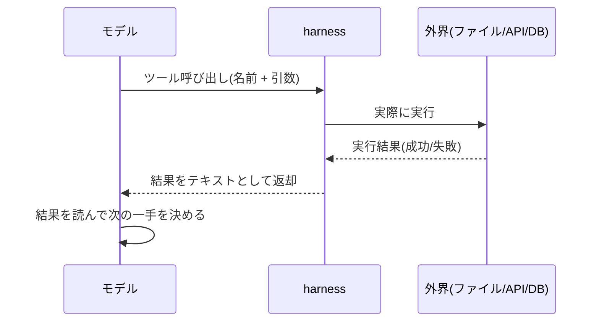

## このセクションで学ぶこと

- 言語モデルは本来テキストを返すだけで、外界に直接触れられない
- ツールはモデルが外界へ作用するための「手」であり、harness が実行を仲介する
- ツール呼び出し → 実行 → 結果返却という往復が、エージェントループの最小単位になる

## モデルは「考える」だけで、自分では何もできない

言語モデルは、与えられた文脈の続きとしてテキストを生成する装置です。どれほど賢く推論しても、モデル単体ができるのは「文字列を返すこと」だけです。ファイルを読むことも、API を叩くことも、データベースを更新することもできません。モデルには外界に触れる手段が一つもないのです。

ここで登場するのが**ツール**です。ツールとは、モデルが「これを、この引数で実行してほしい」と指定できる機能の単位で、ファイル読み取り・Web 検索・コマンド実行・メール送信といった**外界への操作**を表します。モデル自身がツールを実行するわけではありません。モデルは「ツールを呼び出したい」という意思を構造化されたデータとして**出力するだけ**で、実際に手を動かすのは harness です。

つまりツールは、思考しかできないモデルに与えられた**唯一の「手」**です。foundations で学んだ harness の 5 要素のうち、この章で扱うのはその第一の要素であるツールにあたります。

## 呼び出し・実行・返却の往復

エージェントが外界と関わるとき、必ず次の往復が起きています。

たとえば「README の冒頭を要約して」と頼まれたエージェントは、まず `read_file` ツールを `{"path": "README.md"}` という引数で呼び出します。harness がそのファイルを実際に読み、中身をモデルに返します。モデルはその中身を**新しい入力**として受け取り、ようやく要約を書けるのです。モデルは最初からファイルの中身を知っていたわけではなく、ツールの結果として手に入れた点に注目してください。

この「呼び出し → 実行 → 結果が次の入力になる」という 1 往復が、エージェントループの最小単位です。エージェントが複雑なタスクをこなすのは、この往復を何度も積み重ねているだけにすぎません。

## 注意点 — ツールがなければエージェントは生まれない

よくある誤解は、「賢いモデルさえあればエージェントになる」というものです。実際には、どれだけ高性能なモデルでも、ツールを一つも渡されなければ**ただのチャットボット**です。外界を観測する手段も、変更する手段も持たないからです。エージェントの能力の上限は、モデルの賢さではなく、**渡されたツールが何を可能にするか**で決まります。だからこそ、次節以降で見る「どんなツールを、どう定義して渡すか」という設計が、エージェントの質を大きく左右します。

## まとめ

- モデルはテキストを返すだけで、外界に触れる手段はツールしかない。
- ツールの実行は harness が仲介し、結果がモデルの次の入力になる。
- 呼び出し → 実行 → 返却の往復が、エージェントループの最小単位である。
