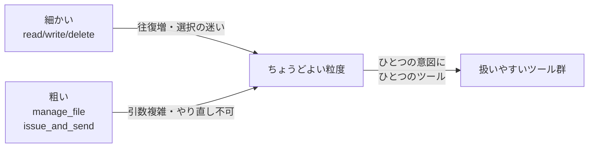

## このセクションで学ぶこと

- ツールの粒度は細かすぎても粗すぎてもエージェントを動かしにくくする
- 粒度は呼び出し回数・選択の迷い・引数の複雑さのトレードオフで決まる
- 「ひとつの意図にひとつのツール」を目安に設計する

## 粒度とは「1 ツールにどこまで持たせるか」

ツールを設計するとき必ず突き当たるのが、**粒度**の問題です。たとえばファイル操作を提供したいとき、`read_file` `write_file` `delete_file` と細かく分けるのか、それとも `manage_file(action, path, content)` のように 1 つにまとめるのか。あるいは「請求書を作って送る」という業務を、`create_invoice` と `send_email` の 2 ステップに分けるのか、`issue_and_send_invoice` という 1 つの**複合ツール**にするのか。これが粒度の設計です。

粒度に唯一の正解はありません。重要なのは、細かい側と粗い側それぞれに何を失うかを理解し、タスクに合わせて選ぶことです。

## 細かすぎ・粗すぎ、それぞれの痛み

**細かすぎる**と、ひとつの意図を達成するのにモデルが何度もツールを呼ばねばならず、往復が増えます。往復が増えればトークンを消費し、途中でつまずく機会も増えます。また、似た小ツールが大量に並ぶと、前節で見たとおりモデルは**どれを選ぶか迷い**ます。

**粗すぎる**と、ひとつのツールに引数が増えて入力スキーマが複雑になり、モデルが引数を組み立てにくくなります。`manage_file(action="delete", ...)` のように動作をフラグで切り替える設計は、内部で分岐が増え、説明文も「ときと場合により挙動が変わる」曖昧なものになりがちです。さらに、粗いツールは**部分的なやり直し**が効きません。「作る」と「送る」が一体だと、送信だけ再試行したいときに困ります。

## 目安は「ひとつの意図にひとつのツール」

実務的な指針は、**モデルが持つひとつの意図に、ひとつのツールが対応する**ように切ることです。「ファイルを読みたい」「Web を検索したい」はそれぞれ独立した意図なので別ツールにします。一方、「ログインしてからデータを取る」のように、モデルにとっては分ける意味がなく必ずセットで起きる操作なら、1 つのツールにまとめてしまってよいでしょう。判断軸は「モデルがその境界で**選択や判断をする必要があるか**」です。判断する必要のない内部手順は、ツールの中に隠してしまうほうがモデルは楽になります。

Claude Code のツール群も、ファイル編集・検索・コマンド実行といった**モデルが明確に使い分けたい単位**で分かれており、その単位内の細かな手順は各ツールの内側に隠れています。粒度設計とは、結局「どこでモデルに選ばせ、どこを隠すか」を決めることなのです。

## 注意点 — 粒度は説明文とセットで決まる

粒度を変えると、必ず説明文と引数の書きやすさも変わります。粗くまとめたら説明文が複雑になっていないか、細かく割ったら選択が曖昧になっていないかを、前節の description の観点と合わせて確認してください。粒度・スキーマ・説明文は独立した設計項目ではなく、互いに引っ張り合う 3 点セットです。

## まとめ

- 細かすぎると往復と選択の迷いが増え、粗すぎると引数とやり直しが苦しくなる。
- 「ひとつの意図にひとつのツール」を目安に、判断不要な手順はツール内に隠す。
- 粒度は説明文・スキーマと連動するので、必ずセットで見直す。
