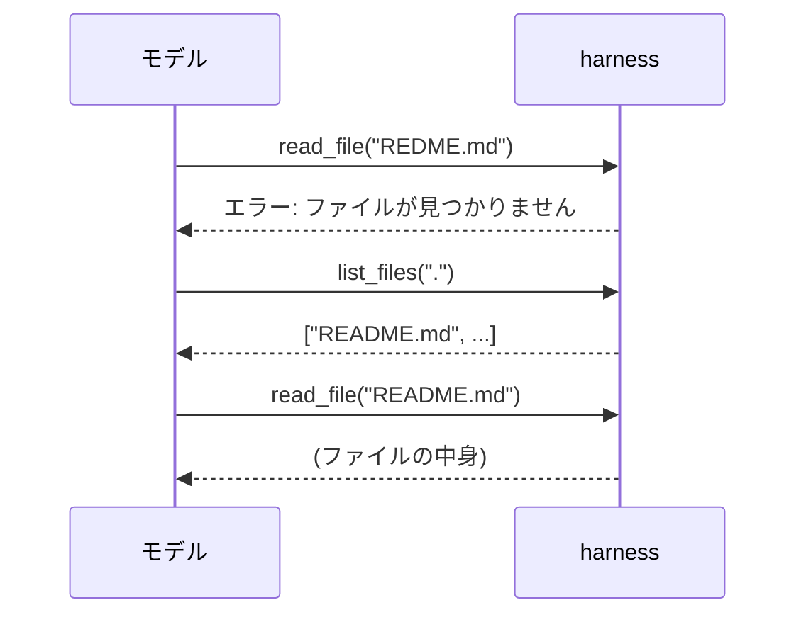

## このセクションで学ぶこと

- ツールの失敗を握りつぶさず、エラー内容をモデルに返すと自己修正できる
- エラーメッセージはモデルへの入力なので、原因と次の手がわかる形で書く
- 例外で止めず「失敗という結果」を返す設計が、ループを継続させる

## 失敗もまた、モデルへの入力である

第 1 節で「ツールの結果がモデルの次の入力になる」と述べました。これは**成功したときだけ**の話ではありません。ツールが失敗したときも、その失敗は次の入力として扱えます。ファイルが見つからない、API がタイムアウトした、引数が不正だった——こうした失敗を harness がモデルに返してやれば、モデルはそれを読んで**自分で立て直す**ことができます。これを自己修正と呼びます。

人間がコマンドを打ち間違えてエラーメッセージを読み、打ち直すのと同じです。モデルも「ファイルが存在しません」という結果を受け取れば、パスを見直したり、先にファイル一覧を取得したりと、次の一手を考えられます。エラーは行き止まりではなく、ループを次に進める材料なのです。

## 例外で止めるのではなく、結果として返す

ここで設計上の分かれ道があります。ツールの中で例外が起きたとき、それを harness の外まで投げてプロセスを止めてしまうと、エージェントループそのものが死にます。そうではなく、**失敗を「結果」としてモデルに返す**のが要点です。

```python
def read_file(path: str) -> str:
    try:
        return open(path).read()
    except FileNotFoundError:
        # 例外で落とさず、失敗を「結果」として返す
        return f"エラー: ファイルが見つかりません: {path}。" \
               f"list_files でパスを確認してください。"
```

この関数は失敗しても文字列を返します。モデルはそれを読み、`list_files` を呼んでパスを確かめ、正しいパスで再試行できます。もし例外をそのまま投げてループを止めていたら、モデルには立て直すチャンスすら与えられません。



## エラーメッセージは「モデルが読む文章」

エラー結果はモデルへの入力なので、**人間向けのスタックトレースより、モデルが次にどう動けばよいかがわかる文章**のほうが効きます。良いエラーには 3 つの要素があります。何が起きたか(失敗の事実)、なぜ起きたか(原因)、どうすればよいか(次の手のヒント)です。上の例の「`list_files` でパスを確認してください」がまさに次の手のヒントにあたります。

逆に、`Error: null` のような中身のないメッセージや、内部実装の詳細だけを返すメッセージは、モデルを混乱させます。エラー文も description と同じく、モデルに向けた指示文だと考えてください。

## 注意点 — 何でも握りつぶすのは別問題

失敗を結果として返すことと、失敗を**なかったことにする**ことは違います。空文字列や「成功」を返して失敗を隠すと、モデルは間違ったまま先に進み、被害が大きくなります。返すべきは「失敗したという事実とその理由」であって、失敗の隠蔽ではありません。停止はさせない、しかし嘘もつかない——この線引きが大切です。

## まとめ

- ツールの失敗もモデルの入力にすれば、モデルは自己修正できる。
- 例外で止めず「失敗という結果」を返し、ループを継続させる。
- エラー文は「何が・なぜ・どうすれば」を含め、モデルが読む文章として書く。
