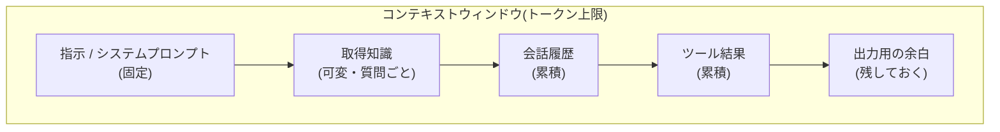

## このセクションで学ぶこと

- コンテキストを構成する 4 種類(指示・履歴・ツール結果・取得知識)を区別できること
- それぞれが予算に占める性質(固定/累積/可変)の違い
- 4 種の配分を設計判断として捉える視点

## コンテキストは 4 種類の材料でできている

前のセクションで、コンテキストを予算として配分する話をしました。では、その予算は何に使われるのでしょうか。エージェントのコンテキストに入る材料は、大きく次の 4 種類に分けられます。

- **指示(システムプロンプト)**: エージェントの役割・方針・守るべき制約。「あなたは社内文書を検索して答えるアシスタントです」のような土台。
- **履歴(会話履歴)**: ユーザーとモデルのこれまでのやり取り。何を聞かれ、何を答えてきたか。
- **ツール結果**: モデルが呼び出したツールの出力。検索結果、API のレスポンス、計算の答えなど。
- **取得知識**: その質問に答えるために外部から引っ張ってきた情報。ドキュメントの抜粋やナレッジベースの断片。

エージェントの 1 ターンは、この 4 つを積み上げたものをモデルに渡し、その上に出力用の余白を残す、という構造になっています。

## 性質が違うから扱いも違う

4 種類は予算の使われ方がそれぞれ違います。ここを区別できると設計が一気に楽になります。

- **指示は固定**: 基本的に毎ターン同じものが入り続けます。ここが肥大すると、全ターンで一定のコストを払い続けることになります。短く効かせるのが理想です。
- **履歴は累積**: ターンが進むほど雪だるま式に増えます。放っておくと最終的にウィンドウを食いつぶす最大の要因になりがちです。
- **ツール結果も累積**: 検索結果や API レスポンスは長くなりやすく、しかも履歴の一部として残り続けます。生の出力を丸ごと残すと急速に膨らみます。
- **取得知識は可変**: 質問ごとに「今回必要な分だけ」入れます。何をどれだけ入れるかは検索の設計しだいです。これが次のセクションのテーマです。

## 配分は設計判断である

たとえばカスタマーサポートのエージェントなら、長い会話履歴を保つより「直近の数ターン+要約」で十分なことが多い。一方、調査タスクなら取得知識に予算を厚く割きたい。**どの材料にどれだけ予算を割くかは、タスクによって変わる設計判断**です。

固定の指示を削るのか、累積する履歴を畳むのか、取得知識を絞るのか — 溢れそうになったときにどこから手を付けるかは、この 4 分類が地図になります。

## まとめ

- コンテキストは指示・履歴・ツール結果・取得知識の 4 種類の材料でできている。
- 指示は固定、履歴とツール結果は累積、取得知識は可変、と予算への効き方が違う。
- どこに予算を厚く割くかはタスクごとの設計判断で、4 分類が溢れ対策の地図になる。
