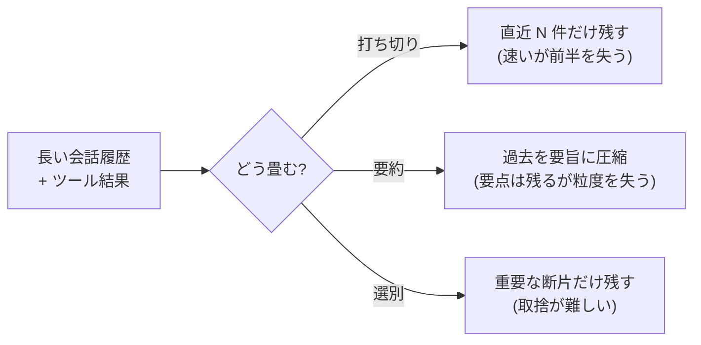

## このセクションで学ぶこと

- 累積するコンテキストを「畳む」必要が生じる理由
- 打ち切り・要約・圧縮という 3 つの代表的な手段とその違い
- 何を捨て何を残すかが情報の損失を伴う判断であること

## 累積は必ず溢れる

ここまでで、履歴とツール結果は **累積する** 材料だと見てきました。エージェントが長く動けば動くほど、これらは雪だるま式に増えていきます。そして 02-01 で確認したとおり、コンテキストウィンドウには上限があります。つまり長く動くエージェントでは、放っておけば **いつか必ず溢れる** のです。

溢れてから慌てて切り捨てると、API が機械的に古い部分を落とし、エージェントは会話の前提を突然忘れます。そうなる前に、設計者が意図して情報を **畳む**(占有トークンを減らす)必要があります。畳む手段には大きく 3 つあります。

## 3 つの畳み方

- **打ち切り(トランケーション)**: 最も素朴な手段です。古い履歴を捨て、直近の N ターンだけを残します。実装は簡単で速いですが、捨てた部分の情報は完全に失われます。「最近のことだけ分かれば十分」なタスク向けです。
- **要約(サマライゼーション)**: 過去のやり取りをモデル自身に短くまとめさせ、長い履歴を 1 つの要旨に置き換えます。要点は残りますが、細かい数値や固有名詞などの粒度は落ちがちです。長い会話を続けたいときに効きます。
- **選別(選択的保持)**: すべてを均等に扱わず、重要な断片だけを残してそれ以外を落とします。たとえばツール結果の生の出力は捨て、結論の 1 行だけ残す、といった操作です。何が重要かの判断が難しいのが弱点です。

これらをまとめて **コンパクション**(圧縮)と呼ぶことがあります。実務では複数を組み合わせ、「古い履歴は要約し、直近は生で残す」といった形をよく使います。

## 畳むことは捨てることである

ここで忘れてはいけないのは、**どの手段も情報の損失を伴う** という点です。畳むとは、突き詰めれば「何を捨てるかを選ぶ」ことです。要約すれば細部が消え、打ち切れば過去が消えます。

だからこそ「何を残すか」はタスク依存の設計判断になります。サポート対話なら直近のやり取りと未解決の論点を残せばよく、コーディングなら編集中のファイルの状態を優先して残したい。**捨ててよいものとそうでないものを見極めること** が、畳む技術の本体です。

また、いつ畳むかというタイミングも設計の一部です。毎ターン少しずつ畳むのか、上限の手前まで来てからまとめて畳むのか、で挙動が変わります。早く畳みすぎれば本当はまだ要る情報を失い、遅すぎれば溢れに間に合いません。実務では「ウィンドウの何割を超えたら畳む」といった閾値を決めておくのが定石です。次のセクションでは、1 つのセッションの中で畳むのではなく、セッションを越えて情報を残す「メモリ」の話に進みます。

## まとめ

- 履歴とツール結果は累積するので、長く動くエージェントは放置すれば必ず溢れる。
- 畳む手段は打ち切り・要約・選別の 3 つが代表で、実務では組み合わせて使う。
- どの手段も情報の損失を伴うため、「何を捨て何を残すか」がタスク依存の設計判断になる。
