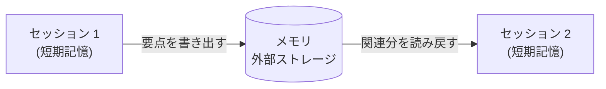

## このセクションで学ぶこと

- コンテキストウィンドウは 1 セッションで消える短期記憶でしかないこと
- セッションを越えて情報を残すメモリの基本的な仕組み
- 何を覚え何を忘れるかという、メモリもまた取捨選択であること

## コンテキストウィンドウは忘れる

ここまで扱ってきたコンテキストウィンドウは、言ってみればエージェントの **短期記憶** です。1 回のセッションが終われば中身は消えます。次にユーザーが話しかけても、エージェントは前回の会話を何も覚えていません。畳んで(02-04)残した要約ですら、そのセッションの中だけの話です。

しかし実用的なエージェントには「先週この人はこう言っていた」「このプロジェクトの方針はこうだった」と覚えていてほしい場面があります。これを実現するのが **長期記憶**、すなわち **メモリ** の設計です。コンテキストウィンドウの外に情報を逃がし、必要なときに呼び戻す仕組みです。

## メモリは「外に書いて、また読む」

メモリの基本は驚くほど単純で、**コンテキストの外に書き出し、次のセッションで読み戻す** だけです。

- セッションの終わりや途中で、覚えておくべき要点を外部ストレージ(データベースやファイル)に **書き出し** ます。
- 次のセッションが始まるとき、いま必要な情報をそこから **読み戻し**、コンテキストに足します。

ここで重要なのは、読み戻すときも結局はコンテキストウィンドウに詰め込む、という点です。つまりメモリは前のセクションまでの話と地続きで、**「取得知識」を検索ではなく過去の記録から引いてくる版**だと捉えられます。RAG が外部文書を引くのと同じ構造で、引く先が「自分が過去に書いた記録」になっただけです。

## メモリもまた取捨選択である

メモリで最も難しいのは技術ではなく、**何を覚え、何を忘れるか** です。すべてを覚えようとすれば、記録は際限なく膨らみ、読み戻すときにまた予算を圧迫します。結局ここでも 02-04 と同じ「捨てる判断」が問われます。

- ユーザーの安定した好みや事実(名前・役割・恒久的な方針)は覚える価値が高い。
- その場限りのやり取りや、すぐ古くなる情報は、覚えてもノイズになりやすい。

さらに、覚えるだけでなく **更新と忘却** も設計に含まれます。古くなった事実をいつまでも保持すれば、エージェントは過去の前提で誤った判断をします。新しい情報で上書きする、一定期間使われない記録は捨てる、といった手入れがないと、メモリはやがて当てにならない記録の山になります。

つまりメモリ設計とは「重要で、長く有効な情報だけを選んで外に残す」営みです。コンテキストエンジニアリング全体を貫くのは、入れるときも、畳むときも、覚えるときも、**有限の枠に何を選ぶか** という同じ問いなのです。

## まとめ

- コンテキストウィンドウは 1 セッションで消える短期記憶で、それを越えるのがメモリ(長期記憶)。
- メモリの基本は「外部に書き出し、必要分を読み戻す」で、読み戻しは取得知識への詰め込みと同じ構造。
- 何を覚え何を忘れるかという取捨選択が肝で、コンテキスト設計を貫く「枠に何を選ぶか」の問いに帰着する。
