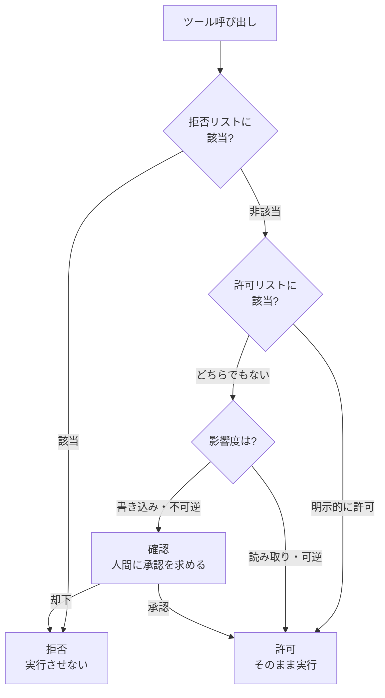

## このセクションで学ぶこと

- ツール呼び出しを許可・確認・拒否の三層に振り分ける権限モデルの基本形を学びます
- どの操作をどの層に置くかを、影響度の観点から判断できるようになります
- 既定を拒否寄りに置くフェイルセーフの考え方を押さえます

## 権限は三層で考える

前のセクションで、危険な操作だけを縛れば安全な操作は任せられると述べました。その「縛り方」を具体化したのが、**許可・確認・拒否の三層モデル**です。エージェントがツールを呼ぼうとするたびに、その呼び出しをこの三つのいずれかに判定します。

- **許可(allow)**: 確認なしでそのまま実行する。影響が小さく可逆な操作向け(例: ファイルの読み取り、検索)
- **確認(confirmation)**: 実行前に人間へ承認を求め、応答を待つ。影響があるが状況次第で任せたい操作向け(例: ファイルの書き換え、コマンド実行)
- **拒否(deny)**: そもそも実行させない。許してはならない操作向け(例: 認証情報の読み出し、本番削除)

Claude Code の許可プロンプトは、まさにこの「確認」の層です。読み取りは黙って進み(許可)、書き込みやコマンド実行で止まって尋ねてくる(確認)挙動を思い出してください。

## 何をどの層に置くか — 影響度で割り当てる

層の割り当ては、操作の**影響度**で決めるのが基本です。判断軸は主に二つあります。

ひとつは「読み取りか、書き込みか」。読み取りは状態を変えないので原則は許可寄り、書き込みは状態を変えるので確認寄りに置きます。もうひとつは「可逆か、不可逆か」。やり直せる操作(下書きの編集など)は緩く、やり直せない操作(削除、外部への送信、課金)は厳しくします。たとえば同じ「書き込み」でも、ローカルの一時ファイルへの書き込みは許可、本番データベースへの書き込みは確認、本番テーブルの削除は拒否、というように分けます。

## 既定は拒否寄りに — フェイルセーフ

設計でいちばん大事なのは、**既定値(どちらとも判定できないときの扱い)を安全側に倒す**ことです。明示的に許可した操作だけを通し、それ以外は通さない方式を**許可リスト(allowlist)**と呼びます。逆に、危険なものだけを列挙して残りを全部通す拒否リスト方式は、列挙し忘れた操作がすり抜けるため危険です。

判断に迷う、あるいは想定外の操作が来たときは、許可ではなく確認や拒否に倒す——これを**フェイルセーフ**と言います。「とりあえず通す」ではなく「とりあえず止める」を既定にしておけば、設計の穴があっても被害が最小化されます。

## まとめ

- 権限は許可・確認・拒否の三層で判定し、確認層が Claude Code の許可プロンプトに当たる
- どの層に置くかは、読み取り/書き込み・可逆/不可逆という影響度で割り当てる
- 既定は拒否寄り(許可リスト方式)に置き、迷ったら安全側に倒すフェイルセーフを徹底する
