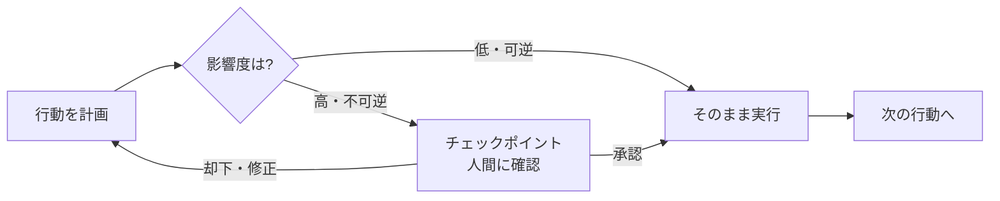

## このセクションで学ぶこと

- human-in-the-loop とは何か、なぜ自律エージェントでも人間を残すのかを理解します
- 「どこで人間に止まってもらうか」という確認の置きどころが設計の核心だと押さえます
- 影響度に応じた確認頻度の調整と、判断材料の渡し方という実務の勘所を学びます

## 自動化しきらず、要所で人間に委ねる

ここまでの章で、権限の三層・インジェクション対策・出力制御という縛りを見てきました。それでも、機械的なルールだけでは判断しきれない場面が必ず残ります。そこで効くのが**human-in-the-loop(HITL)**、エージェントの実行ループの要所に人間の判断を挟む設計です。

03-02 の「確認」層を思い出してください。Claude Code が書き込みやコマンド実行で止まって尋ねてくる、あの挙動がまさに HITL です。エージェントは行動を選ぶところまで自動で進み、影響の大きい一歩の直前で人間に「これでよいか」を委ねます。完全自動と完全手動の間に、人間が要所だけ関与する中間点を作るわけです。狙いは、機械が得意な高速な作業は任せつつ、価値判断や不可逆な決定は人間が握ることにあります。

## 核心は「確認の置きどころ」

HITL の難しさは、確認を入れること自体ではなく**どこに入れるか**にあります。

すべての操作で確認を求めると、人間が逐一承認することになり自律が死にます。これでは 03-01 で見た「人間が張り付く」状態に逆戻りです。逆に何も確認させなければ安全が死にます。だから、ループ上に確認のための停止点=**チェックポイント**を、影響度に応じて選んで置きます。割り当ての軸は 03-02 と同じで、読み取りや可逆な操作は確認なしで流し、不可逆・高影響の操作(削除、外部送信、課金、本番反映)の直前にだけチェックポイントを置きます。

もうひとつ実務で効くのが**判断材料の渡し方**です。人間に「実行してよいですか」とだけ聞いても、根拠がなければ正しく判断できません。何をしようとしているか、なぜそう判断したか、影響範囲はどこまでかを添えて渡すことで、人間は中身を見て承認・却下・修正を選べます。

## 注意点 — 確認は多すぎると形骸化する

陥りがちな失敗が**承認疲れ(alert fatigue)**です。確認要求が多すぎると、人間は中身を読まずに反射的に「はい」を押すようになり、確認が名前だけのものになります。こうなると HITL は安全に寄与しません。

対策は、確認を**減らして重くする**ことです。低影響の操作はルールで自動化し、人間に回すのは本当に判断が要る少数の高影響操作だけに絞ります。一回の確認には十分な情報を添え、人間がきちんと中身を見て決められる状態にします。「確認の数」ではなく「確認の質」が、HITL が機能するかどうかを分けます。

## まとめ

- human-in-the-loop は、実行ループの要所に人間の判断を挟む設計で、確認層がその実体
- 核心は確認の置きどころ。影響度に応じてチェックポイントを選び、判断材料を添えて渡す
- 確認が多すぎると承認疲れで形骸化するため、数を絞って一件ごとを重く扱う
