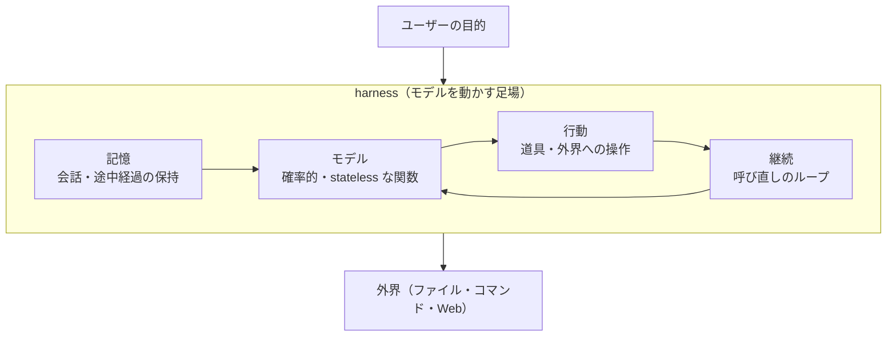

## このセクションで学ぶこと

- harness を「モデルを取り囲み、動かす周辺すべて」として定義できる
- harness が記憶・行動・継続を外側から補う役割を担うことを理解する
- モデルと harness の関係を関係図として捉えられる

## harness とは「モデルを動かす足場」

ここまでで、モデル単体は確率的で状態を持たない関数であり、記憶・行動・継続を欠いていると確認しました。では、これらを外から補うものは何か。それが harness です。

harness はもともと「馬具」や「装具」を指す言葉で、馬の力を引き出して馬車を動かすための装着具を意味します。本書ではこれを比喩として、**状態を持たないモデルを取り囲み、記憶・行動・継続を与えて『動かす』周辺の仕組み全体**を harness と呼びます。モデルが「エンジン」だとすれば、harness は燃料を送り、ハンドルやブレーキをつなぎ、走り続けさせる車体側の一式です。

## harness が補う 3 つの欠如

前のセクションで挙げた 3 つの欠如を、harness はそれぞれ外側から埋めます。

- **記憶を補う**: 過去の会話や作業の途中経過を保存し、次の呼び出しの入力に詰め直して渡します。
- **行動を補う**: ファイル操作やコマンド実行などの「道具」を用意し、モデルの出力を実際の操作に変換します。
- **継続を補う**: 一度の応答で止めず、モデルをもう一度・もう一度と呼び直して作業を前に進めます。

重要なのは、harness は特定のライブラリや製品の名前ではないということです。上のような働きをするものは、自作のスクリプトでも、フレームワークでも、商用ツールでも、すべて harness です。

## モデルと harness の関係図

モデルと harness の関係を図にすると、中心に確率的関数としてのモデルがあり、その周りを harness の各役割が取り囲む構造になります。

中心のモデルは相変わらず「入力を受けて出力を返す」だけですが、それを記憶・行動・継続が取り囲むことで、外界に働きかけ続ける存在になります。この「モデル+harness」の全体が、私たちがエージェントと呼ぶものです。

## 注意点と具体例:Claude Code も一つの harness

身近な例として Claude Code を挙げます。Claude Code は内部で LLM を呼び出しますが、それだけではなく会話履歴を保持し(記憶)、ファイル編集やコマンド実行の道具を備え(行動)、作業が終わるまでモデルを呼び直します(継続)。まさに harness の典型例です。Claude Code の詳しい読み解きは第 4 章で扱いますが、いまは「あれもモデルを足場で囲ったものなのだ」と眺めておけば十分です。

## まとめ

- harness は、stateless なモデルを取り囲み記憶・行動・継続を補う周辺の仕組み全体です。
- 特定の製品名ではなく、その働きをするものはすべて harness と呼べます。
- モデル+harness の全体がエージェントであり、Claude Code もその一例です。
