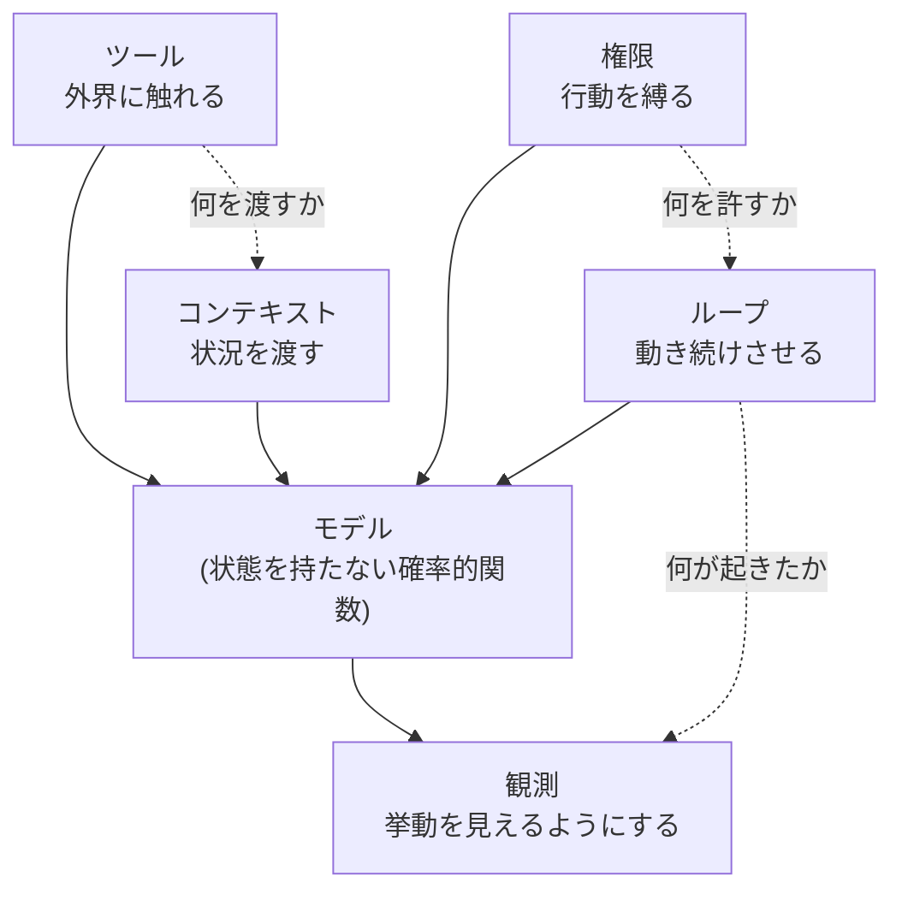

## このセクションで学ぶこと

- harness は 5 つの構成要素に分解して捉えられる
- 各要素はモデルの「できないこと」を 1 つずつ補う役割を持つ
- 5 要素の関係を 1 枚の解剖図として俯瞰する

## harness を 5 つに分けて見る

第 01 章では、harness を「モデルを動かす周辺すべて」として定義しました。ただ「周辺すべて」のままでは設計も比較もできません。そこでこの章では、harness を **ツール・コンテキスト・権限・ループ・観測** という 5 つの構成要素に分解します。バラバラの工夫の寄せ集めに見えていたものが、この 5 つの引き出しに整理されると、急に見通しがよくなります。

なぜこの 5 つなのか。鍵は、第 01 章で見たモデルの限界にあります。LLM は状態を持たない確率的関数で、外界に触れられず、記憶を保てず、自分で何度も動き続けることもできませんでした。**5 要素は、その限界を 1 つずつ埋めるために存在します。** どれもモデルの足りなさへの応答であり、思いつきで足された部品ではありません。

## 5 要素の解剖図

5 つの要素とモデルの関係を 1 枚にすると、次のようになります。中心にモデルがいて、それを 5 要素が取り囲み、限界を補っている構図です。

ツールは外界への手足を与え、コンテキストは状況を渡し、権限は行動の境界を引き、ループはモデルを繰り返し動かし、観測はその一部始終を外から見えるようにします。点線は要素どうしのつながりを表しています。ループは権限の制約の中で回り、ツールの結果はコンテキストに積まれ、すべての挙動は観測に流れ込む――要素は独立ではなく、互いに噛み合って一つの harness を形作っています。この相互依存こそが本章の山場で、最後の節(02-05)で詳しく扱います。

## 注意点 — ここでは「概観」にとどめる

この章では 5 要素を**一通り見渡すこと**を目的にします。ツールをどう定義するか、コンテキストをどう詰めるか、権限をどう設計するかといった一つひとつの作り込みは、それぞれが独立したテーマになるほど深いものです。設計の具体は後続カリキュラム(design)、壊れにくくする工夫は resilience に委ね、ここでは「何があるか」と「なぜ要るか」の地図を手に入れることを優先します。

## まとめ

- harness はツール・コンテキスト・権限・ループ・観測の 5 要素に分解できる。
- 各要素はモデルの限界を 1 つずつ補うために存在する。
- 5 要素は独立ではなく互いに噛み合う。本章はその概観で、深掘りは後続カリキュラムに委ねる。
