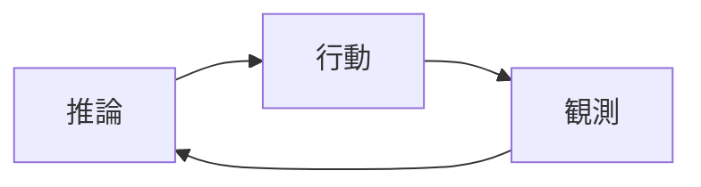

## このセクションで学ぶこと

- 推論→行動→観測の循環がエージェントループの骨格であること
- ReAct を「モデルの工夫」ではなく「harness の制御構造」として読み直すこと
- ループを回しているのはモデルではなく harness 側のコードであること

## 推論・行動・観測という三拍子

エージェントが「自律的に動いているように見える」とき、その内側で起きているのはとてもシンプルな三拍子の繰り返しです。

1. **推論(Reasoning)**: いまの状況を踏まえて、次に何をすべきかを考える。
2. **行動(Acting)**: 考えた結果に従って、ツールを呼ぶ・コマンドを実行するなどの操作をする。
3. **観測(Observation)**: 行動の結果(出力・エラー・取得したデータ)を受け取る。

そして観測の結果をふたたび推論の材料にして、次の三拍子に入ります。この循環こそがエージェントループであり、「自律」と呼ばれるものの実体です。難しい知能が宿っているのではなく、**この単純な輪が回り続けているだけ**だと押さえてください。

なお、ここでいう「観測(Observation)」は、第 2 章の 5 要素で扱った「観測(Observability)」とは別物です。前者はツールの実行結果を次の推論へ渡すループ内の一手を指し、後者はエージェントの挙動を外から見えるようにする仕組みを指します。同じ「観測」でも層が違う、と切り分けておいてください。

## ReAct を harness 視点で読み直す

ai-agent-roadmap では、ReAct(Reasoning + Acting)を「モデルに推論と行動を交互にさせる手法」として学んだはずです。ここでは視点を一段下げます。

ReAct を成立させているのは、実はモデルではありません。モデルは「次はこのツールを使いたい」という意思表示を **テキストや構造化された出力として返すだけ** です。その出力を解釈し、実際にツールを呼び、結果をモデルに渡し直す——この一連の段取りはすべて **harness 側のコード** が担っています。

つまり ReAct とは「賢いモデルの振る舞い」というより、**harness が用意したループの台本にモデルを乗せている**状態です。モデルは一手ぶんの判断を出すだけで、手を繰り返し打たせているのは外側の制御構造なのです。

具体的に追ってみましょう。たとえば「最新のエラーログを調べて原因を答えて」という依頼に対し、モデルはまず「ログを読む必要がある」と推論し、その手段として `read_file` というツールを使いたいと出力します。これが推論と行動です。harness はその出力を受け取って実際にファイルを読み、中身をモデルに渡し直します。これが観測です。モデルは渡されたログを見て「次は該当行を検索したい」と次の一手を出す——この一往復ごとに、判断はモデル、実行と橋渡しは harness、という役割分担がはっきり繰り返されています。賢く見える挙動の中身は、この単純な分担の積み重ねにすぎません。

## 注意点 — ループの主語を間違えない

初学者がつまずきやすいのは「モデルがループを回している」と思い込む点です。モデルは 1 回の呼び出しで 1 つの応答を返すだけで、自分から次の一手に進むことはできません。一度応答を返したら、そのモデルの仕事はそこで終わりです。**「もう一度モデルを呼ぶ」かどうかを決めているのは harness** であり、観測結果を添えて次の呼び出しを発行しているのも harness 側のコードです。この主語の取り違えを直すと、次のセクションで見る 1 ターンの中身がぐっと読みやすくなります。逆にここを曖昧にしたままだと、「自律的なモデル」という言葉に幻惑されて、設計の手がかりを見失ってしまいます。

## まとめ

- 自律の正体は推論→行動→観測の単純な循環である。
- ReAct は harness が用意した制御構造であり、モデルは一手を出すだけ。
- ループを繰り返すかを決めているのは harness 側のコードである。
