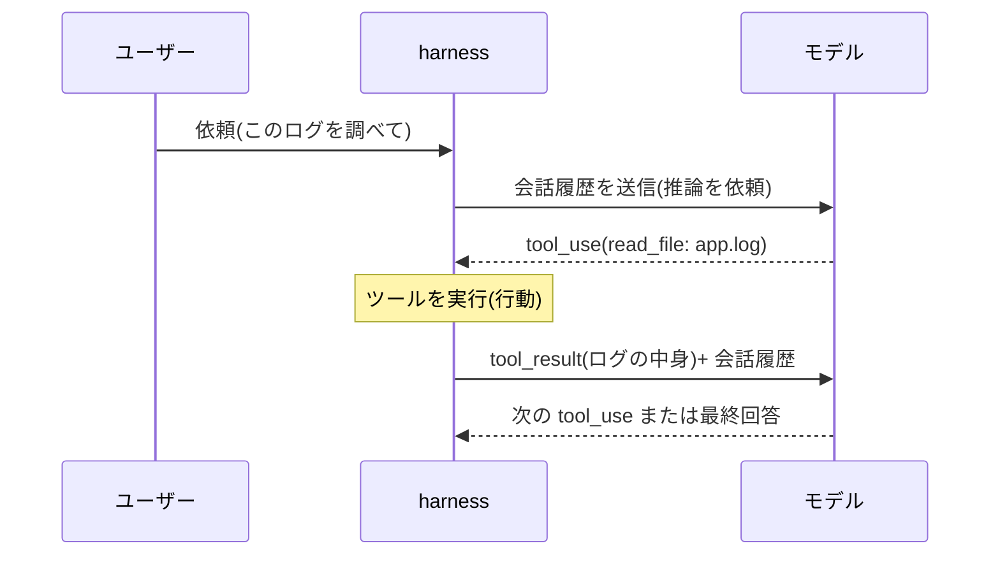

## このセクションで学ぶこと

- 1 ターンがモデルと harness の間のメッセージ往復で構成されること
- tool_use と tool_result が一往復のペアになっていること
- 観測結果は次のモデル呼び出しの入力メッセージとして渡されること

## 1 ターンを分解する

前のセクションで見た「推論→行動→観測」を、実際にやり取りされる **メッセージ** の粒度まで降りて追ってみます。ここを一度ていねいに追うと、エージェントの内部が「魔法」でなくなります。

ユーザーが「このログを調べて」と頼んだとします。harness はその依頼をメッセージとしてモデルに送り、モデルは「`read_file` を `app.log` という引数で使いたい」という **tool_use** を返します。これが推論の出力であり、行動の指示です。

harness はこの tool_use を読み取り、実際にファイルを読みます。そして読んだ中身を **tool_result** というメッセージにして、これまでの会話に追加した上で、**もう一度モデルを呼び直します**。モデルにとっては、これが観測の受け取りです。

ここで大事なのは、tool_use と tool_result が **必ずペアになる**ことです。モデルが「このツールを使いたい」と言ったら、harness はその要求に対応する結果を返さなければなりません。要求しっぱなし・結果だけ唐突に渡す、という片側だけのやり取りは成立しません。モデルから見れば「自分が頼んだことの答えが返ってくる」という対応関係が常に保たれていて、この一問一答の積み重ねが会話履歴として伸びていきます。tool_use 一つに tool_result 一つ——この往復の単位を押さえておくと、後でログを読むときに「いまどの行動の結果を見ているのか」が迷わず追えるようになります。

## メッセージ往復のシーケンス

1 ターンのなかでメッセージがどう往復するかを図にすると、次のようになります。

ポイントは、**矢印が必ず harness を経由している**ことです。モデルとツールが直接つながることはありません。モデルは「使いたい」と言うだけ、harness が「実際に使って結果を渡す」。この往復が一周して、ようやく 1 ターンです。

## 注意点 — 観測は「次の入力」として積まれる

見落としやすいのは、tool_result が **新しい呼び出しの入力に追記される** という点です。モデルは前回の自分の発言を覚えているわけではなく、harness が会話履歴をまるごと積み直して渡すから、文脈が続いているように見えます。1 往復ごとに履歴が伸びていく——この積み上げ方が、次章以降のコンテキスト管理の話につながります。

## まとめ

- 1 ターンは tool_use と tool_result の往復で構成される。
- モデルとツールは直接つながらず、必ず harness を経由する。
- 観測結果は次のモデル呼び出しの入力メッセージとして積み直される。
