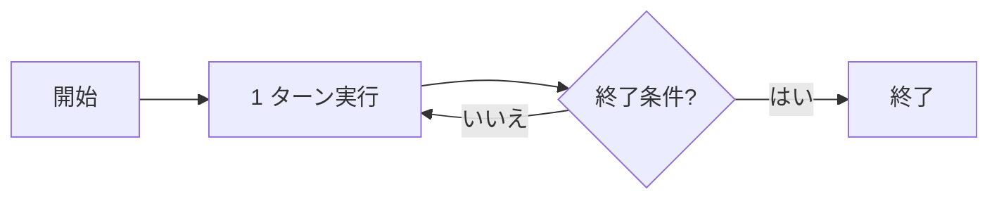

## このセクションで学ぶこと

- 自律とはループが終了条件まで回り続けることに過ぎないこと
- ループを止める条件(完了・上限・エラー)は harness が決めること
- 「賢さ」と「自律性」は別物であると区別できること

## 「自律」を分解すると拍子抜けする

エージェントの「自律性」と聞くと、自分で目標を立て、判断し、勝手に動く知的な何かを想像しがちです。しかし harness 視点で分解すると、その正体は拍子抜けするほど単純です。

自律とは、**前のセクションで見た 1 ターンを、人が口を挟まないまま何度も繰り返す**ことに過ぎません。tool_use が返ってきたら実行し、結果を渡してまた呼ぶ。これを「もう終わりでよい」と判断するまで続ける。ループが連続して回っている状態を、外から見て「自律的だ」と呼んでいるだけなのです。

## ループを止めるのは harness

ここで重要なのは、**「もう終わりでよいか」を最終的に管理しているのは harness** だという点です。モデルは「最終回答を返した(これ以上 tool_use しない)」というシグナルを出せますが、それを受けてループを抜けるのも、逆に反復回数が上限に達したから強制的に止めるのも、harness の仕事です。

代表的な終了条件は次の三つです。

- **完了**: モデルが tool_use を返さず、最終回答を出した。これは「自然な終わり」で、モデルが「もうやることはない」と判断したサインを harness が受けてループを抜けます。
- **上限**: 反復回数やトークン量が事前に決めた上限に達した。これは「強制的な終わり」で、モデルがまだ続けたがっていても harness が打ち切ります。暴走への安全弁です。
- **エラー**: 続行できない失敗が起きた。ツールが例外を返した、外部 API が落ちた、といった場合に harness がループを止めます。

このうち「完了」だけがモデル発のシグナルで、「上限」と「エラー」は harness が外から判断する点に注目してください。つまり止まり方の大半は、モデルの賢さではなく harness の設計に握られています。終了条件をどう組むかが、そのまま「このエージェントはどこまで自走し、どこで止まるか」を決めるのです。

## 注意点 — 賢さと自律性を混同しない

「自律的に動く=賢い」と捉えると判断を誤ります。終了条件が甘ければ、賢くないモデルでも延々と回り続け、無意味な行動を重ねる **暴走** になります。逆に終了条件をきつく縛れば、賢いモデルでも短く確実に止まります。**自律性はループ設計の問題であり、モデルの知能とは別の軸**だと切り分けて理解してください。製品として「どこまで任せられるか」を決めるのは、モデルを賢いものに差し替えることではなく、終了条件や上限をどう組むかという harness 側の設計判断なのです。

## まとめ

- 自律とは 1 ターンを終了条件まで繰り返しているだけのこと。
- ループを止める条件(完了・上限・エラー)は harness が管理する。
- 賢さと自律性は別物で、自律性はループ設計で決まる。
