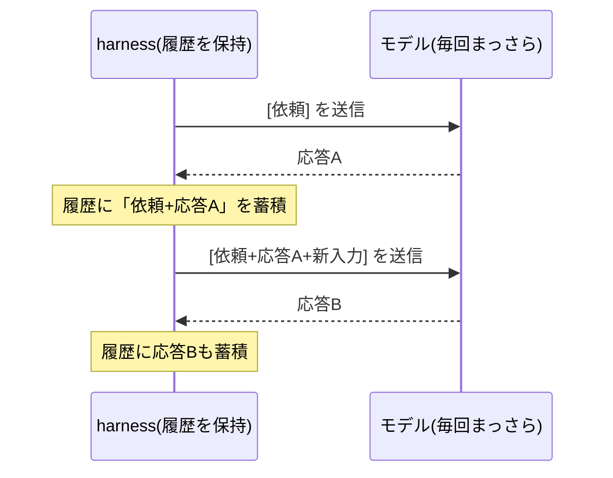

## このセクションで学ぶこと

- モデルは毎回まっさらで、過去のやり取りを一切覚えていないこと
- 「覚えているように見える」のは harness が会話履歴を積み直して渡しているからであること
- 状態を持つのはモデルではなく harness であること

## モデルは毎回「初対面」である

ここまでで、ループが回り続けることが自律の正体だと見てきました。最後に、そのループを成り立たせている地味だが決定的な仕組みを押さえます。**モデルは呼び出しごとにまっさらで、前回何を話したかをまったく覚えていない**、ということです。

第 01 章で確認したとおり、LLM は状態を持たない確率的関数、つまり **stateless** でした。1 回目の呼び出しと 2 回目の呼び出しのあいだに、モデルの中に記憶は残りません。2 回目のモデルは、1 回目のモデルが何を答えたかを知らない「初対面」の状態で入力を受け取ります。

それでもチャットやエージェントが文脈を保って会話できるのは、なぜでしょうか。

## 覚えているのは harness のほう

答えはシンプルです。**毎回、これまでのやり取りを丸ごと積み直して渡しているから**です。前のセクションで「tool_result は次の入力に追記される」と見ましたが、追記されているのは tool_result だけではありません。ユーザーの最初の依頼も、モデルの過去の発言も、すべて含んだ **会話履歴** を harness が保持していて、呼び出しのたびに先頭からまるごと渡し直しています。

つまり、状態を持っているのはモデルではなく **harness のほう** です。stateless なモデルを、stateful な harness が会話履歴という形で包むことで、外からは「ずっと文脈を覚えている一貫した相手」に見せている——これが「記憶を持つエージェント」の正体です。

この構図を一度つかむと、いろいろな現象が腑に落ちます。たとえば同じモデルでも、渡す履歴を変えれば応答はまったく変わります。履歴を空にして呼べば、モデルは過去を一切知らない「初対面」として答えます。逆に過去のやり取りを丁寧に積めば、文脈に沿った一貫した応答になります。**モデルの振る舞いは、モデル自身の記憶ではなく「何を履歴として渡すか」で決まっている**のです。会話のリセットや、別スレッドで話が通じないといった日常的な挙動も、すべて「harness がどの履歴を渡したか」で説明がつきます。

## 注意点 — 履歴は無限には積めない

便利な仕組みですが、限界もあります。会話履歴は呼び出しのたびに伸び続け、モデルが一度に受け取れる量(コンテキスト長)には上限があります。長い作業では、古いやり取りを要約したり捨てたりして履歴を整える必要が出てきます。**「どう覚えさせ、どう忘れさせるか」はモデルではなく harness の設計問題**であり、本書の後続カリキュラム(コンテキスト管理)で本格的に扱うテーマです。ここでは「記憶は harness が作っている」という一点を持ち帰ってください。

## まとめ

- モデルは stateless で、呼び出しごとに過去を覚えていない。
- 文脈が続くのは harness が会話履歴を積み直して渡しているから。
- 状態を持つのは harness であり、その管理(覚え方・忘れ方)が後続の設計テーマになる。
