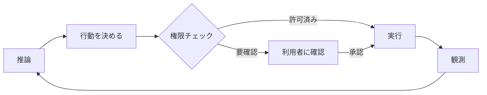

## このセクションで学ぶこと

- 許可プロンプトを「権限」という縛りの現れとして読む
- 一度の指示で複数作業が進む様子を「ループ」として読む
- 権限がループの暴走を抑える関係を観察で確かめる

## 権限 — 「やっていいですか?」が出る瞬間

Claude Code を使っていると、ファイルを消すコマンドや見慣れない操作の前で「実行してよいか」と **確認を求められる** ことがあります。一方で、ファイルを読むだけのような操作は黙って進みます。この差が、harness の **権限** という要素の現れです。

第 2 章で見たとおり、権限はエージェントが取れる行動の範囲をあらかじめ縛る仕組みです。Claude Code は「読み取りは自由、書き込みや破壊的な操作は確認」というように、操作の種類で扱いを分けていると観察できます。実際に、安全そうな操作と危険そうな操作を続けて頼んでみると、後者だけで許可プロンプトが出る — この違いを自分の目で確かめられます。

許可を一度与えると、同種の操作はしばらく聞かれなくなることもあります。これは「この範囲は許可済み」という状態を harness が保持しているためだと推し量れます。権限は固定の壁ではなく、利用者とのやりとりで動く境界線なのです。

## ループ — 一回の指示が複数の手に分かれる

次に観察したいのが **ループ** です。「テストを直して」と一度頼むだけで、Claude Code は対象ファイルを探し、読み、書き換え、テストを走らせ、結果を見てまた直す、という具合に **複数の手を続けて** 打ちます。指示は一回なのに、行動は何ステップにもわたります。

これが第 3 章で見た推論→行動→観測のループです。テストが失敗すれば(観測)、失敗の原因を考え(推論)、修正をかける(行動)。この往復が、人手を介さずに進んでいきます。「自律的に動いた」と感じる正体は、ループが止まる条件に達するまで回り続けているだけ、という第 3 章の話がそのまま見て取れます。

ループが回っていることは、止まる瞬間を観察するといっそうはっきりします。Claude Code は、目的を達したとき、あるいは行き詰まって判断を仰ぐ必要が出たときに手を止め、利用者にボールを返します。逆に言えば、その条件に達するまでは何ステップでも自分で進む。だから「指示が一回で済んだ」のは、足場が終了条件を満たすまでループを回し続けてくれたからだ、と読み替えられます。

## 権限とループは噛み合っている

ここで 2 要素の関係に注目してください。ループは放っておけば手を打ち続けます。だからこそ、危険な手の前で止めて確認を取る権限が要るのです。下の図のように、ループの各行動が権限のチェックを通ってから外界に届く、という関係になっています。

権限を緩めればループは速く回りますが歯止めは弱くなり、厳しくすれば安全だが何度も確認で止まります。Claude Code の確認プロンプトは、この **速さと安全のトレードオフ** を利用者に委ねている瞬間だと読めます。

## まとめ

- 許可プロンプトは、操作の種類で行動を縛る権限の現れ。
- 一度の指示で複数の手が続くのは、推論→行動→観測のループが回っているから。
- 権限はループの暴走に歯止めをかける関係にあり、速さと安全のトレードオフを担う。
