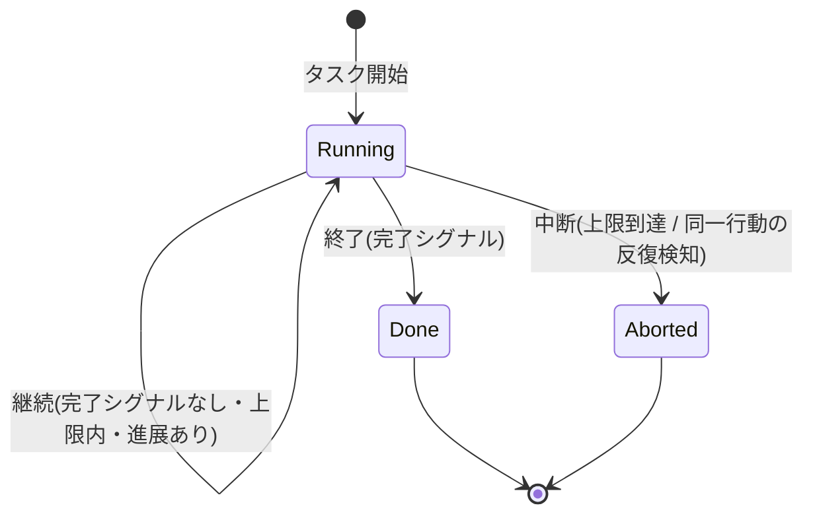

## このセクションで学ぶこと

- 自律エージェントで起きる無限ループの代表的なパターン
- 継続・終了・中断という三つの状態遷移でループを捉える見方
- 同一行動の繰り返しを検知して中断につなげる実装の勘所

## 無限ループの典型パターン

エージェントの無限ループは、ランダムに暴れるというより、いくつかの決まった形で現れます。

一つは **同一行動の反復** です。同じ検索クエリを何度も投げる、同じファイルを読み直し続ける、といった「同じことを繰り返して進展しない」状態です。観測結果が毎回同じなのに、モデルがそれを手がかりにできず、また同じ行動を選んでしまうケースです。

二つめは **二状態の振動** です。A をやって失敗 → B をやって失敗 → また A、と二つ(以上)の行動を行き来し続けます。それぞれの行動単体では繰り返しに見えないため、単純な「直前と同じか」のチェックでは捕まえにくいのが厄介です。

三つめは **ゴールの後退** です。完了に近づいたと思ったらモデルが「やっぱり足りない」と判断し、終わりが遠ざかり続けます。前のセクションで触れた曖昧なゴールが原因になりがちです。

いずれも共通するのは、**ループは回っているのに状態が前に進んでいない** という点です。

## 継続・終了・中断の状態遷移

これらを捉えるために、ループの各周回を「次にどの状態へ遷移するか」で見ると整理できます。一周ごとに harness は、もう一周回す(継続)、正常に止める(終了)、異常を検知して強制的に止める(中断)のいずれかを選んでいます。



`Running` への自己遷移が「継続」です。`Done` が前セクションの完了による正常終了、`Aborted` が無限ループや上限を検知したときの強制的な中断です。無限ループ対策とは、この `Running → Aborted` への遷移条件をどれだけ的確に引けるか、という設計だと言えます。

## 繰り返しを検知する実装の勘所

最も実装しやすい検知は **同一行動の反復** です。各周回でツール名と引数をまとめて識別子(行動ハッシュ)にし、直近 N 周の履歴と突き合わせます。同じ行動が連続したり、短い窓の中で何度も現れたりしたら、進展なしと見なして中断します。

```python
recent = deque(maxlen=5)
def should_abort(action):
    key = hash((action.tool, json.dumps(action.args, sort_keys=True)))
    repeated = recent.count(key) >= 2   # 直近5周で同一行動が3回以上
    recent.append(key)
    return repeated
```

注意点として、検知は **完璧を狙わず、まず安いものから入れる** のが実務的です。同一行動の反復検知だけでも、放置すれば数千周する暴走の大半を止められます。二状態の振動やゴールの後退まで厳密に捕まえようとすると複雑になりますが、最後の砦としてステップ上限(次セクション)があるので、検知をすり抜けても最終的には止まります。検知と上限を二段構えにするのが安全です。

## まとめ

- 無限ループは同一行動の反復・二状態の振動・ゴールの後退として現れる。
- ループは継続・終了・中断の三状態遷移で捉え、`Running → Aborted` の条件を設計する。
- 行動ハッシュによる反復検知を入口にし、ステップ上限と二段構えにすると確実に止まる。
