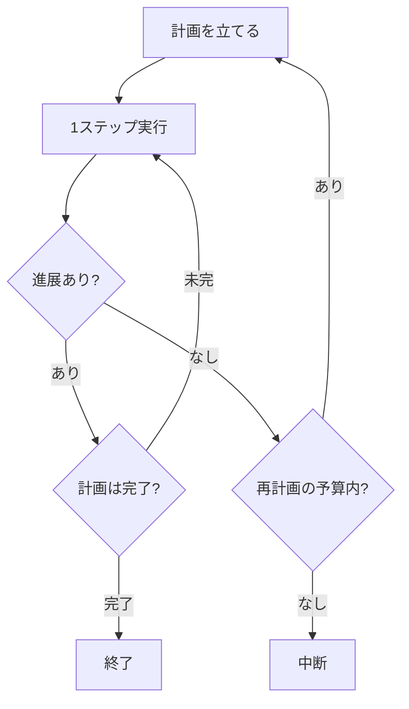

## このセクションで学ぶこと

- 暴走を「止める」だけでなく「立て直す」選択肢があること
- 計画を持つことで進展を測れ、再計画で停滞から抜けられること
- 再計画もまた予算で縛らないと無限ループの温床になること

## 止めるか、立て直すか

ここまでは、暴走したエージェントを「止める」設計を見てきました。しかし無限ループや停滞を検知したとき、選択肢は止めることだけではありません。もう一つ、**立て直す(再計画する)** という道があります。

たとえば同じ検索を 3 回繰り返して進展がない、と検知したとき。単に中断して終わるのではなく、「今のやり方では進めない」とモデルに突きつけ、別のアプローチを考えさせます。うまくいけばエージェントは行き詰まりから抜け出し、タスクを最後までやり遂げます。止めるのは安全策、立て直すのは回復策で、両者は補い合います。

ただし立て直しには前提があります。**何をもって「進んでいない」と判断するか** の基準がなければ、立て直すタイミングも分かりません。その基準になるのが計画です。

## 計画があると進展が測れる

計画とは、ゴールに至る手順をあらかじめステップに分解したものです。「データを集める → 集計する → レポートにする」のように先に道筋を持たせておくと、harness は「今どのステップにいるか」「前回からステップが進んだか」を観測できます。計画上のステップが何周経っても消化されないなら、それは停滞のサインです。

進展があれば計画を進め、完了なら終了します。進展がなければ、すぐ中断するのではなく再計画にまわす余地を作ります。計画を持つことの本質は、賢く動くこと自体より、**「進んでいない」を測れるようにすること** にあります。

## 再計画も予算で縛る

注意点は重要です。再計画は停滞からの回復策ですが、**無制限に許すと新たな無限ループになります**。立て直しては失敗し、また立て直しては失敗する、という上の階層でのループです。検知をすり抜けるパターンが、再計画というもっともらしい衣をまとって戻ってくる、と考えてください。

ですから再計画にも上限を引きます。「再計画は最大 2 回まで」「再計画してもステップ総数の予算は据え置き」のように、前のセクションの予算の考え方をそのまま一段上の階層にも適用します。フローチャートで再計画の前に「再計画の予算内?」という分岐を置いたのはそのためです。回復のチャンスを与えつつ、それ自体が暴走しないよう天井をかける。これが「迷ったら立て直す」を安全に実装する勘所です。

立て直す力は強力ですが、止める設計の上に乗って初めて安全になります。回復策は安全策を置き換えるものではなく、その内側に収めるものだと覚えておいてください。

## まとめ

- 停滞を検知したら、止めるだけでなく再計画で立て直す回復策もある。
- 計画を持つ本質は、賢さより「進展しているか」を測れるようにすること。
- 再計画は無制限だと上位の無限ループになるため、回数や総予算で必ず縛る。
