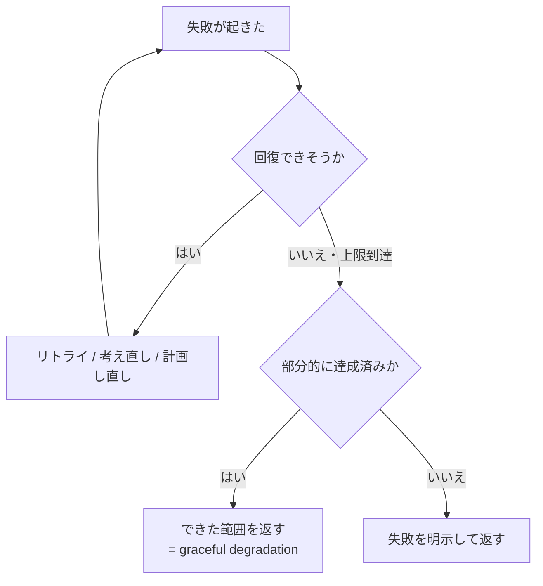

## このセクションで学ぶこと

- どうしても回復できない失敗があり、そのときは「諦め方」も設計しておく
- 全部を投げ出すのではなく、できた範囲を残して返すのが graceful degradation
- いつ諦め、それをどう呼び出し元へ伝えるかが harness の責務

## 回復できない失敗もある

ここまで、失敗を分類し(02-01)、安全にリトライし(02-02)、エラーから学ばせる(02-03)方法を見てきました。しかし、これらを尽くしても回復できない失敗は残ります。外部 API がずっと落ちている、必要な権限が最後まで得られない、何度考え直しても同じ壁に当たる——こうしたとき、エージェントを延々と粘らせるのは前章のループ制御に反します。予算も時間も無限ではありません。

だからエラー回復の最後のピースは、**きれいな諦め方**です。回復を試みるだけでなく、「ここで打ち切る」境界と「打ち切ったあと何を返すか」を決めておく必要があります。

## 全か無かにしない — graceful degradation

諦めるといっても、すべてを投げ出してエラーで終わるのが唯一の選択肢ではありません。多くのタスクは複数の小さな成果の集まりです。10 件のうち 8 件は取得できて、2 件だけ外部障害で取れなかったのなら、**取れた 8 件を返す**ほうが、全体を失敗扱いで捨てるより役に立ちます。

これが **graceful degradation(優雅な劣化)** です。一部が壊れても全体を落とさず、できた範囲で価値を返す。完全な結果が理想ですが、それが無理なときに **部分的成功** へ切り替えられることが、壊れても使い続けられる harness の条件です。

身近な例で言えば、検索ツールが落ちたときに「検索できないので何もできません」と止まるのではなく、すでに手元にある情報だけで暫定の答えを出す、といった振る舞いです。代替手段に切り替える、優先度の高い項目だけ先に片付ける、精度を落としてでも応答を返す——いずれも「できることを最大限やって、できないところは切り離す」という同じ発想です。理想の結果と現実に出せる結果の差を、エラーではなく劣化として扱うのがコツです。

## 諦めたことを正しく伝える

部分的成功で気をつけたいのは、**劣化を黙って隠さない**ことです。8 件返したなら「10 件中 8 件。2 件は外部障害で取得できず」と、達成できた成果と未達の事実を併せて伝えます。これを伝えないと、呼び出し元(人間でも別のエージェントでも)は不完全な結果を完全だと誤解し、誤った判断につながります。

諦めの境界は、前章で学んだリトライ上限・予算・期限で定めます。境界に達したら劣化モードへ切り替え、「どこまでできて、何を諦めたか」をコンテキストや返り値に残す。02-03 で扱った「失敗を残す」考え方は、諦めたあとの報告にもそのまま生きます。

## まとめ

- 回復できない失敗は残るので、打ち切る境界と諦め方をあらかじめ設計しておく
- 全か無かにせず、できた範囲を返す graceful degradation が壊れても使える harness をつくる
- 諦めたことは隠さず、達成した成果と未達の事実を呼び出し元へ正しく伝える
