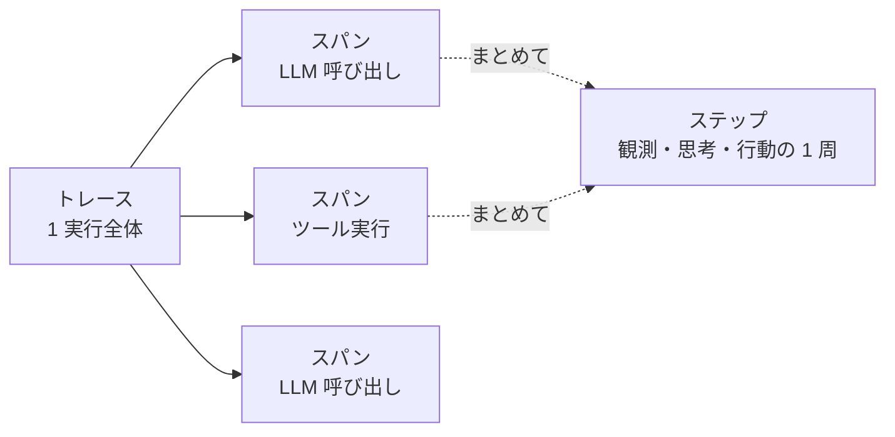
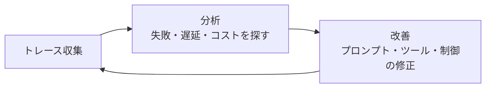

## このセクションで学ぶこと

- エージェントの実行をトレース・スパン・ステップの階層で捉える
- 各ステップで「入力・判断・出力」を記録しないと後から追えない
- 観測はトレース収集→分析→改善のパイプラインとして回す

## なぜ「記録」から始めるのか

この章のタイトルは「見えないものは直せない」です。エージェントは LLM が次の一手を決め、ツールを呼び、その結果を見てまた考える、というループを自分で回します。人間が一手ずつ指示していないぶん、何が起きたのかは実行が終わったあとには手元に残りません。バグが出ても「さっき何を考えてそのコマンドを打ったのか」を再現できなければ、直しようがないのです。だから回復(02 章)や制御(01 章)の前に、まず**起きたことを残す**仕組みが要ります。

foundations で学んだ harness の 5 要素のうち「観測」は、エージェント自身が環境を観測することを指しました。ここで扱う観測はその外側、つまり**わたしたち開発者がエージェントを観測する**話です。Claude Code がツール呼び出しを 1 件ずつ画面に出していたのも、人間向けの観測の一形態でした。

## トレース・スパン・ステップの三層

記録は粒度の違う三層で整理すると見通しがよくなります。

- **トレース**は 1 回の実行全体です。「ユーザーがこう頼んでから、ゴールに着くまで」を 1 本にまとめます。
- **スパン**はその中の個々の作業区間です。LLM へのリクエスト 1 回、ファイル読み取り 1 回などが、それぞれ開始時刻と終了時刻を持つスパンになります。
- **ステップ**はエージェントループの 1 周にあたり、人間が「ここで何を判断したか」を追う単位です。

各スパンには最低限、**入力・判断(モデルの出力やツールの引数)・出力(結果)** を残します。これがないと、後から「なぜこの API を叩いたのか」が永遠に分からなくなります。

## 観測はパイプラインで回す

記録は貯めるだけでは意味がありません。**集める → 分析する → 改善する**の流れに乗せて初めて効きます。

たとえば「ツール呼び出しの引数が毎回少しずつ違って失敗している」と分析で気づけば、プロンプトを直す改善につながり、その効果がまた次のトレースに表れます。05 節で扱う「harness を育てる」も、結局はこのループの話です。

## 注意点

すべてを記録しようとすると、ログにパスワードや個人情報まで残ってしまいます。**何を残し、何を伏せるか**は最初に決めておきましょう。また、トレースに ID を振っておかないと、並行して動く複数の実行が混ざって読めなくなります。

## まとめ

- エージェントの実行はトレース(全体)→スパン(作業区間)→ステップ(ループ 1 周)の三層で記録する。
- 各区間で入力・判断・出力を残さないと、非決定なバグは後から追えない。
- 観測は収集→分析→改善のパイプラインとして回して初めて価値が出る。
