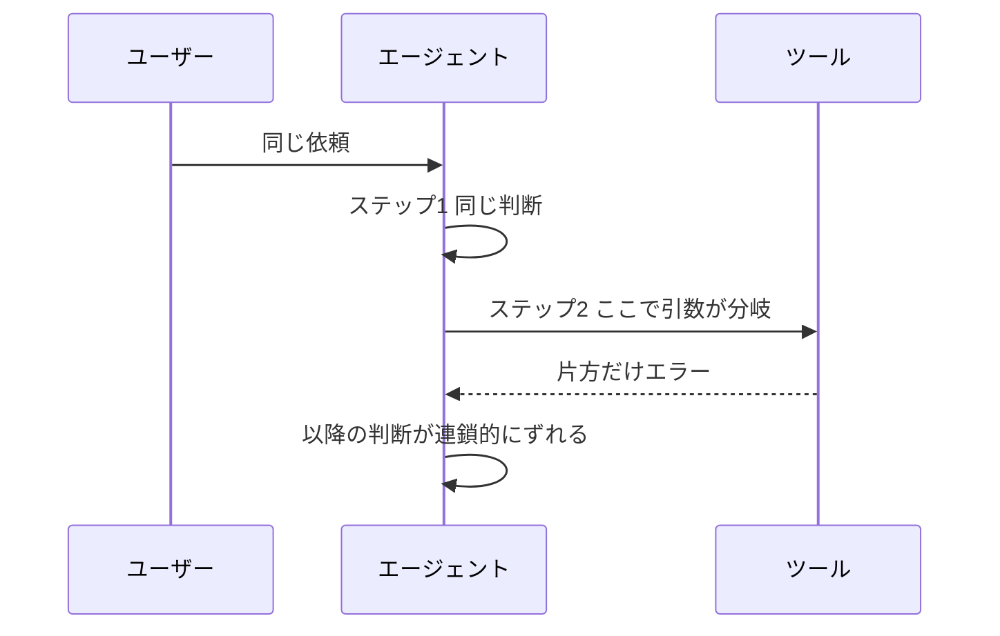

## このセクションで学ぶこと

- LLM の非決定性ゆえに同じ入力でも結果が変わることを理解する
- 再現できないバグは「条件を固定して再現性を上げる」発想で攻める
- トレースを起点に、どのステップで分岐したかを切り分ける

## 同じことをしても結果が変わる

ふつうのプログラムは、同じ入力なら同じ出力を返します。だからバグは「再現 → 観察 → 修正」の手順で潰せました。ところがエージェントの中心にいる LLM は**非決定的**です。次の語をサンプリング(確率的に選択)で決めるため、まったく同じプロンプトでも、あるときは正しいツールを呼び、あるときは別のツールを呼ぶ、ということが起こります。

ai-agent-roadmap で触れたハルシネーションも、この非決定性と地続きです。「昨日は動いたのに今日は動かない」を引き当てたとき、コードを何度見返しても原因が見つからないのは、原因がコードではなく**モデルの揺れ**にあるからです。

## 再現性を上げてから攻める

再現できないバグは、いきなり直そうとせず、まず**再現性を上げる**ことから始めます。揺れを生む要素を 1 つずつ固定していくのです。

```text
ばらつきを抑える主なつまみ
  temperature を下げる   → 出力が決まった方向に寄る
  シードを固定する        → サンプリングの揺れをそろえる
  入力(コンテキスト)を固定 → 同じ履歴・同じツール結果を渡す
```

温度を下げ、シードをそろえ、渡すコンテキストを固定すれば、揺れはかなり減ります。それでも再現するなら原因はプロンプトやツール設計にあり、固定したら消えるなら原因はモデルの揺れそのものです。この**切り分け**ができるだけで、打ち手は大きく変わります。

## トレースで分岐点を探す

再現性を上げたうえで頼るのが、前節のトレースです。失敗した実行と成功した実行のトレースを並べ、**どのステップから振る舞いが分かれたか**を探します。



多くの場合、最初の分岐は早い段階で起きていて、そこから連鎖的にずれていきます。最後の派手なエラーではなく、**一番上流の分岐点**を見つけることがデバッグの勘所です。

## 注意点

非決定性を完全に消すことはできませんし、消すべきでもありません。多様な出力こそが LLM の強みでもあるからです。狙うのは「ゼロにする」ことではなく、**原因を切り分けられるところまで揺れを抑える**ことです。本番では温度を上げて運用しつつ、デバッグ時だけ固定する、という使い分けが現実的です。

## まとめ

- LLM は非決定的なので、同じ入力でも結果が変わりうる。
- 再現できないバグは温度・シード・入力を固定し、再現性を上げてから攻める。
- 成功と失敗のトレースを並べ、連鎖の起点となる上流の分岐点を探す。
