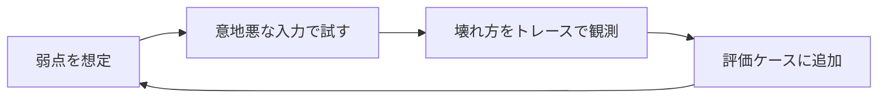

## このセクションで学ぶこと

- 評価セットで「壊れ方」を本番前に先取りする意義を理解する
- レッドチーミングは観測・評価の視点で弱点を洗い出す営みだと捉える
- 回帰を防ぐため、見つけた失敗を評価ケースとして残す

## 観測の前倒し — 壊れる前に壊し方を知る

ここまでの 2 節は「起きてしまったこと」を後から観測する話でした。この節は逆に、**本番で壊れる前に、自分で壊して観測する**話です。非決定なエージェントは「動くときは動く」ので、たまたまうまくいったデモを見て安心しがちです。しかし運用で効くのは、うまくいくケースの数ではなく、**どこで・どう壊れるかを把握できているか**です。

design カリキュラムでは、権限やガードレールで「壊れないように守る」防御設計を学びました。この節はその裏側、つまり**守りが効いているかを観測・評価で確かめる**視点に立ちます。守りを作ることと、守りの穴を測ることは別の仕事です。

## 評価セットで品質を測り続ける

評価セット(eval)は、入力と「こう振る舞ってほしい」をペアにしたテスト集合です。プロンプトを変えた、ツールを足した、モデルを上げた——そのたびに評価セットを通せば、**変更が品質を上げたか下げたかが数字で見えます**。

```text
評価ケースの例(概念)
  入力:  「先月の売上を要約して」
  期待:  売上ツールを呼ぶ / 数字を捏造しない / 取得失敗時は正直に報告
```

LLM の出力は揺れるので、1 回通って合格ではなく、複数回・複数ケースで通過率を見るのがコツです。非決定性(前節)を逆手に取り、「だいたい何割成功するか」を品質の指標にします。

## レッドチーミングで弱点を洗い出す

レッドチーミングは、あえて意地悪な入力や想定外の状況を投げて、**壊れ方を先取りする**活動です。観測の視点で言えば、評価セットを「ふつうの依頼」から「困った依頼」まで広げる営みです。



たとえば「曖昧で矛盾した指示」「ツールがエラーを返し続ける状況」「やってはいけない操作への誘導」などを与え、エージェントが**踏みとどまれるか・暴走しないか**を確かめます。ここで大事なのは、攻撃の手口そのものを磨くことではなく、観測を通じて**自分のシステムの穴を知り、塞ぐ**ことです。

## 注意点

見つけた失敗は、その場で直して終わりにせず、**必ず評価ケースとして残します**。残さないと、別の変更の副作用で同じ不具合がぶり返す回帰が起きます。評価セットは「過去に踏んだ地雷の地図」として育てていくものです。また、評価で測れるのは想定した壊れ方だけなので、本番の観測(次節)と両輪で回す前提を忘れないでください。

## まとめ

- 評価セットは変更のたびに通し、品質の上下を通過率で測る道具。
- レッドチーミングは意地悪な入力で壊れ方を先取りし、観測で穴を見つける営み。
- 見つけた失敗は評価ケースに残し、回帰を防ぐ地図として育てる。
