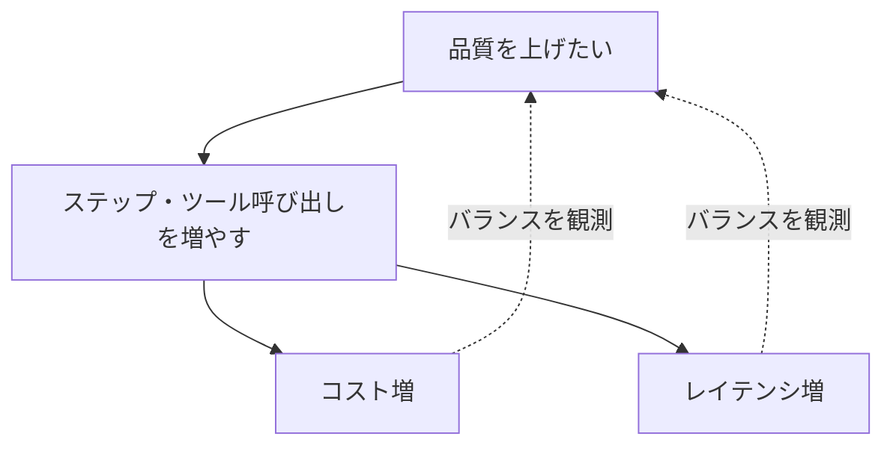

## このセクションで学ぶこと

- 本番のエージェントはコスト・レイテンシ・品質の三つを継続的に観測する
- 平均値だけでなく分布と外れ値を見ないと事故を見落とす
- しきい値を決めてアラートにつなぎ、悪化に気づける状態をつくる

## 本番では「三つの軸」を同時に見る

ここまでの節は、開発やデバッグの場面での観測でした。この節は本番、つまり**実際のユーザーがエージェントを使い続けている状態**での観測です。本番で見るべき軸は大きく三つあります。**コスト**(いくらかかっているか)、**レイテンシ**(どれだけ待たせているか)、**品質**(役に立っているか)です。

エージェントはループを回し、何度も LLM を呼ぶため、この三つは互いに引っ張り合います。ステップを増やせば品質は上がるかもしれませんが、トークン消費が増えてコストもレイテンシも悪化します。一つだけ見ていると、知らないうちに別の軸が崩れます。



## 平均ではなく分布を見る

本番の観測でいちばんやりがちな失敗が、**平均だけを見る**ことです。「平均レイテンシ 5 秒」は健全に見えても、その裏で 100 回に 1 回 60 秒待たされているユーザーがいるかもしれません。エージェントは非決定なので、たまにループが伸びて極端に遅い・高い実行が混じります。

```text
レイテンシの見方(概念)
  平均        : 全体のざっくりした傾向
  p50(中央値) : ふつうのユーザーの体感
  p95 / p99   : 「いちばん困っている人」の体感
```

平均ではなく **p95・p99 といったパーセンタイル**で外れ値を見ると、まれだが深刻な悪化に気づけます。コストも同じで、平均トークン消費の裏に「コンテキストが膨らみ続けて暴走した 1 実行」が隠れていることがあります。01 章の予算による上限は、まさにこの外れ値を抑える仕掛けでした。

## 品質はプロキシ指標で追う

品質は数字にしにくい軸ですが、近い指標(プロキシ)で代用できます。ツール呼び出しの**成功率**、ユーザーがやり直した**再依頼率**、タスクの**完了率**などです。これらが時間とともに悪化していれば、モデルの変更や入力傾向の変化を疑うきっかけになります。

## 注意点

観測は「ダッシュボードを眺める」だけでは不十分です。人は四六時中グラフを見ていられないので、**しきい値を決めてアラートにつなぐ**必要があります。「p95 レイテンシが 30 秒を超えたら通知」「1 時間あたりのコストが想定の 2 倍になったら通知」のように、悪化を自動で拾える状態にしておきましょう。ただしアラートを細かくしすぎると慣れて無視するようになるので、本当に対応が要る事象だけに絞るのがコツです。

## まとめ

- 本番はコスト・レイテンシ・品質の三軸を、互いの綱引きとして同時に観測する。
- 平均ではなく p95・p99 など分布の裾を見て、まれで深刻な外れ値を捉える。
- しきい値とアラートで悪化に自動で気づける状態をつくり、過剰通知は避ける。
