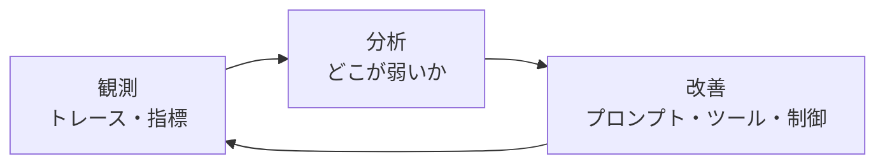

## このセクションで学ぶこと

- 観測は改善につながって初めて価値を持つことを理解する
- 観測→分析→改善のループで harness を一度きりでなく育て続ける
- 制御・回復・観測の三つが噛み合って「壊れない自律」になると捉える

## 観測は改善のためにある

ここまで、何を記録し(03-01)、非決定なバグをどう追い(03-02)、壊れ方を先取りし(03-03)、本番で何を見るか(03-04)を見てきました。最後に押さえたいのは、**観測そのものは目的ではない**ということです。トレースをいくら貯めても、ダッシュボードをいくら眺めても、そこから手を入れなければ何も変わりません。観測は、次の一手を決めるための材料にすぎないのです。

## harness は育てるもの

エージェントの harness は、一度組んだら完成、というものではありません。モデルは更新され、ユーザーの使い方は変わり、新しい壊れ方が現れます。だから harness は、運用しながら**少しずつ直し続ける**前提でつくります。この、観測をもとに手を入れ続ける営みを**継続的改善**と呼びます。観測で見つけた失敗を評価ケースに足し(03-03)、外れ値を予算で抑え(01 章)、回復の手筋を増やす(02 章)——この積み重ねが、harness を強くしていきます。

## 三つの輪が噛み合って「壊れない自律」になる

このカリキュラム全体を振り返ると、**制御(止める)・回復(立て直す)・観測(見る)** の三つを扱ってきました。どれか一つでは足りません。観測がなければ何を直すか分からず、回復がなければ一度の失敗で止まり、制御がなければ暴走します。三つが噛み合って初めて、自律は「壊れても立て直せる」状態になります。完璧な自律を一度で作ろうとせず、観測を起点に育て続けることが、現実的な「壊れない自律」への道です。

## まとめ

- 観測は改善の材料であり、手を入れて初めて価値が出る。
- harness は作り切りでなく、観測→分析→改善のループで育て続けるもの。
- 制御・回復・観測の三つが噛み合って「壊れない自律」が成り立つ。
