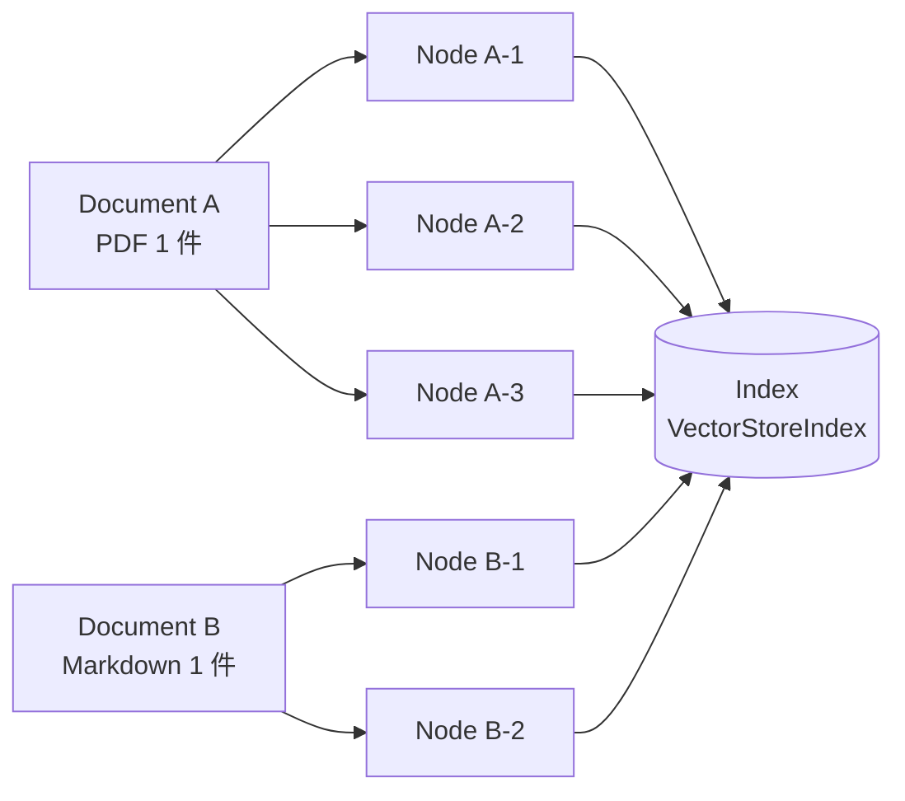

## このセクションで学ぶこと

- Document・Node・Index の役割の違いを説明できる
- Node が持つメタデータと関係情報がなぜ重要かを理解する
- データモデルを意識した実装が後段の精度に効く理由を掴む

## 3 つの抽象を地図にする

LlamaIndex のデータモデルは、`Document` → `Node` → `Index` の 3 階層で考えると整理がつきます。`Document` は **取り込んだ生データ 1 件**、`Node` は **検索可能な最小単位(チャンク)**、`Index` は **Node 集合を問い合わせ可能にした構造体** です。多くの初学者が「Document を直接ベクトル化していると思ってしまう」のですが、実際には Document をいったん Node に分割し、その Node に対して埋め込みを付け、Index に格納するという段取りになっています。



この階層を意識すると、後段の動作がぐっと予測しやすくなります。検索でヒットするのは **Node** であって Document ではありません。LLM に渡されるコンテキストも Node のテキストです。つまり「どこで分割するか」「Node にどんなメタデータを残すか」が、回答精度を実質的に決めると言っても過言ではありません。

## メタデータと関係情報の力

`Node` は単なる文字列ではなく、**メタデータと Node 間の関係情報** を持てる点が大事です。LlamaIndex 0.10 系では `TextNode` に `metadata` 辞書を、`relationships` に「前の Node」「次の Node」「親の Document」などのリンクを持たせられます。

```python
from llama_index.core.schema import TextNode, NodeRelationship, RelatedNodeInfo

node = TextNode(
    text="RAG は外部知識を検索して回答に組み込む手法です。",
    metadata={"source": "rag-intro.md", "section": "概要", "tags": ["rag"]},
)
node.relationships[NodeRelationship.SOURCE] = RelatedNodeInfo(node_id="doc-001")
```

メタデータは 3 つの実務的な効果を生みます。**第一に出典の追跡**で、回答に「出典: rag-intro.md」と添えるのに使えます。**第二に検索フィルタ**で、たとえば「`tags=rag` の Node に絞って検索」のように事前条件を絞れます。**第三に Node 同士の関係**で、ヒットした Node の前後文脈を補足したり、親 Document に戻して全文を取り出したりできます。この「関係を辿れる」性質が、後の Ch02 で扱う Parent-Child Chunking のような高度な技法の土台になります。

## 具体例と注意点

例として、社内マニュアル(数百ページ)を取り込むケースを考えます。Document はマニュアル全体ではなく **ページ単位や見出し単位で分けて取り込む** のがよく、メタデータには「マニュアル名・章番号・更新日」を残します。これによりユーザーが「最新版のマニュアルから答えて」と要求したときに、`updated_at` でフィルタしてから検索する設計が成り立ちます。

注意点としては、**メタデータを盛りすぎないこと**。Node のメタデータは多くの場合 LLM に渡すプロンプトにも入るため、不要な情報まで詰め込むとトークンを浪費し、ノイズで回答精度が下がります。LlamaIndex には `excluded_llm_metadata_keys` / `excluded_embed_metadata_keys` というフィールドがあり、「LLM には見せないが検索フィルタには使う」といった切り分けも可能です。最初から細かく設定する必要はありませんが、メタデータが増えてきたら使い分けを思い出してください。

## まとめ

- データは **Document → Node → Index** の階層で流れ、検索の単位は Node。
- Node の **メタデータと関係情報** が出典表示・フィルタ・文脈補足の土台になる。
- 盛りすぎは逆効果。LLM に見せる情報と検索だけに使う情報を分ける発想を持つ。
