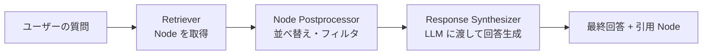

## このセクションで学ぶこと

- Query Engine が内部で行う検索 → 後処理 → 生成の流れを説明できる
- Node Postprocessor の役割と代表例を把握する
- 高レベル API と低レベル組み立ての使い分けを判断できる

## Query Engine は「検索 → 後処理 → 生成」のパイプライン

`index.as_query_engine().query(...)` は 1 行ですが、その中では **3 ステップのパイプライン** が走っています。検索(Retriever)、後処理(Node Postprocessor)、生成(Response Synthesizer)です。この構造を理解すると、「精度が出ない」「コンテキストが長すぎる」「重複が出る」といった現象に対して **どの段で手を入れるべきか** を切り分けられるようになります。



中段の **Node Postprocessor** が初学者には見落とされがちですが、ここが効くかどうかで品質が変わります。検索でヒットした 10 件の Node をそのまま LLM に渡すのではなく、「類似度が低いものを捨てる」「重複や冗長なものをまとめる」「Re-ranking モデルで並べ替える」といった処理を挟めるのが Postprocessor の役割です。

## 具体例 — 低レベル組み立てで挙動を制御する

`as_query_engine()` だけだと内部が見えないので、明示的に組み立てて挙動を制御してみます。

```python
from llama_index.core import VectorStoreIndex
from llama_index.core.query_engine import RetrieverQueryEngine
from llama_index.core.postprocessor import SimilarityPostprocessor
from llama_index.core.response_synthesizers import get_response_synthesizer

index = VectorStoreIndex.from_documents(documents)

retriever = index.as_retriever(similarity_top_k=10)

# 類似度 0.7 未満の Node を捨てる
postprocessor = SimilarityPostprocessor(similarity_cutoff=0.7)

synthesizer = get_response_synthesizer(response_mode="compact")

query_engine = RetrieverQueryEngine(
    retriever=retriever,
    node_postprocessors=[postprocessor],
    response_synthesizer=synthesizer,
)

response = query_engine.query("Sentence Splitter と Token Splitter の違いは?")
print(response)               # 回答テキスト
print(response.source_nodes)  # 引用元の Node 群
```

ポイントは `top_k=10` で **広めに拾ってから Postprocessor で絞る** という流れです。最初から `top_k=3` にすると取りこぼしが起こりやすく、`top_k=10` で広めに拾って類似度 0.7 で足切りした方が、結果的に高品質な 3〜5 件が残ります。「拾う段は緩く、絞る段は厳しく」がよくある定石です。

代表的な Postprocessor には次のものがあります。

- `SimilarityPostprocessor`: 類似度の閾値で足切り
- `KeywordNodePostprocessor`: 必須/禁止キーワードで Node を絞る
- `LLMRerank` / `SentenceTransformerRerank`: 別モデルで並べ替える(Re-ranking、Ch02 で詳細)
- `MetadataReplacementPostProcessor`: Sentence-Window 用に Node の文脈を膨らませる

## 注意点 — 高レベル API は出発点

`as_query_engine()` は手早く動作確認するには便利ですが、本番品質を出すには **Postprocessor を一つも挟まない構成は不利** だと思っておいてください。最低でも `SimilarityPostprocessor` を入れて閾値を設定するだけで、出典のない作り話のような回答が目に見えて減ります。

もう一つの注意は、`response.source_nodes` を **必ず UI に出す** ことです。RAG の信頼性は「どの Node から答えたか」を見せられるかにかかっています。Query Engine は引用元を保持しているのに、UI で捨ててしまっては元も子もありません。次節の Response Synthesizer はこの引用情報の扱い方にも関係してきます。

## まとめ

- Query Engine は **Retriever → Postprocessor → Synthesizer** の 3 段パイプライン。
- 「広く拾って厳しく絞る」が定石。`SimilarityPostprocessor` から導入する。
- 高レベル API は出発点。`source_nodes` は必ず引用として UI に露出する。
