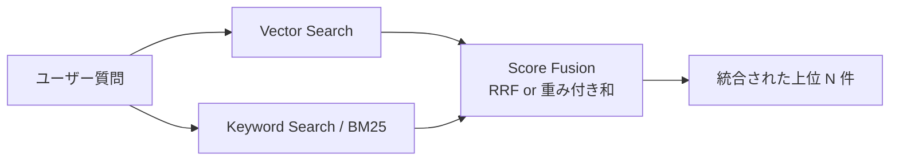

## このセクションで学ぶこと

- ベクトル検索とキーワード検索が得意とする質問の種類が異なる理由を説明できる
- スコア統合の代表手法である RRF と重み付き和の使い分けを判断できる
- Hybrid Search が逆効果になるケースを見抜ける

## なぜ片方だけでは取りこぼすのか

前章で学んだベクトル検索は、意味の近さで文書を引っ張ってくる強力な手法でした。「退会方法を知りたい」というクエリで「解約のお手続き」という別表現の文書も拾えるのは、埋め込みが意味空間上で近い位置にあるからです。一方で、ベクトル検索は **固有名詞・型番・エラーコード・略語** といった「意味は薄いが文字列の一致が重要」な情報には弱いという性質があります。`ERR_CONN_RESET` のような識別子は、埋め込みに乗りにくく、近傍が「他のエラーコード」になりがちで肝心の文書を取りこぼします。

逆に、BM25 を代表とするキーワード検索は文字列一致に強い反面、表現揺れに弱いという特徴があります。「退会」と「解約」は別語として扱うため、辞書を持たない限り取りこぼします。

Hybrid Search は、この **得意領域がほぼ補完関係にある** ことを利用して両方を走らせ、結果を統合する技法です。意味で当てるベクトル側と、字面で当てるキーワード側の「両方の上位に出てくる文書」が一段強くなり、片方からしか出ない文書も救えるので、平均的な Recall(取りこぼし率の低さ)が改善します。



## スコア統合の2つの定番

統合方式で最初に覚えるべきは次の2つです。

**RRF (Reciprocal Rank Fusion)** は、各検索器の **順位** だけを使って `score = Σ 1 / (k + rank)`(`k` は通常 60)を足し合わせます。スコアのスケールが検索器ごとに違っても影響を受けない頑健さが特徴で、チューニング項目が `k` だけなので最初に試す既定値として優秀です。

**重み付き和** は、各検索器のスコアを 0-1 に正規化してから `α * vector_score + (1-α) * bm25_score` のように足します。「うちのドメインではキーワードを強めにしたい」といった調整がしやすい反面、スコアのスケールや分布がクエリごとに変動するので、本番では正規化の方法に注意が必要です。

```python
# 擬似コード: RRF
def rrf(rank_lists, k=60):
    scores = {}
    for ranks in rank_lists:           # ranks = [doc_id, doc_id, ...]
        for r, doc_id in enumerate(ranks, start=1):
            scores[doc_id] = scores.get(doc_id, 0) + 1 / (k + r)
    return sorted(scores.items(), key=lambda x: -x[1])
```

## 効くケース・効かないケース

Hybrid が効きやすいのは、**固有名詞や ID と自然文が混じる FAQ・サポート文書・社内ナレッジ**、**製品マニュアル**、**法令・契約書のように用語が固定された文書** です。検索クエリの中に「型番 + 症状」のように字面と意味が両方含まれるケースで威力を発揮します。

逆に効きにくい、あるいは逆効果になるのは次のような場合です。第一に、**コーパスが小さくキーワードのバリエーションが乏しい場合**。BM25 側がほとんど何も返さず、ベクトル側のノイズだけ拾ってしまいます。第二に、**会話の言い換えが極端に多いユースケース**(例: カウンセリング Bot)。BM25 が表現揺れを取りこぼし、その低品質結果が統合で混ざることでベクトル単独より精度が落ちることがあります。第三に、**そもそも上位の検索結果が安定して正しい状態**。ここで Hybrid を入れても改善幅は小さく、運用コストだけ増えます。

「とりあえず Hybrid を入れる」という判断ではなく、**ベクトル単独の失敗事例を集めてから** 入れるべきかを決めるのが実務的な順序です。

## まとめ

- ベクトル検索は意味、キーワード検索は字面に強く、両者は補完関係にある
- 統合は RRF から試し、必要に応じて重み付き和でドメイン調整する
- 失敗事例を見ずに導入すると、ノイズ混入で逆効果になることがある
