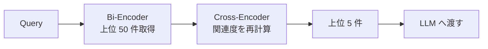

## このセクションで学ぶこと

- 2段階検索の発想と、Re-ranker が解いている問題を説明できる
- Cross-Encoder と LLM as Reranker のコスト・精度の違いを判断できる
- Re-ranker が効かない / 入れない方がよい局面を見抜ける

## なぜ「取得 → 並べ替え」の2段階にするのか

ベクトル検索の正体は、独立にベクトル化されたクエリと文書のコサイン類似度です。クエリと文書を**別々**に埋め込んでから比較するこの方式は **Bi-Encoder** と呼ばれ、事前に全文書を埋め込んでおけるため数百万件のコーパスに対しても高速に動作します。ただし、Bi-Encoder は「クエリと文書をまとめて読んで判断する」ことができないため、語感は似ているが意図がずれている文書を上位に出してしまう失敗をよく起こします。

そこで登場するのが **Cross-Encoder** です。クエリと文書を `[CLS] query [SEP] document` のように連結して1つのモデルに入れ、両者の関係を直接スコア化します。文脈の相互作用を捉えられるため精度は格段に高い反面、**毎回クエリと文書の組ごとに推論が必要**で、数百万件をこれで処理するのは現実的ではありません。

ここから自然に導かれる戦略が、**Bi-Encoder で広く粗く取り、Cross-Encoder で狭く精密に絞る**「2段階検索」です。例えば「ベクトル検索で上位 50 件 → Cross-Encoder で上位 5 件に絞る」という構成にすれば、計算量を抑えつつ最終的な上位の精度を大きく上げられます。



## 実装の選択肢

実務でよく使う Re-ranker は次の3系統です。

第一に **専用 Cross-Encoder モデル**。`bge-reranker` や `cohere-rerank` が代表で、APIまたは自前ホストで使えます。Latency は数十〜数百 ms 程度で、精度は安定しています。最初に試す既定値として優秀です。

第二に **LLM as Reranker**。GPT-4 系などに「次の文書のうちクエリへの関連が高い順に並べ替えて」とプロンプトする方式。精度上限は高いですが、コストとレイテンシが跳ね上がります。**人手で評価したい難問のオフライン分析**や、**最終 1-2 件を選ぶ仕上げの段階** で使うのが現実的です。

第三に **メタデータ・ビジネスルールによる加点**(更新日が新しい / 著者が公式 / セクションタグの一致など)。学習済みモデルではなく決定論的に並べ替えるため、ドメイン要件を確実に反映できます。Cross-Encoder のスコアと最終的に加重平均することも多いです。

```python
# 擬似コード: 2段階検索
candidates = vector_retriever.retrieve(query, top_k=50)
scored = [(doc, reranker.score(query, doc.text)) for doc in candidates]
top = sorted(scored, key=lambda x: -x[1])[:5]
```

## 効くケース・入れない方がよいケース

Re-ranker が大きく効くのは、**候補の中に正解が含まれているが順位が低いとき** です。Recall は十分なのに上位が誤答というケース、つまり「絞り込みの精度」が課題のときに導入する価値があります。

逆に、**そもそも候補に正解が含まれていない**ときは Re-ranker をいくら強化しても解決しません。この場合は Recall を上げる施策(Hybrid Search、Multi-Query、チャンキング見直しなど)を先に打つべきです。Re-ranker は「順位の問題」を解く道具で、「取りこぼしの問題」は解けないと覚えておくと判断を間違えにくくなります。

また、**応答までの latency が厳しいリアルタイム用途**では Cross-Encoder の推論時間が支配的になり、ユーザー体験を損なうことがあります。この場合は top_k を小さくする、軽量モデルを選ぶ、ストリーミングで先に生成を開始するなどの設計上の妥協が必要です。

## まとめ

- Bi-Encoder で広く取り、Cross-Encoder で精密に並べ替えるのが Re-ranking の基本形
- まず専用 Cross-Encoder、難所だけ LLM、ドメイン要件はメタデータで補う
- Re-ranker は「順位の問題」専用で、Recall 不足は別技法で解消する
