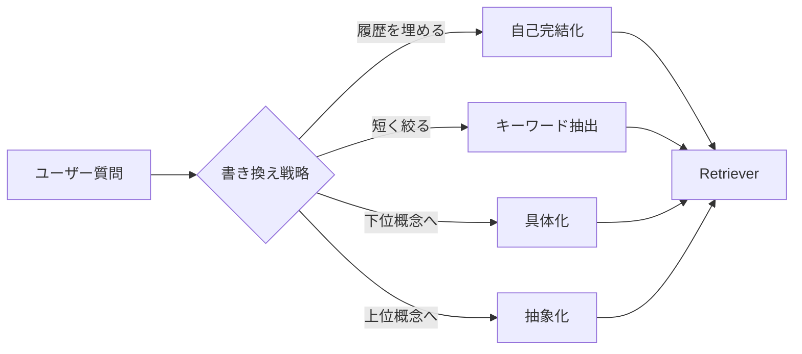

## このセクションで学ぶこと

- 質問の書き換えが検索精度を上げる理由を、埋め込みとキーワードの両面で説明できる
- 抽象化・具体化・キーワード抽出・会話履歴の取り込みなど代表的な書き換え戦略を選び分けられる
- 書き換えが副作用を生む典型パターンを認識できる

## ユーザー質問は「検索しづらい形」で来る

実際のユーザー質問を観察すると、検索には不向きな形が頻繁に現れます。「これってどうすればいい?」のような **代名詞だけで対象が抜けた質問**、「えーっと、昨日見たエラー」のような **省略・口語混じり**、「最新の API で〇〇したいんだけど、前は××で動いたんだよね、でも今は…」のような **複数の意図が混じった長い文**。これらをそのまま埋め込んでもベクトル空間で意味が散らかり、BM25 にとっても無関係な単語が多すぎてノイズになります。

Query Rewriting は、**retriever に渡す前に LLM で質問を書き換える** という単純な発想で、この入力品質の問題を直接解決します。書き換えのコストは LLM 呼び出し1回分で済みますが、後段の検索品質が改善する効果は大きく、費用対効果の高い前処理です。

## 代表的な書き換え戦略

実務で頻出するパターンを4つ押さえておきます。

**(1) 自己完結化(decontextualization)**: 会話履歴を踏まえて、代名詞や省略を埋めた1文に書き換える。「これってどうすればいい?」→「LangGraph で Checkpointer を SQLite に切り替える設定方法」。マルチターン対話の RAG では事実上必須の前処理です。

**(2) キーワード抽出 / フレーズ化**: 質問から検索に効きそうな名詞句を抽出して短い検索クエリにする。BM25 と相性が良く、Hybrid Search の片側で使うと効果的です。

**(3) 具体化(下位概念への展開)**: 漠然とした質問を、ドメインの具体語に置き換える。「速くするには?」→「Vector Index のシャーディング、HNSW のパラメータチューニング、Re-ranker の top_k 削減」のように、関連しそうな具体語を含む文を生成します。

**(4) 抽象化(Step-back Prompting)**: 逆に、質問を一段上の概念に引き上げる。「pgvector でインデックスが遅い」→「ベクトル DB のインデックス設計の一般原則」。具体ピンポイントでは取りこぼす、解説型の上位文書を引っ張りたいときに効きます。

## どの戦略を選ぶか、何が落とし穴か

戦略選択の素朴な指針は次の通りです。**マルチターン対話**なら(1)は必ず入れる。**コーパスが用語固定の技術文書**なら(2)が安定。**ユーザーが初心者で抽象的な質問を投げる**システムなら(3)(4)を試す価値があります。複数の戦略を **同時に走らせて結果を Multi-Query で統合する** 構成(後述 02-06)も実用的です。

落とし穴も知っておきます。第一に、**書き換えで意図が変わる**事故。LLM が勝手に質問を「一般化しすぎる」「別の前提を仮定する」ことで、元の質問と無関係な検索が走ります。書き換え後のクエリを必ずログに残し、不一致を抽出する仕組みが必要です。第二に、**短い質問が長くなることでBM25 の精度が落ちる** ケース。BM25 は文書長と単語頻度のバランスで効くため、無駄な単語を足すと逆効果になります。第三に、**コストとレイテンシの増加**。書き換え用に毎回 LLM を呼ぶので、安価で速いモデルを別途用意する設計が現実的です。

## まとめ

- 質問の入力品質が低いから検索が外れる、と理解すると書き換えの価値が腑に落ちる
- 自己完結化・キーワード抽出・具体化・抽象化を、用途とコーパスで使い分ける
- 書き換えで意図がずれる事故を防ぐためログを残し、コスト管理も忘れない
