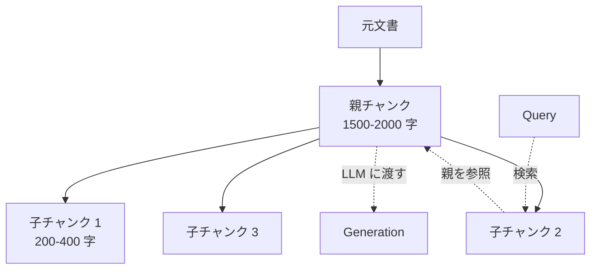

## このセクションで学ぶこと

- 検索精度と生成文脈の要求がトレードオフになる構造的理由を説明できる
- Parent-Child / Sentence-Window といった「単位を分ける」設計を選び分けられる
- チャンクサイズ調整との違いと、組み合わせ方の判断軸を持てる

## チャンクサイズに潜むトレードオフ

RAG のチャンクサイズには、根本的な葛藤があります。**検索精度を上げるには細かく区切りたい**。短いチャンクは焦点が絞られ、無関係な単語が混ざりにくいので埋め込みのノイズが減り、Cross-Encoder の判定も鋭くなります。一方で、**生成品質を上げるには大きな文脈を渡したい**。LLM は短いスニペットだけでは前後関係が読み取れず、「で、これって何の話?」という回答を返しがちです。

両者を同じチャンクサイズで満たそうとすると、必ずどちらかが犠牲になります。500 字なら検索は鋭いが文脈が薄い、2000 字なら文脈は豊富だが検索の焦点がぼやける。この板挟みを **「検索する単位」と「生成に渡す単位」を分けて持つ** ことで一気に解消するのが Parent-Child Chunking です。



子チャンク(短い・検索に最適)が retriever のヒット対象で、ヒットした子の **親(大きな文脈)を LLM に渡す**。これで「鋭く当てて、広く読ませる」が両立します。

## 代表的な構成パターン

**(1) Parent-Child の素朴形**: 親 = セクション全体、子 = セクション内を 200-400 字でスライド分割。子チャンクには parent_id を付与しておき、ヒット時に親を再構築します。

**(2) Sentence-Window Retrieval**: 子 = 1文、親 = ヒット文の前後 N 文。文単位で検索することで「キーワードを含む1文」をピンポイントで当て、その周辺を渡せます。FAQ や規約文書のように **1文で答えが書いてあるが、前提条件が前後に分散する** ケースに有効です。

**(3) 階層チャンキング(Hierarchical)**: 章 > セクション > 段落の3階層を持ち、検索クラスタごとに渡す階層を変える。長文ドキュメント(技術書・契約書)で力を発揮しますが、設計と運用の複雑度が上がります。

```python
# 擬似コード: Parent-Child の検索
hits = vector_index.search(query_embedding, top_k=10)  # 子チャンクが返る
parent_ids = {h.metadata["parent_id"] for h in hits}
parents = doc_store.get_many(parent_ids)               # 重複排除した親を取得
context = "\n\n".join(p.text for p in parents)
answer = llm.generate(prompt(query, context))
```

## チャンクサイズ調整との違い・組み合わせ方

「チャンクサイズを大きくすればいいのでは?」という疑問は当然出てきます。違いの本質は、**同じチャンクで検索 / 生成の両方をやろうとするか、別々にするか**です。サイズ調整は妥協のスイートスポット探しですが、Parent-Child は妥協ではなく **役割分担** です。

実務的な選び分けは次のように考えます。文書が短く均質(FAQ 集など)で、サイズを少し大きめにすれば両方の要求が満たせるなら、サイズ調整で十分です。文書が長く、構造化されている(マニュアル・論文・規約・コードベース)場合、Parent-Child を入れる価値が高くなります。

注意点も押さえておきます。第一に、**親を渡すと context が膨らみ、LLM のコストとレイテンシが増える**。複数の子がヒットして親が重複したり、巨大な親を複数渡すと容易に context window を圧迫します。重複排除と親サイズの上限管理が必要です。第二に、**親の境界が不適切だと「関係ない部分」も渡してしまう**。セクション分割が雑な文書では効果が出にくく、前処理での構造抽出が前提になります。第三に、**評価方法を更新する必要がある**。子チャンクの再現率だけ見ても意味がなく、「親を渡したときに LLM が正しく答えられたか」をエンドツーエンドで測る必要があります。

## まとめ

- 検索は鋭く、生成は広く、を同時に満たすため「単位を分ける」発想を持つ
- Parent-Child・Sentence-Window・階層型を文書構造で選び分ける
- context 膨張と親境界の品質に注意し、エンドツーエンドで評価する
