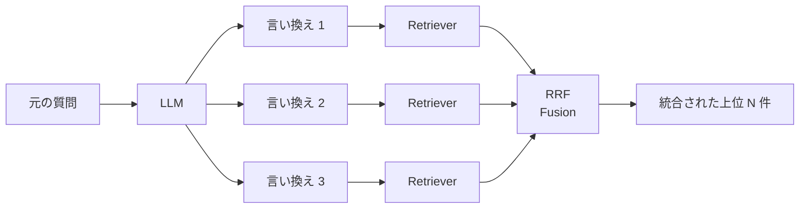

## このセクションで学ぶこと

- 質問を複数化することが Recall 向上に寄与する仕組みを説明できる
- RAG-Fusion の RRF 統合と単純な和集合の違いを判断できる
- Multi-Query を入れない方がよい局面を見抜ける

## 1つの質問は1つの「視点」しか持たない

ベクトル検索の取りこぼしを観察すると、ある共通パターンが見えてきます。**質問の表現が変わると、ヒットする文書も変わる**。「ベクトル DB の選び方は?」と「pgvector と Qdrant の違いは?」は意図がほぼ同じでも、埋め込み空間では別の位置に着地し、上位に来る文書が違います。これは欠陥ではなく、埋め込みが文の表現に依存している以上自然なことです。

Multi-Query は、この性質を逆手に取り、**1つの質問を LLM で複数の言い換えに展開して、それぞれで検索する** 手法です。例えば「ベクトル DB の選び方は?」から、

- ベクトル DB の比較ポイントは?
- pgvector / Qdrant / Pinecone の違いは?
- プロダクション運用に適したベクトル DB は?

の3つを生成し、それぞれで上位 N 件ずつ取得します。視点が増えるぶん **Recall(取りこぼしの少なさ)が改善** し、複数の言い換えで上位に出る文書は「一段強い」シグナルとして扱えます。



## 統合方法 — 和集合 vs RRF (RAG-Fusion)

統合方式は大きく2つです。

**和集合 + 重複排除**: 各クエリの結果を単純に合体し、重複を除いて Re-ranker に渡す。実装が楽で、後段に Re-ranker がある構成では十分に機能します。デメリットは「複数クエリで何度も上位に出た文書を強くする」という情報が捨てられる点です。

**RRF による統合(RAG-Fusion)**: 各クエリの順位を RRF で足し合わせ、`score = Σ 1 / (k + rank_q)` を文書ごとに計算する。02-01 で見た Hybrid Search の統合と同じ式で、**複数クエリの上位に共通して現れる文書が自然に上位に来ます**。Re-ranker が無い構成や、Re-ranker のコストを抑えたい場合に効果的です。

```python
# 擬似コード: RAG-Fusion
def rag_fusion(query, llm, retriever, k=60, n_queries=3):
    rewrites = llm.generate_n_paraphrases(query, n=n_queries)
    all_ranks = [retriever.retrieve(q) for q in rewrites]  # 各々が順位リスト
    scores = {}
    for ranks in all_ranks:
        for r, doc in enumerate(ranks, start=1):
            scores[doc.id] = scores.get(doc.id, 0) + 1 / (k + r)
    return sorted(scores.items(), key=lambda x: -x[1])
```

## 効くケース・効かないケース

Multi-Query が特に効くのは、**質問の言い換え幅が大きいドメイン**(カスタマーサポート、社内検索、健康相談など)、**コーパスに同じ事象を別表現で書いた複数文書が存在する**ケース、そして **Recall が課題で Re-ranker でも救えない** ケースです。

逆に効きにくいのは次のような場合です。第一に、**ID やコードの直当て**。言い換えを増やすほど ID が薄まり、BM25 の効きを殺してしまいます。Hybrid Search の BM25 側は元クエリで走らせ、ベクトル側だけ Multi-Query にするなどの工夫が必要です。第二に、**コーパスが小さく重複の少ない一意な文書群**。同じ事を別表現で書いた文書が無いので、言い換えても結局同じ少数の文書しか出てきません。第三に、**リアルタイム性が厳しい用途**。LLM 呼び出し1回 + 検索 N 回 + 統合のコストが累積し、レイテンシ予算を超えがちです。

実装上の注意として、**LLM の言い換えが質問の意図を変えてしまう** 事故も Query Rewriting と同様に起きます。生成された言い換えクエリを必ずログに保存し、定期的に「元クエリと意図が一致しているか」を抜き取り評価する運用が必要です。

## まとめ

- 1質問 = 1視点という制約を、複数の言い換えで広げる発想
- RAG-Fusion(RRF)で重複ヒットを自然に強化、Re-ranker と組み合わせる構成も実用的
- 言い換え幅の小さい / ID 直当て / リアルタイム要件のドメインでは効果が薄い
