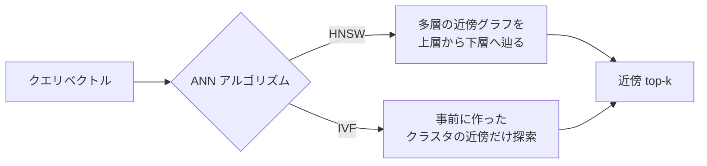

## このセクションで学ぶこと

- ベクトル DB が解いているのは「高次元空間での最近傍探索」という問題であること
- 厳密な最近傍探索が高次元では現実的でなく、ANN(近似最近傍)に行き着く必然性
- HNSW と IVF という代表的な ANN アルゴリズムの考え方の違い

## ベクトル DB は「製品の比較表」より先に問題を理解する

pgvector・Qdrant・Chroma・Pinecone といった製品名を並べて比較する前に、これらが共通して解いている問題を押さえておくと、後の選定がぐっと楽になります。ベクトル DB が解いているのは、突き詰めれば一つの問題です。**与えられたクエリベクトルに対し、データセット中で「最も近い」ベクトル上位 k 件を高速に返す** — これだけです。

「最も近い」の定義はコサイン類似度やユークリッド距離などで与えられます。ベクトルは埋め込みモデル(embedding model)が生成した、典型的には数百〜数千次元の実数列です。問題そのものは単純ですが、次元が高いことが計算を急に難しくします。

## なぜ素朴な総当たりではダメなのか — 高次元の壁

最も素朴な実装は「クエリと全データの距離を計算して上位 k 件を返す」です。データが数千件なら、これで何の問題もありません。しかし、RAG で扱う知識ベースは容易に **数十万〜数億ベクトル** に膨らみます。総当たりだと、1 クエリあたり全件と距離計算する必要があり、レイテンシが秒〜分のオーダーになってしまいます。

さらにやっかいなのは「**次元の呪い**」です。高次元空間では、ほとんどの点同士の距離が似た値に収束していき、ツリー型のインデックス(kd-tree など低次元では有効な手法)が効きづらくなります。低次元向けの工夫がそのままでは通用しないため、専用のアルゴリズムが必要になります。

ここで登場するのが **ANN(Approximate Nearest Neighbor、近似最近傍探索)** です。厳密な最近傍を保証する代わりに、ごくわずかな精度を犠牲にして、桁違いに高速な検索を実現します。RAG の用途では、上位 10 件のうち本当の上位 10 件と 9 件が一致していれば実用上ほぼ問題ない、という割り切りが効きます。

## 代表的な ANN アルゴリズム — HNSW と IVF

ANN にはいくつか系統がありますが、ベクトル DB の文脈で押さえておきたいのは **HNSW** と **IVF** の二つです。

**HNSW(Hierarchical Navigable Small World)** は、ベクトル同士をエッジで繋いだ **近傍グラフを多層構造で持ち**、上の層から「近そうな方向」へ辿りながら下層へ降りていく手法です。検索が速く精度も高い反面、グラフ構築にメモリと計算コストがかかります。Qdrant・Pinecone・pgvector(0.5 以降)など多くの製品が採用しています。

**IVF(Inverted File Index)** は、ベクトル空間を事前に **k-means などでクラスタ分割** しておき、クエリ時には近いクラスタだけを探索する手法です。メモリ効率が良く大規模データに向きますが、クラスタ境界付近の精度に注意が必要で、データを追加すると再クラスタリングのコストが発生しがちです。

実務上は「**HNSW がデフォルト、巨大データやメモリ制約があるなら IVF を検討**」という感覚で十分です。アルゴリズムの数学的詳細より、**どちらを使うかが index の作り方・更新コスト・パラメータチューニングに直結する** ことを覚えておきましょう。次節以降の製品比較は、この共通の地盤の上で「どの index を採用したか」「どう運用しやすくしたか」の違いを見ていく作業になります。

## まとめ

- ベクトル DB の本質は「高次元空間での最近傍探索を高速にやる」ことに尽きる
- 厳密解は次元の呪いで現実的でないため、精度を少し諦めて速度を稼ぐ ANN が標準
- HNSW(グラフ系)と IVF(クラスタ系)が二大潮流で、製品差はこの上の運用設計に出る
