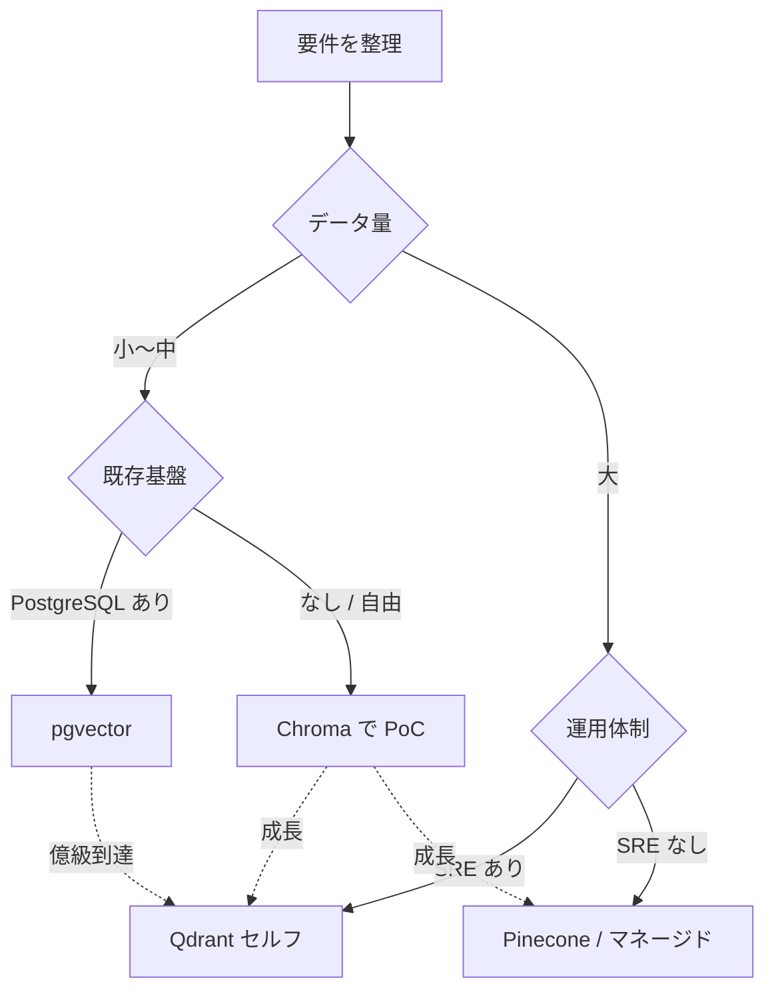

## このセクションで学ぶこと

- ベクトル DB 選定を「データ量・更新頻度・既存基盤・運用体制」の 4 軸で構造化する方法
- 各軸で見える典型的な落とし穴
- フェーズに応じて選択を見直すという考え方

## 機能比較表で決めない — 4 つの判断軸で構造化する

ベクトル DB 選定の議論は、しばしば「機能の◯×表」で迷走します。サポートする距離関数・index 種別・フィルタ構文を並べると、どれも似た記号が並ぶからです。実務では **4 つの軸** に分けて要件を整理する方が早く結論に着きます。

| 判断軸 | 問うべきこと | 結論への効き方 |
| --- | --- | --- |
| データ量 / スケール | 何ベクトル？どの程度の QPS と P95 レイテンシが必要？ | 数百万までは pgvector / Chroma も候補。億を超えると専用品が現実的 |
| 更新頻度 | 追加・削除はバッチ?ストリーム?更新は頻繁? | 高頻度更新は HNSW 系 + 専用 DB が有利。バッチなら IVFFlat も十分 |
| 既存基盤との親和性 | 既に何の DB を運用している?権限・監視・バックアップは? | PostgreSQL がいるなら pgvector が圧倒的に安い。クラウド指定なら同社マネージド版 |
| 運用体制 | 専任の SRE はいる?マネージドに払う余裕は? | 人が少ないなら Pinecone やマネージド版、人がいるなら Qdrant セルフホストも選べる |

これらは独立ではありません。たとえば「データ量は中規模、更新は低頻度、PostgreSQL を運用中、SRE は不在」なら **pgvector + HNSW** がほぼ自動で決まります。「億単位、ストリーム更新、マネージド希望」なら Pinecone か Qdrant Cloud に絞られます。

## 各軸で見落としやすい落とし穴

軸ごとに、初学者が踏みやすい罠を一つずつ挙げておきます。

**データ量** — 「将来のため」に過剰なスケールを想定して専用品を選ぶと、運用コストとロックインが先に来てしまいます。最初の 6 か月で 100 万ベクトルに届くかどうか、を冷静に見積もるのが先決です。届かないなら pgvector で始めて、必要になったら移行する戦略の方が総コストは安いことが多いです。

**更新頻度** — index は「作るとき」と「更新するとき」でコスト構造が違います。IVFFlat は再クラスタリングが必要で、データ分布が変わると古い index が陳腐化します。HNSW はオンライン追加には強い一方、削除がやや苦手な実装もあります。**「どんな書き込みパターンか」を index 選択前に必ず言語化** しましょう。

**既存基盤との親和性** — 認証・権限・PII 保護のレイヤを忘れがちです。RAG で扱うデータは多くの場合「ユーザーごとにアクセスできる範囲が違う」性質を持ちます。これを **DB レイヤで担保するか、アプリで担保するか** は早期に決めておく必要があります。pgvector なら Row Level Security と組めますが、専用品の権限モデルはまだ発展途上の場合があります。

**運用体制** — 「セルフホストで十分」と言い切る前に、深夜のアラート対応・バージョンアップ・バックアップ復旧の演習を誰がやるかを決めておきましょう。マネージドは料金が見えやすい代わりにベンダーロックがあり、セルフホストは料金は安く見えても人件費が乗ってきます。

## フェーズに応じて選び直す — 「一度決めたら終わり」ではない

最後に強調したいのは、**ベクトル DB は技術的に置換可能な層** だということです。埋め込みモデルを変えれば全データを作り直す必要がありますが、ベクトル DB を変える際は、ベクトルとメタデータを取り出して別の DB に書き戻すだけで済むことが多いです。アプリ側を抽象化(LlamaIndex の Vector Store インターフェースなど)しておけば、移行コストはさらに下がります。

**PoC は軽量側で素早く始め、本番化のタイミングで運用要件に合った製品へ載せ替える** — これが現実的な進め方です。最初から最終解を選ぼうとせず、判断軸の優先順位を都度見直すのが、ベクトル DB 選定で迷わないコツです。

## まとめ

- データ量・更新頻度・既存基盤・運用体制の 4 軸で要件を構造化すると結論に早く着く
- 各軸には固有の落とし穴がある(スケール過大評価、index と書き込みパターンの不一致など)
- ベクトル DB は置換可能な層なので、フェーズに応じて選び直す前提で設計する
