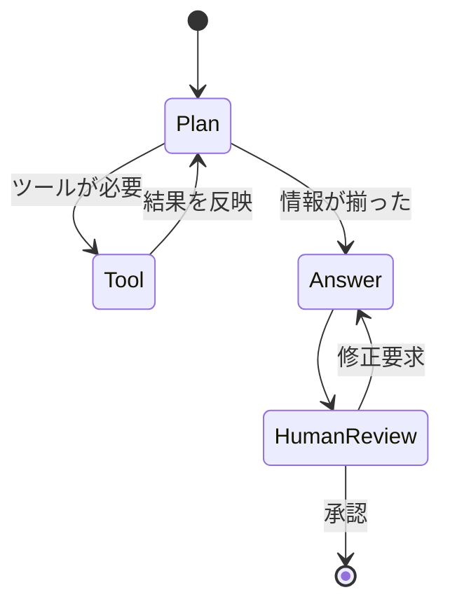

## このセクションで学ぶこと

- Chain(直列パイプライン)が苦手な要件は何か
- Agent を「グラフ + 状態」で表現すると何が嬉しいか
- LangChain と LangGraph の住み分け(どこから乗り換えるか)の判断基準

## Chain は「直線」で終わってしまう

前節で見たとおり、LangChain の中心概念は Chain です。Chain は **入力 → 出力の一方向** が前提で、プロンプト整形 → LLM 呼び出し → 後処理、のような直列タスクには非常にきれいに収まります。RAG の単純な質問応答ぐらいまでは、これで十分です。

ところが、Agent らしい振る舞いを書き始めると、急に苦しくなります。たとえば次のような要件はすべて、純粋な直列では表現しきれません。

- **条件分岐**: LLM の判断によって「次はツール呼び出し」「次は人に確認」「次は終了」と進路が変わる
- **ループ**: ツール呼び出し → 結果評価 → 不十分ならもう一度、を回数や条件で繰り返す
- **割り込み**: 途中で人間の承認待ちに入り、承認が来てから再開する
- **永続化と再開**: 数分〜数時間かかる処理を一度止めて、別プロセス・別マシンから続きを実行する

LangChain のレガシー Agent(`AgentExecutor` など)はこれらを内部のループで隠していましたが、**ロジックが「黒い箱」の中に隠れる** ため、デバッグも拡張もしづらいという問題がありました。

## グラフと共有 State という発想

LangGraph はこの状況に対して、**Agent をステートマシンとして書く** という素直な答えを出します。処理単位を **ノード**、遷移を **エッジ**、Agent 全体で共有する作業領域を **共有 State** として明示的に書くだけです。

ノードは「LLM 呼び出し」「ツール実行」「人間レビュー」など任意の処理を表し、エッジは条件付きで分岐できます。State には会話履歴・ツール出力・中間結論・現在のステップなど **すべての途中経過** を集約します。

この構造に変えると、先ほどの苦手分野がそのまま設計に乗ります。条件分岐は「条件付きエッジ」として書け、ループは「ノードへ戻るエッジ」として書け、人間の介入は「専用ノードで一時停止 → 外部入力で再開」という形で表現できます。State をシリアライズして保存(Checkpointing)すれば、長時間処理の中断・再開も自然に扱えます。詳細は次章でじっくり扱います。

## どこから LangGraph に乗り換えるべきか

実務上の判断は意外とシンプルです。Chain で素直に書けるなら LangChain のままで十分、Chain にループや if 文を書き込み始めたら LangGraph に移すサインです。具体的には次のいずれかが当てはまったら、LangGraph に移行する価値があります。

- ツール呼び出しを **複数回ループ** させたい(ReAct 的な振る舞い)
- 進路が **LLM の判断で 3 つ以上に分岐** する
- 途中で **人間の承認** を挟みたい(Human-in-the-Loop)
- 処理が長く、**中断・再開・並行実行** が必要
- どの状態でどう動いたかを **観測・再生** したい(LangSmith との相性は LangGraph 側がより良い)

逆に、上記がいずれも要らない一方向のパイプライン(社内 FAQ 検索のような RAG など)であれば、LangGraph を持ち出すのは過剰設計です。

## まとめ

- Chain は直列タスクには強いが、分岐・ループ・割り込み・永続化が必要な Agent には限界がある
- LangGraph は「ノード + エッジ + 共有 State」というステートマシン抽象でこれらを正面から扱う
- 直列で済むなら LangChain、ループや分岐・人間介入が要るなら LangGraph、という棲み分けが現在の標準
