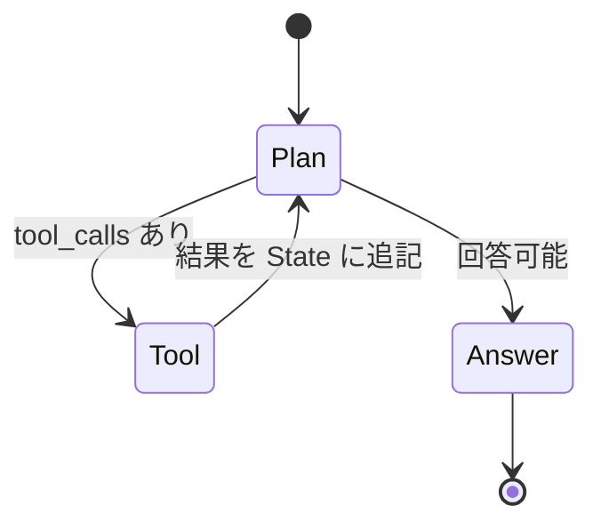

## このセクションで学ぶこと

- StateGraph がどんな発想で Agent を表現しているか
- State / Node / Edge の三要素がどう噛み合うか
- ステートマシンとして書くと何が嬉しいか(可観測性・分岐・再開)

## Agent は「状態と遷移」で書くと素直になる

前章で、Chain では Agent らしい振る舞いが書きづらいという話をしました。LangGraph が出した答えは、**Agent をステートマシンとして書く** というものです。ステートマシンは「いまどの状態にいて、何が起きたら次のどの状態へ移るか」だけを記述するモデルで、状態遷移図を見れば全体像が一目で分かります。

LangGraph の中心クラスである `StateGraph` は、この発想をそのまま API にしています。Agent を組み立てるときに書くのは次の三つだけです。

- **State**: Agent 全体で共有する構造化データ(会話履歴・ツール出力・中間結論など)
- **Node**: 一つの処理単位。State を受け取って、State の更新分を返す関数
- **Edge**: Node から Node への遷移ルール。固定の遷移と条件付き遷移の二種類がある

「Node が State を読み書きしながら、Edge をたどって進む」というのが Agent のすべてです。



この図は典型的な ReAct ループを LangGraph で書いたときの構造です。`Plan` ノードで LLM が次の手を決め、ツールが必要なら `Tool` ノードへ、十分な情報が揃ったら `Answer` ノードへと条件付きで分岐します。`Tool` の結果は State の `messages` に追記されて `Plan` に戻り、ループします。

## 三要素を最小コードで眺める

具体的なイメージを持つために、最小のスケルトンを示します。LangGraph 0.2 系では次のように書きます。

```python
from typing import TypedDict, Annotated
from langgraph.graph import StateGraph, START, END
from langgraph.graph.message import add_messages

class AgentState(TypedDict):
    messages: Annotated[list, add_messages]

def plan(state: AgentState) -> dict:
    # LLM を呼んで次の発話を決める
    return {"messages": [llm.invoke(state["messages"])]}

graph = StateGraph(AgentState)
graph.add_node("plan", plan)
graph.add_edge(START, "plan")
graph.add_edge("plan", END)
app = graph.compile()
```

ポイントは三つあります。`StateGraph(AgentState)` で **State の型** を最初に固定すること、`add_node` で **処理単位** を登録すること、`add_edge` で **START から END までの経路** を引くこと。これだけで Agent の骨格になります。実プロジェクトではここに条件付きエッジやチェックポインタを足していきますが、土台は常にこの形です。

## ステートマシンとして書く三つの利点

この抽象に乗ると、実務で効く利点が三つあります。

- **可観測性**: いまどの状態にいるか、State に何が入っているかが API レベルで見える。ログや LangSmith での再生がそのまま設計の単位になります
- **分岐とループの素直さ**: 条件付きエッジで if 文・ループ・人間介入の入口を **設計図のまま** 書ける。前章で挙げた Chain の苦手分野がそのまま消えます
- **中断と再開**: State がシリアライズ可能なので、Checkpointer に保存して別プロセスから再開できる。長時間タスクや HITL が自然に扱えます

逆に注意点もあります。一方向の RAG パイプラインなど、状態遷移がほとんどない処理に StateGraph を持ち出すと、ボイラープレートだけが増えます。**ステートマシンとして書く価値があるか** を最初に見極めるのが、設計者の最初の仕事です。

## まとめ

- LangGraph は Agent を「State / Node / Edge」のステートマシンとして書く設計言語
- 最小コードは「State 型を決める → Node を登録 → Edge をつなぐ → compile」の四ステップ
- 可観測性・分岐の素直さ・中断再開の三点が、ステートマシン化の主な見返り
