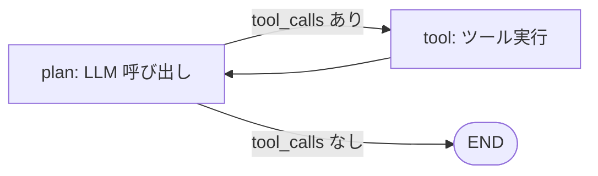

# Conditional Edge — 条件分岐をどう設計するか

## このセクションで学ぶこと

- Conditional Edge の基本形(ルータ関数 + 行き先マップ)を書ける
- ReAct ループを Conditional Edge で表現できる
- 分岐ロジックを Node に埋め込まないなど、設計上の落とし穴を避けられる

## 基本形 — ルータ関数で次の Node を選ぶ

Conditional Edge は「ある Node を出た直後に、State を見て次の Node を選ぶ」しくみです。LangGraph 0.2 系では `add_conditional_edges` を使い、第二引数に **ルータ関数**、第三引数に **行き先の辞書** を渡します。

```python
def route_after_plan(state: AgentState) -> str:
    last = state["messages"][-1]
    if getattr(last, "tool_calls", None):
        return "tool"
    return "end"

graph.add_conditional_edges("plan", route_after_plan, {
    "tool": "tool",
    "end": END,
})
```

ルータ関数は **State を受け取り、行き先キーを文字列で返す純関数** です。第三引数の辞書がキーから実際の Node 名へのマッピングになります。図にすると次のとおりです。



`tool` を抜けたあとは固定エッジで `plan` に戻すだけです。これで ReAct ループが完成します。**ループは特別な構文ではなく、ただの「戻りエッジ」** であることを押さえてください。

## ReAct ループを 30 行で書く

もう少し具体的に、ツール付き Agent の骨格を一通り並べます。

```python
from langgraph.graph import StateGraph, START, END

def plan(state):
    return {"messages": [llm_with_tools.invoke(state["messages"])]}

def tool(state):
    last = state["messages"][-1]
    results = [run_tool(tc) for tc in last.tool_calls]
    return {"messages": results}

def route_after_plan(state):
    last = state["messages"][-1]
    return "tool" if getattr(last, "tool_calls", None) else "end"

graph = StateGraph(AgentState)
graph.add_node("plan", plan)
graph.add_node("tool", tool)
graph.add_edge(START, "plan")
graph.add_conditional_edges("plan", route_after_plan, {"tool": "tool", "end": END})
graph.add_edge("tool", "plan")

app = graph.compile()
```

LLM が `tool_calls` を返したら `tool` Node でまとめて実行し、結果を State に書き戻して再び `plan` へ。`tool_calls` が空ならそのまま `END` に抜けます。**「思考 → ツール → 観測」が条件分岐とループだけで素直に書ける** ことが、Chain との一番の差です。

## 設計上の落とし穴

実装は簡単ですが、設計で迷うポイントがいくつかあります。

- **分岐ロジックを Node に埋めない**: 「Node 内で if 文を書いて、結果として State の `next_step` フィールドを更新する」というアンチパターンに陥りがちです。進路は **必ずルータ関数で表現** すると、図と実装が一致し続けます
- **戻り値はノード名ではなく「キー」にする**: ルータ関数が直接ノード名を返す形も書けますが、行き先マップ経由にしたほうが **後でノード名を変えてもルータを触らなくて済み**、テストも書きやすくなります
- **無限ループに備える**: ReAct は LLM の判断次第で無限に回り得ます。State に `iterations` を持たせて上限でルータが `"end"` を返す、`compile(recursion_limit=...)` を設定するなどの安全策を **必ず** 入れてください
- **複数分岐は「列挙」で**: 行き先が三つ以上になるなら、ルータの戻り値を `Literal["tool", "human", "end"]` のように Enum/Literal で型付けすると、抜けが見つけやすくなります

Conditional Edge は便利ですが、増えすぎるとグラフが読めなくなります。**主要分岐は 2〜3 経路に収め**、それ以上の判断は別のサブグラフに切り出すのが実務では扱いやすい構成です。

## まとめ

- Conditional Edge は「ルータ関数 + 行き先マップ」で次 Node を動的に選ぶ仕組み
- ReAct ループは Conditional Edge と戻りエッジだけで自然に書ける
- 進路は必ず Edge 側へ、無限ループは recursion_limit と iterations で抑える
