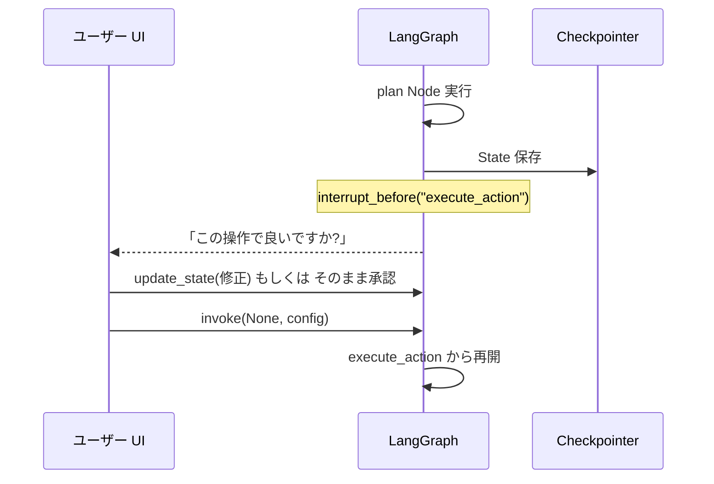

# Human-in-the-Loop — 人間の介入ポイントを設計する

## このセクションで学ぶこと

- HITL が必要になる三つの典型シナリオ
- interrupt_before / interrupt_after による中断と、State 編集による再開
- 承認 UI と Agent をつなぐときの設計上の注意

## なぜ人間を挟むのか

LLM Agent は便利ですが、**取り返しのつかない操作** をうっかり実行してしまうと事故になります。実務で HITL を入れる典型シナリオは三つです。

- **副作用のある操作の前**: 本番 DB への UPDATE、メール送信、決済、ファイル削除など。実行前に人間の Yes/No を取りたい
- **不確実な判断の補助**: 候補を Agent が出し、最終選択や微修正を人間がする(プロンプト改善、原稿レビュー、検索結果の絞り込みなど)
- **学習データ収集**: 人間の判断・修正を記録し、後で評価や FT に使う

LangGraph はこの三つを **同じ仕組み** で扱います。Checkpointing で State を保存しておき、グラフを途中で止め、人間の入力を State に書き戻して続きを実行するだけです。

## interrupt で止めて、State を編集して再開する

具体的には `compile` のときに `interrupt_before` または `interrupt_after` を指定します。これらは「この Node の **実行前/実行後** でグラフを停止する」というマーカーです。停止中、State は Checkpointer に保存されたままなので、別のプロセスや別の時刻から続きを実行できます。

```python
app = graph.compile(
    checkpointer=checkpointer,
    interrupt_before=["execute_action"],   # 副作用のある Node の手前で止める
)

config = {"configurable": {"thread_id": "task-1"}}
result = app.invoke(initial_state, config=config)
# ここで止まる。result には次に走る Node が "execute_action" であることが入っている

# 人間が UI で確認して承認したら、State をそのままに再開
app.invoke(None, config=config)

# 修正したい場合は update_state で State を差し替えてから再開
app.update_state(config, {"plan": revised_plan})
app.invoke(None, config=config)
```

ポイントは三つです。まず、**停止は例外ではなく正常終了** として返ってきます。`get_state(config)` で次に走る Node や現在の State を取り出せます。次に、**`invoke(None, config)` で続きを再開** できます。最後に、**`update_state` で State を書き換えてから再開** できる点。人間が「この plan はダメ、こうして」と修正した内容を State に反映してから続行する、というのが HITL の核です。



## 承認 UI と Agent をつなぐときの注意

設計上の注意点をいくつか挙げます。

- **承認は Node ではなく interrupt で表現する**: 「人間ノード」を作って自前でブロックする設計は壊れやすいです。LangGraph の interrupt + Checkpointer に任せたほうが、再開やタイムトラベルが素直に動きます
- **interrupt 対象の Node を明示的に切り出す**: 「副作用を起こす Node」と「LLM が判断する Node」を分けておくと、interrupt_before の対象が一目で分かります。Node の責務分割(05-02)の効きどころです
- **タイムアウトは外側で**: LangGraph 側に承認待ちのタイムアウト機構はありません。UI 側で「3 日返答がなければキャンセル」のような運用ルールを別途持つ必要があります
- **編集権限の境界を決める**: `update_state` でどのフィールドまで書き換えてよいかは、UI とアプリ側の責務です。messages の改ざんが致命的になるケースは多いので、編集できるのは plan / draft など特定フィールドだけ、と切ること
- **監査ログを残す**: 誰が・いつ・どのフィールドを書き換えて承認したかを、State 外のログにも残しておくと後で困りません

HITL は「Agent を遅くする」のではなく、「**Agent を信頼できる範囲に閉じ込める** ための設計装置」と捉えるのが現場感覚です。

## まとめ

- HITL は副作用前の承認・候補からの選択・学習データ収集の三つで効く
- interrupt_before / interrupt_after で Node の前後に停止点を置き、update_state で書き換えて再開する
- 承認ゲートは専用 Node に切り出し、編集範囲・タイムアウト・監査は外側の責務として設計する
