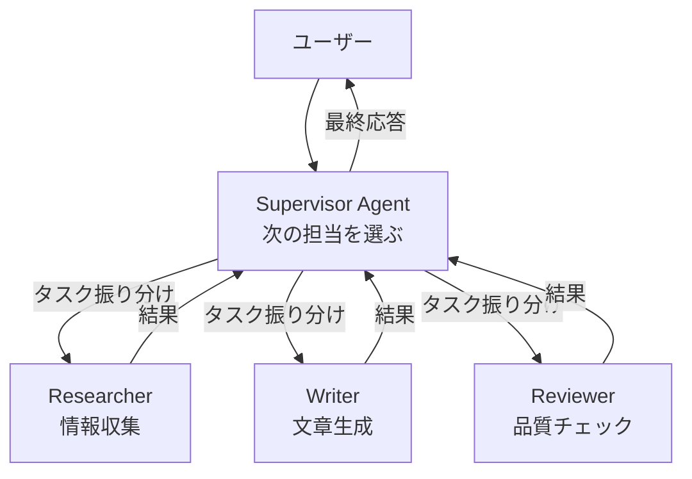

## このセクションで学ぶこと

- Supervisor 型の基本構造(親が次に動かす子を選ぶ)を図で説明できる
- Supervisor 型の長所(制御の見通し・デバッグ性)と短所(親がボトルネックになる)を理解できる
- LangGraph で Supervisor 型を組むときのノード設計のイメージを持てる

## 構造: 親 Agent が司令塔になる

Supervisor 型(中央集権型・Orchestrator 型とも呼ばれます)は、1 体の **Supervisor Agent** が全体の進行を握り、専門役の **Worker Agent** を必要なときに呼び出していく構造です。Worker 同士は直接話しません。すべての出力は一度 Supervisor を経由します。

ポイントは「**Worker 同士が直接矢印で結ばれていない**」ことです。図の対称性そのものが、この構造の設計思想を表しています。

## 長所: 見通しとデバッグ性

Supervisor 型の最大の魅力は、制御の流れが追いやすいことです。

- **誰が次に動くかが必ず Supervisor のログに残る**ので、トレースが線形に近くなります
- **Worker は単純な専門役で済む**ため、各 Agent の system prompt をシンプルに保てます
- **権限管理がしやすい**: 「書き込み Tool は Writer しか持たない」のような分離が自然に書ける
- **失敗時のフォールバックを集中管理できる**: Worker が失敗したら Supervisor が別の Worker に振り直す、といった判断を 1 箇所に書ける

LangGraph で実装するときは、Supervisor を 1 つのノードにし、その出力(=次に動かす Worker 名)を Conditional Edge で読んで対応する Worker ノードへ遷移させ、Worker が終わったら必ず Supervisor に戻る、というループ構造が定番です。この「次に動かす Worker を選ぶ」判断は、Worker を関数に見立てた **Tool calling** として実装することが多く、LLM に選択肢を渡して 1 つ選ばせる形になります。

## 短所: 親がボトルネックになる

一方で、Supervisor 型には次の弱点があります。

- **Supervisor 自身が判断を間違うと全体が崩れる**: 「Researcher を呼ぶべきところで Writer を呼んだ」だけで品質が破綻する
- **並列性が出しにくい**: 基本は 1 ターン 1 Worker のシーケンシャル進行になりやすい
- **Supervisor の system prompt が肥大化しやすい**: 全 Worker の役割と呼び出し条件を書き並べる必要があり、運用が進むにつれて肥大化する

Supervisor 型は「Worker をどう動かすか」を Supervisor が知っている前提で成り立つので、**Worker の数が 10 を超えたあたりから Supervisor のプロンプトが破綻し始めます**。実用上は 3-5 体の Worker までを目安にし、それ以上に増えたら階層化(Supervisor of Supervisors)を検討するのが現実的です。

## 注意点: Supervisor が「ただのルーター」になっていないか

Supervisor 型を組んでみると、Supervisor の役目が「Worker の出力をほぼそのまま返すだけ」になることがあります。この場合、Supervisor を挟まずに最初から該当の Worker を単一 Agent として呼ぶほうが速くて安いです。

良い Supervisor は、

- 複数 Worker の出力を**統合・要約・取捨選択**して最終応答を組み立てる
- Worker の結果を見て**やり直し・追加調査の指示**を出す
- Worker が暴走しないよう**ガード・終了判定**を持つ

といった、ルーター以上の役割を担っていることが望ましいです。逆に言えば、これらの役割が薄いなら単一 Agent + Tool に畳んでよい、というのが前節からの一貫した判断軸です。

## まとめ

- Supervisor 型は親 Agent が次の Worker を選び、結果を統合する中央集権構造である
- 制御が追いやすく権限管理に強い反面、親の判断ミスや prompt 肥大が弱点になる
- Supervisor が「ただのルーター」になっていないかを定期的に問い直す
