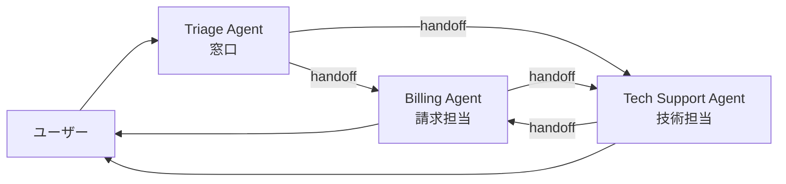

## このセクションで学ぶこと

- Swarm 型の基本構造(Agent 同士が handoff で協調する)を図で説明できる
- Swarm 型が活きる場面(専門分野が多岐・流れが事前に決められない)を挙げられる
- Supervisor 型との設計トレードオフを言語化できる

## 構造: 司令塔を置かず、Agent が次の Agent を選ぶ

Swarm 型(分散型・Handoff 型とも呼ばれます)は、中央の Supervisor を置かず、**各 Agent が自分の役目を終えたら次の Agent に直接バトンを渡す**構造です。OpenAI の Swarm SDK や LangGraph の Multi-Agent ガイドが言及する代表的な構図です。

ポイントは **「矢印が Agent 間に直接張られている」** ことです。前節の Supervisor 図と並べると、構造の違いが視覚的にはっきりします。Triage Agent はあくまで最初の窓口役で、その後の主導権は handoff を受けた Agent に移ります。

## 長所: 動的な振り分けと専門性の発揮

Swarm 型が活きるのは、**事前に呼び出し順序が決められない**ようなタスクです。代表例はカスタマーサポートです。

- ユーザーの最初の発話が「請求の件で…」なら Billing にハンドオフ
- 話が進む中で「ログインもできなくなった」と話題が変わったら Tech Support にハンドオフ
- Tech 側で問題が解決した後、返金処理が必要になれば再び Billing にハンドオフ

このような **会話の流れの中で担当が動的に切り替わるシナリオ** は、Supervisor 型で全パターンを事前に書き切るより、各専門 Agent に「自分の手に余ったら誰に渡すか」を持たせる Swarm 型のほうが自然に書けます。

各 Agent の system prompt も、自分の専門分野と handoff の判断基準だけに集中できるので、シンプルに保ちやすいのも利点です。

## 短所: 制御が追いにくく、ループしやすい

Swarm 型の弱点は、Supervisor 型の長所の裏返しです。

- **誰が次に動くかが分散して決まる**ので、ログを時系列で追うのが難しくなる
- **handoff のループに陥りやすい**: Billing → Tech → Billing → Tech と無限に投げ合うシナリオは設計ミスの典型
- **全体の品質を統合する責任者がいない**: Supervisor 型のように「最終応答を整える」役を誰かが持たないと、Agent ごとの応答が継ぎ接ぎになる

特に handoff の無限ループは、本章の最後で扱うアンチパターンの代表格です。実装上は **最大ターン数の上限を設ける・同一 Agent への連続 handoff を検知する** といったガードを必ず入れます。

## 具体例: Supervisor 型と Swarm 型の使い分け

同じ「リサーチして文章を書く」タスクでも、構造の選び方は変わります。

- **流れがほぼ決まっている(調査 → 執筆 → レビュー)**: Supervisor 型が素直。各ステップを 1 体の Worker に任せ、Supervisor が進行管理する。
- **会話型でユーザーの要求がその場で変わる**: Swarm 型が向く。最初は調査、途中で「やっぱり別テーマで」と言われたらその場で担当を切り替える。

つまり「**ワークフローの形が事前に描けるか**」が分岐点です。描けるなら Supervisor、描けないなら Swarm、と覚えると判断が早くなります。

## 注意点: Swarm を「自由」と勘違いしない

Swarm 型は「Agent に任せれば自律的にいい感じに協調してくれる」ように見えますが、実際は **handoff の条件を各 Agent の prompt に明文化しないと機能しません**。「困ったら他の Agent に振る」だけの設計はすぐにループに陥ります。Swarm 型を採用するなら、各 Agent に「自分が責任を持つ範囲」と「諦めて handoff する条件」を必ず両方書いてください。

## まとめ

- Swarm 型は司令塔を置かず、Agent 同士の handoff で動的に協調する構造である
- 流れを事前に決められない会話型タスクや、専門分野が多岐に渡るサポートで力を発揮する
- 制御が追いにくくループしやすいため、ターン上限と handoff 条件の明文化が必須になる
