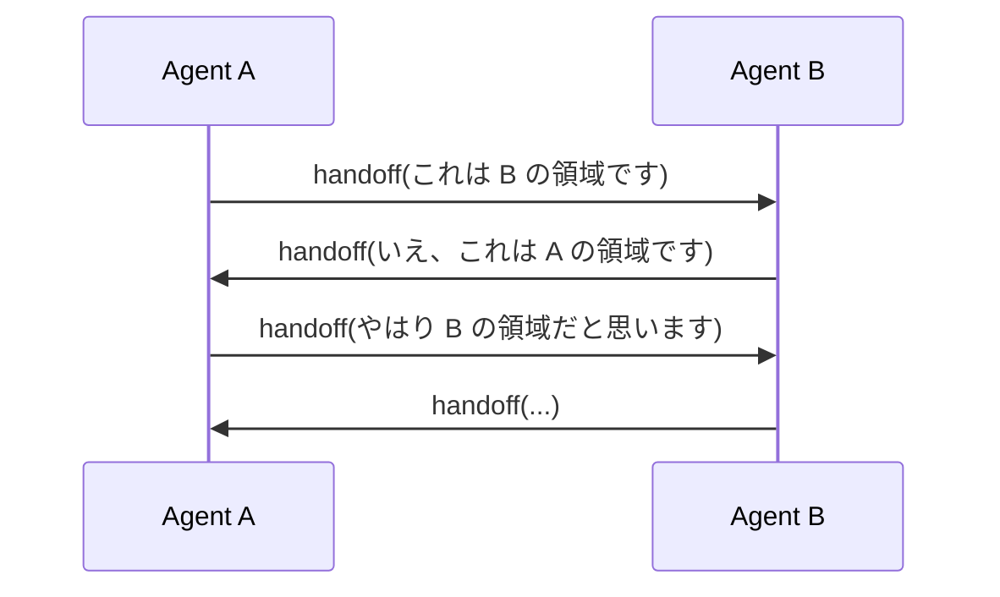

## このセクションで学ぶこと

- Multi-Agent でよく見られる失敗類型(過剰分割・責務曖昧・無限ループ)を識別できる
- 失敗の兆候をログ・コスト・出力品質の観点から検知できる
- 失敗を避けるための実務的な歯止め(上限・終了条件・統合役)を設計に組み込める

## アンチパターン 1: 過剰分割

最も多い失敗が、**Agent を分けすぎる**ことです。「企画担当・調査担当・執筆担当・校正担当・要約担当」と 5 体に分けてみたものの、各 Agent のやっていることは「ほぼ同じプロンプトに違うラベルを付けただけ」になっていることがあります。

兆候:

- 各 Agent の system prompt がほぼ同じ語彙で書かれている
- 1 タスクあたりのトークン消費が単一 Agent 版の 3 倍以上に膨らんでいる
- それでも出力品質が大して上がっていない

対処は単純で、**役割の説明を 2 行で書けない Agent は統合する**ことです。「この Agent は他の Agent と何が違うのか」を一言で言えないなら、その分割には根拠がありません。Ch06-01 で扱った「単一 Agent + Tool で足りないか」の問い直しが、ここでも効きます。

## アンチパターン 2: 責務の曖昧化

分割の数は妥当でも、**境界が曖昧**だと失敗します。例えば Researcher と Writer の責任範囲が重なっていると、

- Researcher が勝手に文章を書き始めて Writer の仕事を奪う
- Writer が「情報が足りない」と再調査を始めて Researcher の仕事を奪う

といった現象が起きます。最終的にどちらの出力を採用すべきか曖昧になり、品質が安定しません。

対処は、各 Agent の system prompt に **「やること」と同じ重みで「やらないこと」を書く**ことです。「Researcher は事実の収集だけを行い、文章化はしない」「Writer は与えられた事実だけを使い、独自に検索はしない」のように、否定形の指示を明示的に入れます。

## アンチパターン 3: メッセージング無限ループ

特に Swarm 型で発生しやすいのが、handoff のループです。

各 Agent が「自分の責務外だから渡す」と判断し続けると、終わりません。Supervisor 型でも、Supervisor が「Reviewer が不合格を出したら Writer に戻す」だけを書いていると、合格条件が緩いまま無限に往復することがあります。

対処:

- **最大ターン数の上限**を実行ループに必ず設ける(LangGraph の `recursion_limit` など)
- **同一 Agent への連続 handoff 検知**を入れ、検知したら強制終了か人間にエスカレーション
- Reviewer 系には **「N 回不合格なら現状の出力で確定する」** といった撤退条件を必ず含める

## アンチパターン 4: 統合役の不在

Swarm 型で起こりがちですが、**最終応答を整える責任者がいない**ケースも品質を落とします。各 Agent が自分の専門範囲だけを答えると、ユーザーから見ると話が継ぎ接ぎになり、誰の応答を信じればよいか分からなくなります。

対処は、Swarm 型でも **最後にユーザーへ返す前に通す「まとめ役」を 1 体置く**ことです。完全な Supervisor まで戻さなくても、最終応答だけを整える軽量な Aggregator Agent を入れるだけで品質が安定します。

## 失敗を早く見つけるための運用習慣

これらのアンチパターンに共通するのは、**実行ログとコストを継続的に眺めない限り気づきにくい**ことです。Multi-Agent を運用に乗せるなら、最低でも次の 3 つは可視化しておくと早期発見につながります。

1. タスクごとの **総ターン数**(ループの兆候)
2. タスクごとの **Agent 別トークン消費**(過剰分割と責務漏れの兆候)
3. **同一 handoff パスの繰り返し回数**(無限ループの兆候)

## まとめ

- 過剰分割・責務曖昧・無限ループ・統合役不在が代表的なアンチパターンである
- 各 Agent に「やらないこと」とターン上限・撤退条件を必ず書き、Swarm 型ではまとめ役を残す
- ログとコストを継続的に観察し、Multi-Agent の妥当性を運用しながら問い直す
