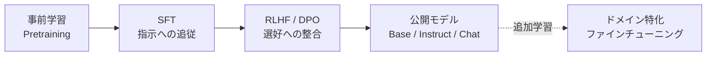

## このセクションで学ぶこと

- 大規模言語モデルの学習が複数の段階に分かれている理由を説明できる
- 事前学習・SFT・RLHF・DPO それぞれが「何を最適化する工程」なのかを区別できる
- 自分でファインチューニングするときに触る段階がどこなのかを位置付けられる

## なぜ学習が複数の段階に分かれているのか

「ファインチューニング」という言葉は実務でかなり曖昧に使われていますが、現代の大規模言語モデルは、目的の異なる複数の学習段階を順に積み重ねて作られています。それぞれの段階は **最適化している対象が違う** ため、まず全体像を時系列で把握しておくと、自分が今どこを触ろうとしているのかを見失わずに済みます。

事前学習はインターネット規模のテキストで言語そのものを学ぶ段階、SFT は「こう答えてほしい」という形式を教える段階、RLHF や DPO は人間の好みに合わせて出力を整える段階です。私たちが手元でファインチューニングと呼ぶ作業は、ほとんどの場合この図の右端、すなわち公開済みモデルに対して **SFT を追加で行う** か、**DPO で選好を上書きする** かのどちらかです。

## 各段階で何を最適化しているか

**事前学習** は、巨大なコーパス上で「次のトークンを当てる」という極めて単純な目的関数を最適化します。狙っているのは語彙・文法・常識・コードの構文といった汎用的な言語能力の獲得で、ここを自前で回せる組織はごく少数です。実務でファインチューニングと言うとき、この段階に手を出すケースはまずありません。

**SFT** は、「入力 → 望ましい出力」のペアを教師データとして与え、モデルに **指示に従う振る舞い** を覚えさせる工程です。たとえば「以下の議事録を 3 行で要約してください」という入力に対して、人間が書いた理想的な要約を出力として与え、その通り出るように重みを少しずつ動かします。社内データで「特定の口調」「特定のフォーマット」を出させたい、というニーズはここに該当します。

**RLHF** は、SFT を済ませたモデルに対して、人間が「応答 A と応答 B のどちらが好ましいか」をラベル付けし、そこから **報酬モデル** を学習し、強化学習でモデルを再調整する三段構えの仕組みです。OpenAI が ChatGPT の有用性と安全性を伸ばすために使ったことで広く知られるようになりましたが、報酬モデルの学習を含めて構成が重く、自前で完走させるのはかなり骨が折れます。

**DPO** は、RLHF と同じく **選好データ** を使いますが、報酬モデルや強化学習のループを **省略** して、選好ペアから直接モデルのポリシーを最適化します。実装が単純で安定しやすいため、2024 年以降は社内向けの選好整合に DPO を採用する事例が増えています。

## 注意点 — 「ファインチューニング」がどの段階を指すのか毎回確認する

社外のブログや論文で「LLM をファインチューニングした」と書かれていても、実態は SFT のことも DPO のことも、あるいは事前学習の継続(継続事前学習)のこともあります。**指している段階が違えば、必要なデータの種類・量・コストがまったく違う** ので、議論を始める前に「どの段階の話か」を必ず揃えてください。本章の以降のセクションでは、特に断らない限り「公開モデルに対する SFT」を中心に扱います。

## まとめ

- LLM は 事前学習 → SFT → RLHF/DPO の順で目的の異なる最適化を重ねて作られる
- 実務で触るのはほぼ「公開モデルへの SFT」か「DPO による選好整合」のどちらか
- 「ファインチューニング」と言われたら、どの段階を指しているのかを最初に確認する
