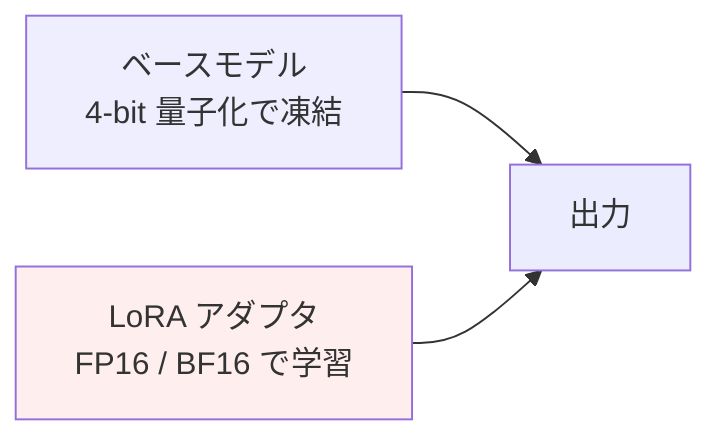

## このセクションで学ぶこと

- LoRA が「全パラメータを更新しない」という発想で成り立っている理由を説明できる
- QLoRA が 4-bit 量子化と LoRA を組み合わせて VRAM を劇的に減らせる仕組みを直感的に説明できる
- 自分の手元 GPU でどの規模のモデルまで現実的に触れるかを見積もる視点を持つ

## なぜ全パラメータを更新しないのか

数十億〜数百億パラメータのモデルを「すべての重みを更新する形」でファインチューニングしようとすると、勾配・オプティマイザ状態・活性化が GPU メモリを圧迫し、A100 や H100 を複数枚積んでようやく動く規模になります。手元の単一 GPU で済ませたい現場とは、要求リソースの桁が違います。

ここで効いてくるのが **「下流タスクへの適応に必要な情報は、実はごく低い次元の空間に収まっているのではないか」** という観察です。LoRA(Low-Rank Adaptation)は、この仮説を素直にモデル構造へ落とし込んだ手法です。

## LoRA の仕組み — 重み行列に「差分」を後付けする

LoRA は、Transformer の Attention 層などにある重み行列 `W` を **そのまま凍結** し、そこに **低ランクの差分** だけを足し込みます。差分は `B @ A` の積で表現され、`A` と `B` の小さな行列だけを学習します。

```text
元の出力:    y = W x
LoRA 適用:   y = W x + (B A) x
              ↑ 凍結       ↑ ここだけ学習(rank=r の小さな行列)
```

`W` が例えば 4096 × 4096 の巨大な行列でも、`A` は `r × 4096`、`B` は `4096 × r` で済みます。実務でよく使う `r` は 8 〜 64 程度なので、**学習対象パラメータは元の 0.1 〜 1% 程度まで圧縮** できます。学習後は `W + BA` を計算してマージすれば、推論コストは元のモデルと同じです。

このおかげで、勾配計算もオプティマイザ状態も「小さな差分行列」の分しか持つ必要がなくなり、メモリ要件が一気に下がります。

## QLoRA — 4-bit 量子化を重ねて VRAM を一段下げる

LoRA だけでも軽くなりますが、それでも **凍結されているベースモデル本体** は GPU メモリ上に乗せておく必要があります。70B クラスのモデルだと FP16 で約 140 GB あり、これは単一 GPU では収まりません。

QLoRA はこの「凍結されている本体」を **4-bit に量子化** することで、メモリ消費を 16-bit に対して概ね 1/4 まで縮めます。学習対象である LoRA の重みは高精度のまま、フォワード時には量子化された本体重みを必要なときに 16-bit に復元して計算します。



- ベース本体: 4-bit に圧縮、**勾配なし**、推論時のみ使う
- LoRA 部分: 高精度のまま、**ここだけ学習**

「本体は精度を落として圧縮、追加した小さな部分だけ高精度で学習する」というのが直感的なイメージです。実際、QLoRA を使うと **7B 〜 13B クラスのモデルを 16 〜 24 GB の単一 GPU で SFT できる** ようになり、ファインチューニングの裾野を一気に広げました。

## 注意点

- LoRA のランク `r` を上げれば表現力は増しますが、その分メモリと過学習リスクも上がります。最初は `r=8` か `r=16` で十分なケースが多いです。
- どの層に LoRA を当てるかも結果を左右します。Attention の `q_proj` / `v_proj` だけに当てる構成が伝統的ですが、MLP 層を含めて全層に当てる構成のほうが性能が上がる、という報告も増えています。
- 4-bit 量子化は **推論精度を完全に保つわけではありません**。タスクによっては量子化なしの LoRA に比べて品質が下がることがあるため、評価データで必ず比較してください。

## まとめ

- LoRA は「重みの差分」を低ランク行列で表現し、学習対象を元の 1% 以下まで減らす
- QLoRA は本体を 4-bit に量子化して凍結し、その上に LoRA を載せることで VRAM を更に削る
- 単一 GPU で 7B 〜 13B を回せる現実性こそが、LoRA/QLoRA が広く使われている理由
