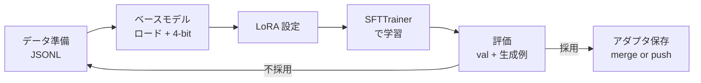

## このセクションで学ぶこと

- ファインチューニング 1 回分の実験を「準備 → 学習 → 評価 → 反映」の流れとして把握できる
- Hugging Face TRL と Unsloth のそれぞれの役割を区別できる
- 最小コード骨格を読み、どこをパラメータとして調整するかをイメージできる

## 実験ワークフロー全体像

ファインチューニングは 1 回打って終わりではなく、ハイパーパラメータやデータを変えて **何度も回す実験** です。回数を稼ぐためには、毎回同じ手順を踏める「型」を最初に作っておくことが重要です。



ポイントは「評価結果を見てデータかハイパーパラメータに戻る」というループが必ず発生することです。最初から完璧な設定は当てられないので、**速く 1 周回せる仕組み** こそが品質を決めます。

## TRL と Unsloth の役割分担

- **Hugging Face TRL** は、SFT / DPO / RLHF を共通インターフェースで提供するトレーナー集です。データセットを渡せば学習ループ・チェックポイント保存・ロギングをまとめて面倒見てくれます。「実験の骨格」を担当する位置付けです。
- **Unsloth** は、LoRA/QLoRA 学習の内部処理を CUDA カーネルで高速化したライブラリです。TRL と差し替えるのではなく、**ベースモデルのロード部分を Unsloth に置き換えて TRL のトレーナーに渡す** という組み合わせで使います。学習時間と VRAM の両方を削れるため、単一 GPU 環境では選択肢の筆頭になります。

## 最小コード骨格

実際のコードは大体こういう骨格になります(2025 〜 2026 時点での典型的な書き方で、詳細 API はバージョンで変わる点に注意)。

```python
from unsloth import FastLanguageModel
from trl import SFTTrainer, SFTConfig
from datasets import load_dataset

# 1. モデルとトークナイザを 4-bit でロード
model, tokenizer = FastLanguageModel.from_pretrained(
    model_name="meta-llama/Llama-3.1-8B-Instruct",
    load_in_4bit=True,
    max_seq_length=2048,
)

# 2. LoRA を装着
model = FastLanguageModel.get_peft_model(
    model,
    r=16,
    target_modules=["q_proj", "k_proj", "v_proj", "o_proj"],
    lora_alpha=32,
)

# 3. データセット(input/output ペアの JSONL を整形済み)
ds = load_dataset("json", data_files="train.jsonl", split="train")

# 4. 学習
trainer = SFTTrainer(
    model=model,
    tokenizer=tokenizer,
    train_dataset=ds,
    args=SFTConfig(
        output_dir="out",
        num_train_epochs=2,
        per_device_train_batch_size=2,
        gradient_accumulation_steps=8,
        learning_rate=2e-4,
        logging_steps=10,
        save_steps=200,
    ),
)
trainer.train()

# 5. アダプタを保存(後でベースとマージ可能)
model.save_pretrained("out/lora-adapter")
```

調整対象になりやすいのは、`r` / `lora_alpha` / `learning_rate` / `num_train_epochs` / `target_modules` の 5 つです。これらを変えながら 07-05 で扱う指標を見て、採用か作り直しかを判断します。

## まとめ

- 実験は「準備 → 学習 → 評価 → 反映」のループであり、速く回す型を最初に作る
- TRL が学習ループの骨格、Unsloth がベースモデルのロードと高速化を担当する
- 調整対象は LoRA のランク・学習率・エポック数など少数に絞り、毎回 1 つだけ動かす
