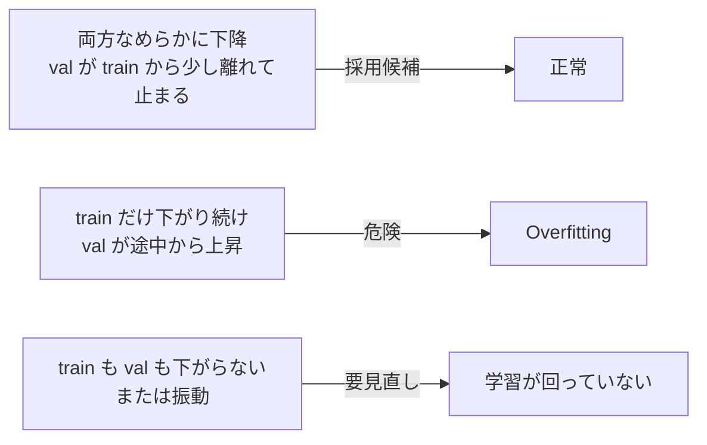

## このセクションで学ぶこと

- 学習曲線(train loss と validation loss)の典型的な形を読み分けられる
- 過学習(Overfitting)が起きているかどうかを複数の観点で判定できる
- チェックポイント選択と最終評価で「何をもって採用とするか」を事前に決められる

## 「成功」を loss だけで判定してはいけない

ファインチューニングの結果を「train loss が下がったから OK」と判断するのは危険です。SFT で見るべきは、**学習データに対する loss と検証データに対する loss の関係**、そして **生成された出力の実際の品質** の二つです。loss は学習が回っているかどうかを示すヘルスチェックであって、ゴールではありません。

## 学習曲線の読み方

学習曲線を見るときは、必ず train loss と validation loss を **並べて** 観察します。典型的なパターンは次の 3 つです。

- **正常パターン**: train loss が滑らかに下がり、validation loss も同様に下がってどこかで横ばいになる。両者の差(=汎化ギャップ)が許容範囲内なら採用候補。
- **Overfitting パターン**: ある時点を境に validation loss が **上昇に転じる**。学習データの個別事例に最適化しすぎたサインで、その時点より前のチェックポイントを採用する必要がある。
- **学習が回っていないパターン**: train loss すら下がらない、または激しく振動する。学習率が高すぎる、データ形式が壊れている、prompt のマスク設定が間違っているなどを疑う。

## チェックポイント選択 — 「最後のステップ」を採用しない

`save_steps` で複数のチェックポイントを残しておき、validation loss が最小になった時点のものを選ぶのが原則です。**最後のエポックが最良とは限りません**。むしろ、Overfitting が始まる直前を採用するほうが汎化性能が高いことがよくあります。

加えて、loss だけでなく **実際の生成サンプル** も毎チェックポイントで取って目視するクセを付けてください。次のような観点でチェックします。

- 想定した出力形式(箇条書き、文字数、フィールド構成)を守っているか
- 学習データに無いケースで突飛な出力をしていないか
- 元モデルが持っていた一般能力(関係ない雑談・要約・コード生成など)を忘れていないか

特に最後の **能力忘却(catastrophic forgetting)** は loss には現れにくく、検証用にあえて「学習タスクと関係ないプロンプト」を数本混ぜておくと早期に気付けます。

## 最終評価 — ホールドアウトで採用是非を決める

採用候補のチェックポイントが決まったら、**学習にも検証にも一切使っていないホールドアウト集合** で最終評価します。ここで使う指標は、用途によって以下のように使い分けます。

- 形式が厳密に決まっている(JSON 出力、固定テンプレート)→ **ルールベースの自動採点**(正規表現マッチ、JSON パース成否、フィールド一致率)
- 文章の質を見たい(要約、口調合わせ)→ **人間レビュー** または **強力な LLM-as-a-Judge**
- ベースモデルに対する勝率を測りたい → **A/B 比較**(同じ入力に対する両モデルの出力を盲検で比較)

採用の基準値(「JSON パース成功率 95% 以上」「人間レビューでの妥当性 4/5 以上」など)は **学習を始める前に決めておく** ことが重要です。結果を見てから基準を後付けすると、自分に都合のよい解釈を呼び込みます。

## まとめ

- train / validation loss の両方を並べて見て、Overfitting のサインを早期に検知する
- 採用するチェックポイントは validation loss の最小点と生成サンプルの両方で決める
- 最終評価はホールドアウト集合と「学習前に決めた採用基準」で判定する
