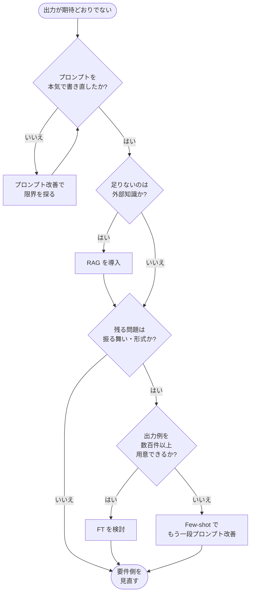

## このセクションで学ぶこと

- 「まずプロンプト改善 → 次に RAG → 最後に FT」の検討順序とその理由を説明できる
- フローチャート上で各分岐の判定基準を意識して使える
- 各段階で「次に進む / 留まる」を判断するシグナルを把握する

## 検討の標準順序:プロンプト → RAG → FT

実務で何度もうまくいく検討順序は、**コストが低く・反復が速く・後戻りしやすい手段から試す**という原則に従います。具体的には次の順序です。

1. **まずプロンプト改善**で限界まで詰める
2. それで足りなければ **RAG** を導入する
3. それでも残った癖や形式の問題に **FT** を当てる

この順序を守ると、後から効いた手段を取り外したくなったときの巻き戻しコストが小さく済みます。逆に最初から FT に飛び込むと、学習データの設計が運用条件と噛み合わず、後で「やっぱり RAG にしよう」となったときに数週間が無駄になりがちです。

## フローチャート

このフローのポイントは、**FT に到達するまでに 3 つの判定**を通る点です。プロンプトを書き切ったか、外部知識の問題ではないか、形式・振る舞いの問題か。さらにその先に「学習データを揃えられるか」という現実的な判定が控えます。FT は手段としては強力ですが、データを揃えられない時点で選べる手段ではありません。

## 各分岐で気をつけること

**「プロンプトを本気で書き直したか」の判定**は、ほとんどのチームが過信します。「もう書き直した」と言いつつ、Few-shot を 3 件足していない、出力例を一度も入れていない、思考の順序を指定していない、というケースが大半です。プロンプト改善には**まだ伸びしろがあるかどうか**を、最低限のチェックリスト(指示の明確化・例示・順序指定・制約の明示)で確認するのが先です。このチェックリストを出し切ってもなお届かない品質が **プロンプトの天井** で、そこを越える要件になって初めて RAG や FT が検討対象になります。

**「外部知識か」の判定**では、誤回答の事実が学習データのカットオフ後の話なのか、組織固有の話なのかを実際の事例で確認します。一般知識で答えられる話を RAG に逃がしても効果は小さく、検索品質の方が新たなボトルネックになります。

**「学習データを数百件以上揃えられるか」の判定**は、FT に進むかどうかを決める最後の関門です。LoRA であっても、まともに振る舞いを変えるには良質な入出力ペアが数百〜数千件は必要です。これを内製で安定供給できないなら、FT は今は選ばない、という判断が現実的です。データを継続的に集めるパイプライン自体に時間がかかるため、「データを揃えはじめる」と「FT に進む」を別の意思決定として分けるのが安全です。

## 評価セットを先に用意してから動く

このフローを実務で回すうえで、もうひとつ強調しておきたいのは、**評価セットを先に用意する**という前提です。プロンプトを直しても、RAG を入れても、FT を回しても、「良くなったか・悪くなったか」を測れる仕組みがなければ判定は感覚に頼ることになります。最低でも 30〜100 件程度の代表的な入力と「望ましい出力 / NG パターン」を文書化したものを、最初のループに入る前に作っておきます。これが整っていれば、フローの各分岐で「次に進む / 留まる / 戻る」の判断が、議論ではなく数字で決まるようになります。

## 注意点

このフローは「段階的に試して打ち止め」を前提としていますが、実際にはひとつ前のステップに戻る判断も必要です。RAG を入れたら検索結果ノイズで品質が下がる、ということは普通に起きます。**各段階のあとで評価セットを回し、進めるか戻すかを意識的に判断**してください。フローを上から下に流すだけではなく、上に戻れる前提で進めるのが、結果として最短経路になります。

## まとめ

- 検討順序は「プロンプト改善 → RAG → FT」。低コスト・高反復・後戻り容易な順に試します
- 各分岐に判定基準(本気の書き直しか、外部知識か、形式の問題か、データを揃えられるか)を置きます
- 評価セットを先に用意し、各段階で「進める / 留まる / 戻す」を数字で判断します
