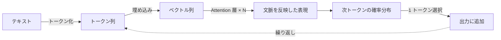

# Transformer の直感的理解

## このセクションで学ぶこと

- Attention が「どのトークンに注目するか」を解いていること
- 文脈によって語の意味が変わる問題を解決する仕組み
- 入力から次トークン予測までの全体の流れ

## Attention は「どこを見るか」を決める

LLM の中核にある **Transformer** の主役が **Attention(注意機構)** です。難しい数式は脇に置いて、役割だけを言えば「いま処理しているトークンにとって、他のどのトークンが重要かを重み付けする」仕組みです。

たとえば「川の土手で休む」と「銀行に預ける」では、同じ「bank」でも意味が違います。Attention は、対象の語が周囲のどの語と関係が深いかを見て、文脈に合った表現へと調整します。これが **自己注意(Self-Attention)** です。各トークンが系列内の他のトークンを参照し、文脈を自分の表現に取り込みます。

## 入力から次トークン予測まで

全体の流れは次のようになります。テキストはトークン化され、各トークンは埋め込みに変換され、Attention を含む層を何度も通って文脈を反映した表現になり、最後に「次に来るトークンの確率分布」が出力されます。

重要なのは、LLM は文章を一気に生成するのではなく、**次トークン予測** を 1 トークンずつ繰り返して文を伸ばしている、という点です。

## 実務での意味

「文脈を全部見て重み付けする」という性質は強力ですが、見るべきトークンが増えるほど計算量が増えます。これが後で学ぶコンテキストウィンドウの制約につながります。

また、1 トークンずつ生成するという性質は、出力が長いほど時間がかかること(レイテンシ)に直結します。回答を最後まで待たずに先頭から表示する「ストリーミング」が広く使われるのは、この逐次生成の性質を活かして体感速度を上げるためです。そして出力が「確率分布からの選択」である事実は、次のセクションの推論パラメータの話に直結します。

## まとめ

- Attention は「いまのトークンにとってどのトークンが重要か」を重み付けする
- 自己注意により、文脈に応じて語の意味を調整できる
- LLM は次トークン予測を 1 つずつ繰り返して文章を生成する
