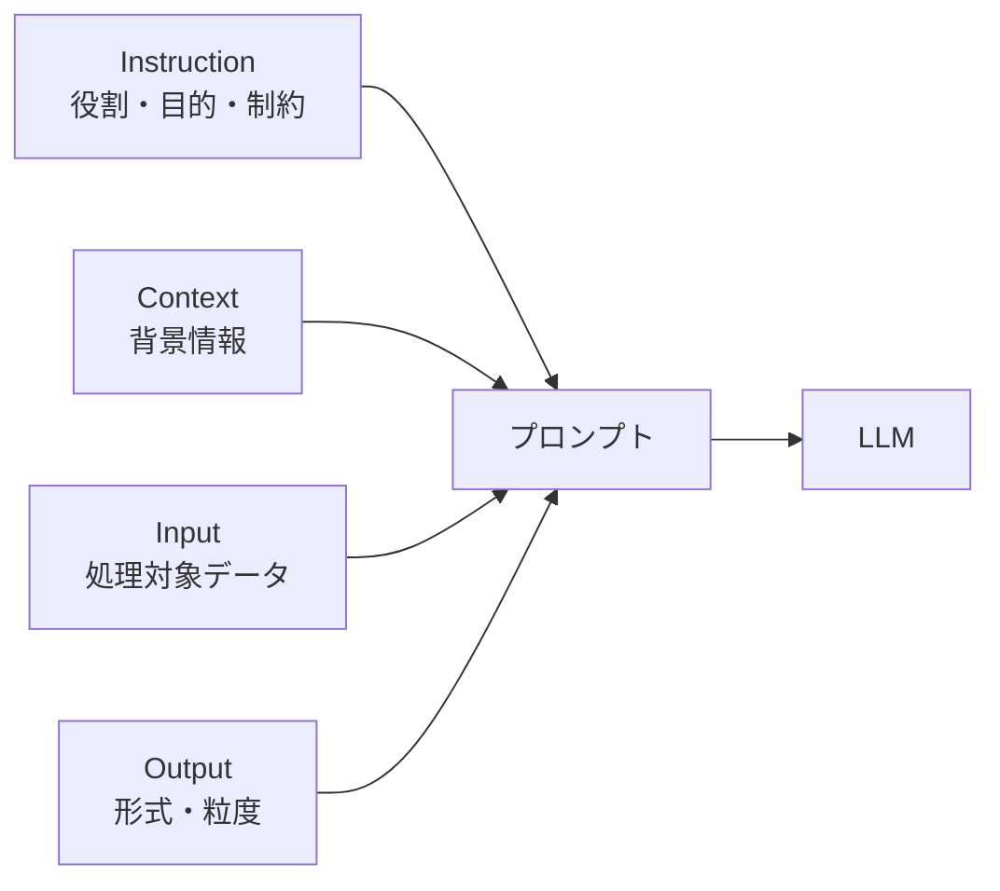

# プロンプトの構造

## このセクションで学ぶこと

- プロンプトを Instruction / Context / Input / Output の 4 要素に分解できること
- 各要素が出力品質に与える役割の違い
- 構造化されたプロンプトが再利用と改善を容易にする理由

## プロンプトを 4 要素に分解する

プロンプトを「お願い文」として 1 本の長文で書くと、何が効いているのか、どこを直せば改善するのかが見えなくなります。実務で安定した結果を得るには、プロンプトを次の 4 つに **分解** して考えるのが定石です。

- **Instruction(指示)**: 何をしてほしいか。役割や目的、守ってほしい制約を言語化する。
- **Context(文脈)**: 判断の前提となる背景情報。社内ルール、参照資料、過去の会話など。
- **Input(入力)**: 今回処理してほしい具体的なデータ。ユーザーの質問や対象テキスト。
- **Output(出力指定)**: 結果の形式・粒度。JSON のスキーマ、箇条書きの個数、文字数上限など。



この 4 要素は順序を厳密に守る必要はありませんが、**それぞれを明示的に書く** ことが重要です。混ぜて書くと、どこが指示でどこが入力なのかをモデルが取り違えることがあります。多くの API には `system` と `user` のロール分けがあり、Instruction を `system` に、Input を `user` に寄せると役割分担が明確になります。

## 具体例 — 議事録要約タスク

たとえば「議事録を要約してほしい」というタスクを、4 要素に分けて書くと次のようになります。

```
[Instruction]
あなたは会議の議事録を整理するアシスタントです。
発言者の主張と決定事項を区別して抽出してください。

[Context]
このチームでは「決定事項」は次回会議までに着手するものを指します。
TODO はチケット化するため担当者と期限を必ず明記してください。

[Input]
<議事録の本文をここに貼り付け>

[Output]
次の JSON スキーマで返してください。
{ "decisions": [{"item": "", "owner": "", "due": ""}], "discussions": [""] }
```

同じタスクを「議事録を要約して」だけ書いた場合と比べると、出力の粒度・形式・抜け漏れの安定性が大きく変わります。とくに `Output` を JSON で固定すると、後段のプログラムでパースしやすく、運用に乗せやすくなります。

## 注意点 — 構造化の効能と落とし穴

4 要素に分けると、改善も切り分けやすくなります。「決定事項が拾えていない」なら Instruction か Context、「形式が崩れる」なら Output、「無関係な情報まで返る」なら Input を狭める、というように **問題と直す場所が対応** します。

一方で、4 要素を意識しすぎて項目を増やしすぎると、プロンプトが肥大化して逆に精度が落ちることがあります。とくに Context は「念のため」で資料を全部貼ると、前章で見た **lost in the middle** が起きやすくなります。今回のタスクで本当に必要な前提だけを選んで載せるのが基本です。

また、Instruction の中に矛盾(「簡潔に」と「詳しく」を同時に要求するなど)があると、出力が不安定になります。書き終えたら 4 要素ごとに読み直し、衝突がないかを確かめましょう。改善のサイクルを回す際は、4 要素のうち **どこを変えたか** を記録しておくと、後で「何が効いたのか」を切り分けやすくなります。テンプレートとして 4 要素の枠を最初に用意し、新しいタスクに当てはめていく運用にすると、チーム内で品質が揃いやすくなります。

## まとめ

- プロンプトは Instruction / Context / Input / Output の 4 要素に分解して書く
- 4 要素を明示的に分けると、改善時にどこを直すかが特定しやすい
- 詰め込みすぎは逆効果。今回のタスクに必要な情報だけを選んで載せる
