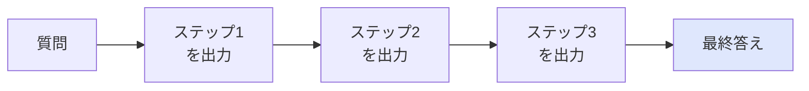

# Chain-of-Thought (CoT)

## このセクションで学ぶこと

- CoT が「思考の途中」を出力させて精度を上げる手法であること
- なぜ途中過程を書かせると正答率が上がるのか(直感的な理由)
- CoT の限界と、軽量化バリエーション(Zero-shot CoT など)

## 「答えだけ」を求めると間違える問題

少し複雑な計算や、複数ステップの論理が必要な質問では、LLM に **答えだけを直接出させる** と誤りが増えます。たとえば「リンゴが 3 個入った袋が 7 つあり、5 個食べた。残りは?」のような問題で、いきなり「16」と返させると間違いが混入しやすくなります。

**Chain-of-Thought (CoT)** は、最終答えの前に **思考の手順** を文章として書かせる技法です。具体的にはプロンプトで「**ステップごとに考えてから答えてください**」と指示するか、Few-shot の例に「考え方 → 答え」をセットで含めます。

```
[Zero-shot CoT]
Q: リンゴが 3 個入った袋が 7 つある。5 個食べた。残りはいくつ?
ステップごとに考えてから、最後に「答え: ...」とだけ書いてください。

→ 1. 全部で 3 × 7 = 21 個。
   2. 5 個食べたので 21 - 5 = 16 個。
   答え: 16
```

## なぜ途中過程を書かせると精度が上がるのか

LLM は **次トークン予測** を繰り返して文を生成します(第 1 章で見たとおり)。途中過程を出力させると、その出力が次のトークン生成のための文脈に積み上がり、後段の推論で参照できるようになります。

直感的には、「頭の中で全部考える」のではなく「途中式をノートに書きながら考える」のに近いイメージです。書くことで一つ前の **推論ステップ** が言語化され、次の推論ステップが落ち着いて出せる、という構造です。



複雑な計算、複数条件のルール適用、表からの集計など、**途中に分岐や計算が挟まるタスク** で効果が出やすいことが知られています。

## 注意点 — CoT が効かない・使えないケース

CoT は強力ですが、いつでも使うべきではありません。

- **単純な分類・抽出**: 「ステップごとに考えて」と書くと、不要な前置きが増えてレイテンシとコストが悪化します。Zero-shot で十分な場面では使わないのが原則です。
- **思考過程を見せたくない場面**: エンドユーザー向けのチャット UI では、長い独り言を表示するのは UX を損ねます。途中過程を出力しつつ、画面には最終答えだけを表示する設計が必要です。
- **思考が「もっともらしく見える嘘」になる場合**: CoT は正しい考え方を保証しません。途中式が筋道立っているように見えても、計算ミスや前提誤りを含むことがあります。重要な判断では、ツール(電卓・コード実行・検索)を併用する次節の ReAct パターンが現実解になります。

また、最近の高性能モデルは内部で推論を行うものも増え、外部から CoT を強要しなくても同等の精度が出る場合があります。プロンプトと出力を見比べ、本当に効いているかを検証してから採用しましょう。

## まとめ

- CoT は最終答えの前に思考の手順を書かせる技法
- 次トークン予測の性質上、途中過程の言語化が後段の推論を助ける
- 単純タスクでは過剰、複雑タスクでは強力。CoT 自体は正しさを保証しない
