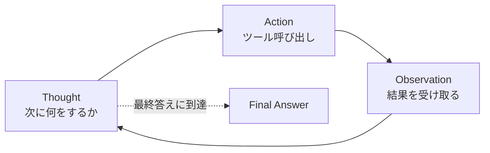

# ReAct パターン入門

## このセクションで学ぶこと

- ReAct が Reasoning(考える)と Acting(行動する)を交互に行う設計であること
- Thought / Action / Observation の 3 要素のループ構造
- 単なる CoT との違いと、Agent につながる位置づけ

## CoT の限界と「行動」の必要性

前節の Chain-of-Thought は、頭の中だけで推論を進めるアプローチでした。しかし実務では、モデルが知らない情報(社内データ、最新の数値、計算結果)が必要になる場面が多々あります。CoT だけだと、知らないことを **もっともらしく作り上げる**(ハルシネーション)が起きやすくなります。

**ReAct(Reasoning + Acting)** は、思考(Reasoning)と行動(Acting)を **交互に** 行うことで、外部の事実を取り込みながら推論を進める設計です。論文タイトルどおり「考える」と「行動する」をセットにします。

## Thought / Action / Observation の 3 要素ループ

ReAct のステップは次の 3 つで構成されます。

- **Thought(思考)**: いま何が分かっていて、次に何をすべきかを言語化する。
- **Action(行動)**: 検索する、計算する、API を呼ぶといった具体的な働きかけ。LLM がツール名と引数を出力する。
- **Observation(観察)**: 行動の結果として返ってきた情報。次の Thought の材料になる。



たとえば「東京の今日の最高気温と、それを華氏に直した値は?」という質問なら、次のように進みます。

```
Thought: まず東京の今日の最高気温を調べる必要がある。
Action: search("東京 今日 最高気温")
Observation: 28℃

Thought: 28℃を華氏に変換する。28 × 9/5 + 32 = 82.4。
Action: calc("28 * 9/5 + 32")
Observation: 82.4

Thought: 必要な情報が揃った。
Final Answer: 最高気温は 28℃ で、華氏では 82.4°F です。
```

## CoT との違い、Agent へのつながり

CoT は「頭の中で考える」だけでしたが、ReAct は **外部世界とのやり取りを推論ループに組み込む** 点が決定的に違います。これにより、最新情報・正確な計算・社内データなど、モデルの重みに含まれない情報を扱えるようになります。

そして重要なのは、ReAct が単なるプロンプト技法を超え、**Agent の中核的なパターン** になっていることです。第 4 章で学ぶ Tool Use や Function Calling は、この Thought → Action → Observation ループを実際のツール呼び出しで実装したものに他なりません。本節ではまず「設計の型」として理解しておけば十分です。

## 注意点 — ループは安価ではない

ReAct ループは、各ステップごとに LLM 呼び出しが発生します。3 〜 5 周もすると、レイテンシとコストが単発の CoT より目に見えて重くなります。簡単な質問には使わない、最大ステップ数の上限を設定しておく、といった制御が必要です。

また、モデルが Action のフォーマットを崩したり、Observation を無視して同じ Thought を繰り返したりする **無限ループ** に陥ることがあります。実装ではタイムアウト・最大反復回数・同じ Action の重複検出などのガードレールを必ず入れます。詳しくは第 4 章で扱います。

## まとめ

- ReAct は Thought → Action → Observation のループで外部情報を取り込む
- CoT との違いは「行動する」ステップがある点。Agent の中核パターン
- ループ回数の上限やフォーマット崩れ対策など、運用面のガードが必要
