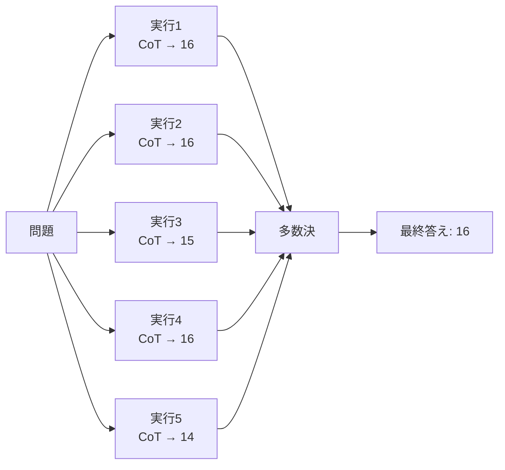

# Self-Consistency と多数決

## このセクションで学ぶこと

- LLM の出力が確率的であることを前提に「複数回試して多数決」を取る発想
- Self-Consistency が CoT と組み合わさったときに効く理由
- 多数決の限界と、適用すべき/避けるべきタスク

## 1 回の答えに賭けない

第 1 章で見たとおり、LLM の出力は確率分布からのサンプリングです。temperature を上げれば、同じ入力でも違う出力が返ります。CoT を使ったとしても、途中の 1 ステップで誤れば最終答えがずれる、という弱さがあります。

**Self-Consistency** は、この弱さに対する素朴で効果的な処方箋です。**同じ問題を複数回**(例えば 5 回や 10 回)解かせて、最終答えで **多数決** を取るだけ。CoT と組み合わせると、特に算数・論理・推論タスクで正答率が上がることが知られています。

## なぜ多数決が効くのか

ポイントは、**正しい答えに至る経路は複数あるが、間違える経路は経路ごとにバラバラになりやすい** という偏りです。サンプリング多様性を持たせて何回も解かせると、正答は同じ値に収束しやすく、誤答は散らばります。結果として、頻度が一番高い答えが正解である確率が上がります。



実装は単純です。同じプロンプトを `temperature` を少し上げた状態(例: 0.7)で N 回呼び、最終答えだけを抽出して `collections.Counter` で集計する、というだけで動きます。

```python
from collections import Counter

answers = []
for _ in range(5):
    resp = client.responses.create(model="...", input=prompt, temperature=0.7)
    answers.append(extract_final_answer(resp))

most_common, _ = Counter(answers).most_common(1)[0]
```

## 注意点 — 効くタスクと避けたいタスク

Self-Consistency が効くのは、**最終答えが離散的で多数決を取りやすい** タスクです。具体的には数値計算、選択肢からの分類、論理パズルなど。逆に、長い文章生成や要約のように **答えが連続的で「同じ」が定義しにくい** タスクには素直には適用できません(その場合は LLM-as-a-Judge で集約するなど別の工夫が要ります)。

また、N 回呼び出すぶん **コストとレイテンシが N 倍** になります。すべてのリクエストに適用するのではなく、難易度の高い少数の問題、もしくは評価時の精度測定など、効果と費用が見合うところで選択的に使うのが現実的です。

最後に、間違いが体系的に偏っている場合(モデル自体が同じ思い込みを持っている場合)、多数決を取っても **同じ間違いに収束** します。多数決は万能ではなく、「経路の多様性が誤りを散らす」ときに効く、という前提を忘れずに。

加えて、N の選び方にも実務的な勘所があります。N を増やすほど正答率は上がりますが、効果は逓減します。5 件と 10 件で大きく変わらない、ということもよくあります。コストとの兼ね合いで、まずは 5 件あたりから試して、必要に応じて増やすのが現実的です。多数決の代わりに **平均値や最頻パターン** を集約に使うバリエーションもあり、タスクの性質に合わせて選びます。

## まとめ

- 確率的出力を前提に、複数回解かせて多数決を取るのが Self-Consistency
- CoT と組み合わせると、算数・論理・分類など離散的なタスクで効きやすい
- コストは N 倍。同じ思い込みは多数決でも矯正できない点に注意
